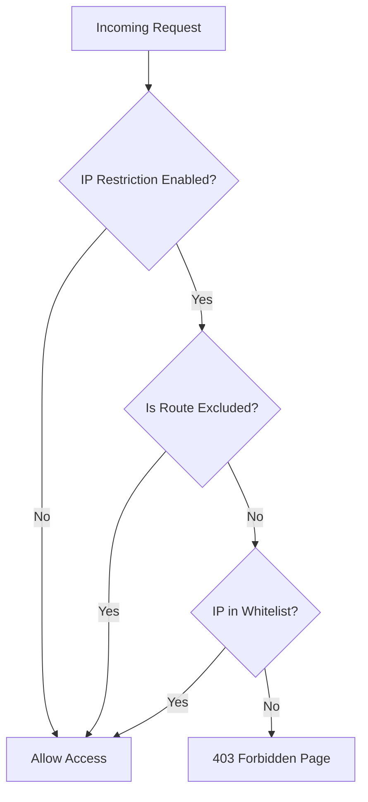

# CRM Minimal-Carbon — Hosting & Security Setup Details

## 📌 Project Overview

| Item                | Details                    |
| ------------------- | -------------------------- |
| **Project Name**    | Minimal-Carbon-CRM         |
| **Framework**       | Laravel 11 (PHP)           |
| **Frontend**        | Blade + Bootstrap 5 + Vite |
| **Database**        | MySQL                      |
| **Domain Provider** | GoDaddy                    |
| **Hosting**         | cPanel (Shared/VPS)        |
| **Source Code**     | Hosted on cPanel + Git     |

---

## 🌐 Domain & DNS (GoDaddy)

- Domain purchased and managed via **GoDaddy**.
- DNS typically points to the cPanel server IP via **A Record**.
- SSL can be managed via cPanel's **AutoSSL** or **Let's Encrypt**.

### DNS Records to Verify

| Type  | Name | Value                    |
| ----- | ---- | ------------------------ |
| A     | @    | `<cPanel Server IP>`     |
| CNAME | www  | `yourdomain.com`         |
| TXT   | @    | SPF/DKIM records (email) |

---

## 🖥️ cPanel Hosting Details

### File Structure on cPanel

```
/home/<cpanel-user>/
├── public_html/           ← Laravel public/ contents (symlinked or deployed)
│   ├── index.php
│   ├── .htaccess
│   ├── css/
│   ├── js/
│   ├── images/
│   └── storage → ../storage/app/public
├── crm-app/               ← Main Laravel application (outside public_html)
│   ├── app/
│   ├── bootstrap/
│   ├── config/
│   ├── database/
│   ├── resources/
│   ├── routes/
│   ├── storage/
│   ├── vendor/
│   ├── .env
│   └── artisan
└── ...
```

> [!IMPORTANT]
> Laravel's `public/` directory contents go inside `public_html/`. The rest of the app should be **outside** `public_html/` for security. Adjust `index.php` paths accordingly.

### Key cPanel Features Used

| Feature             | Purpose                         |
| ------------------- | ------------------------------- |
| **File Manager**    | Upload/edit source files        |
| **MySQL Databases** | Create/manage DB + users        |
| **phpMyAdmin**      | Visual database management      |
| **Terminal**        | SSH access for artisan commands |
| **Cron Jobs**       | Queue workers, scheduled tasks  |
| **SSL/TLS**         | HTTPS certificate management    |
| **PHP Selector**    | Set PHP version (8.1+ required) |
| **MultiPHP INI**    | Custom PHP settings             |

---

## 🔒 IP Security Feature — How It Works

### Architecture



### Excluded Routes (Always Accessible)

- `/admin/login` — Login page (so you can always log in)
- `/api/*` — Public API endpoints
- `/webhook/*` — External webhook callbacks

### Database Tables

#### `allowed_ips` Table

| Column       | Type         | Description                   |
| ------------ | ------------ | ----------------------------- |
| `id`         | bigint(PK)   | Auto-increment                |
| `ip_address` | varchar(45)  | IPv4 or IPv6 address          |
| `label`      | varchar(255) | Friendly name ("Office WiFi") |
| `is_active`  | tinyint(1)   | 1 = active, 0 = disabled      |
| `added_by`   | bigint(FK)   | Admin who added this IP       |
| `created_at` | timestamp    |                               |
| `updated_at` | timestamp    |                               |

#### `app_settings` Table

| Column       | Type         | Description        |
| ------------ | ------------ | ------------------ |
| `id`         | bigint(PK)   | Auto-increment     |
| `key`        | varchar(100) | Unique setting key |
| `value`      | text         | Setting value      |
| `created_at` | timestamp    |                    |
| `updated_at` | timestamp    |                    |

### Key Settings

| Key                      | Default | Description                   |
| ------------------------ | ------- | ----------------------------- |
| `ip_restriction_enabled` | `false` | Master toggle for IP security |

---

## 🚀 Deployment Steps (cPanel)

### First-Time Setup

1. **Upload code** to cPanel via File Manager or Git
2. **Set PHP version** to 8.1+ in MultiPHP Manager
3. **Create MySQL database** and user in cPanel
4. **Configure `.env`** file with production database credentials
5. **Set document root** to Laravel's `public/` directory

### After Adding IP Security Feature

```bash
# SSH into your server or use cPanel Terminal

# Navigate to project root
cd /home/<cpanel-user>/crm-app

# Run the new migrations
php artisan migrate

# Seed the settings permission
php artisan db:seed --class=SettingsPermissionSeeder

# Clear all caches
php artisan config:clear
php artisan cache:clear
php artisan route:clear
php artisan view:clear

# Assign 'settings.manage' permission to super admin from Permissions page
```

### Emergency IP Reset (If Locked Out)

```bash
# Connect via SSH (cPanel Terminal or PuTTY)
cd /home/<cpanel-user>/crm-app
php artisan ip:reset
```

This command will:

- Set `ip_restriction_enabled` to `false`
- Delete all entries from `allowed_ips`
- Give you full access again

---

## ⚠️ Important Notes

1. **Cloudflare Users**: If using Cloudflare proxy, the visitor's real IP is in `CF-Connecting-IP` header. Laravel's trusted proxy config (already set in `bootstrap/app.php` as `$middleware->trustProxies(at: '*')`) will handle this.

2. **Shared Hosting IP**: On shared hosting, multiple sites share an IP. The restriction is based on the **visitor's IP**, not the server IP.

3. **Dynamic IPs**: If your ISP assigns dynamic IPs, your IP may change periodically. Consider:
    - Using a VPN with a static IP
    - Adding IP ranges (CIDR notation support planned for future)
    - Using the emergency reset command if locked out

4. **Backup Before Deploy**: Always backup your database before running migrations.

---

## 📋 File Changes Summary

| File                                                     | Action | Purpose                  |
| -------------------------------------------------------- | ------ | ------------------------ |
| `database/migrations/xxxx_create_allowed_ips_table.php`  | NEW    | IP whitelist table       |
| `database/migrations/xxxx_create_app_settings_table.php` | NEW    | App settings table       |
| `app/Models/AllowedIp.php`                               | NEW    | IP model                 |
| `app/Models/AppSetting.php`                              | NEW    | Settings model           |
| `app/Http/Middleware/IpRestriction.php`                  | NEW    | IP check middleware      |
| `app/Http/Controllers/SettingsController.php`            | NEW    | Settings page controller |
| `app/Console/Commands/IpResetCommand.php`                | NEW    | Emergency reset command  |
| `database/seeders/SettingsPermissionSeeder.php`          | NEW    | Permission seeder        |
| `resources/views/settings/ip-security.blade.php`         | NEW    | Settings UI              |
| `bootstrap/app.php`                                      | MODIFY | Register middleware      |
| `routes/web.php`                                         | MODIFY | Add settings routes      |
| `resources/views/layouts/admin.blade.php`                | MODIFY | Add sidebar link         |
