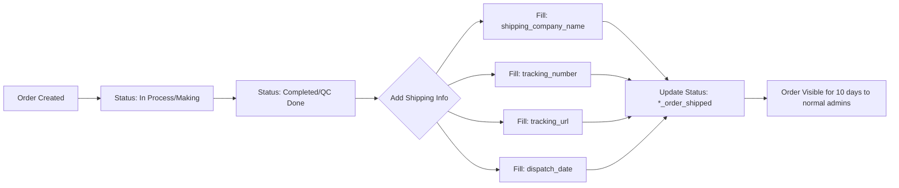

# 📦 Shipping Module — API Documentation

> **For:** React Shipping Module Developer  
> **Backend:** Laravel (PHP) — CRM-Minimal-Carbon  
> **Base URL:** `https://your-domain.com`  
> **Auth:** Session-based admin authentication (cookie/session)  
> **Last Updated:** 2026-02-12

---

## Table of Contents

1. [Authentication](#1-authentication)
2. [Orders API (Shipping Core)](#2-orders-api-shipping-core)
3. [Clients API](#3-clients-api)
4. [Companies API](#4-companies-api)
5. [Invoices API](#5-invoices-api)
6. [Data Models & Schemas](#6-data-models--schemas)
7. [Order Statuses (Diamond Status)](#7-order-statuses-diamond-status)
8. [Shipping-Specific Fields](#8-shipping-specific-fields)
9. [Important Notes for React Integration](#9-important-notes-for-react-integration)

---

## 1. Authentication

All routes are protected behind **session-based admin auth** (Laravel `admin.auth` middleware).

### Login

| Method | URL             | Description                 |
| ------ | --------------- | --------------------------- |
| `GET`  | `/admin/login`  | Show login page             |
| `POST` | `/admin/login`  | Submit login (rate-limited) |
| `POST` | `/admin/logout` | Logout                      |

**POST `/admin/login`**

```
Content-Type: application/x-www-form-urlencoded

Fields:
  email: string (required)
  password: string (required)
  _token: string (CSRF token — required)
```

> [!IMPORTANT]
> All `POST`, `PUT`, `DELETE` requests require a CSRF token (`_token` field or `X-CSRF-TOKEN` header).  
> Get the CSRF token from the `<meta name="csrf-token">` tag on any page, or from the `/sanctum/csrf-cookie` endpoint.

> [!WARNING]
> This project uses **web routes** (not API routes). For React integration, you'll need to handle CSRF tokens and session cookies. Consider using `axios` with `withCredentials: true` and fetching CSRF tokens before making requests.

---

## 2. Orders API (Shipping Core)

All order routes are prefixed with `/admin/` and require `admin.auth` middleware + specific permissions.

### 2.1 Order CRUD Routes

| Method   | URL                       | Permission      | Description                           |
| -------- | ------------------------- | --------------- | ------------------------------------- |
| `GET`    | `/admin/orders`           | `orders.view`   | List orders (paginated, with filters) |
| `GET`    | `/admin/orders/create`    | `orders.create` | Show create form (HTML)               |
| `POST`   | `/admin/orders`           | `orders.create` | Create a new order                    |
| `GET`    | `/admin/orders/{id}`      | `orders.view`   | Show order detail                     |
| `GET`    | `/admin/orders/{id}/edit` | `orders.edit`   | Show edit form (HTML)                 |
| `PUT`    | `/admin/orders/{id}`      | `orders.edit`   | Update an order                       |
| `DELETE` | `/admin/orders/{id}`      | `orders.delete` | Delete an order                       |

### 2.2 List Orders — `GET /admin/orders`

**Query Parameters:**

| Param            | Type    | Description                                                                                               |
| ---------------- | ------- | --------------------------------------------------------------------------------------------------------- |
| `search`         | string  | Search across client_name, client_email, client_address, jewellery_details, diamond_details, company name |
| `shipped`        | `1`     | Set to `1` to show ONLY shipped orders                                                                    |
| `order_type`     | string  | Filter by type: `ready_to_ship`, `custom_diamond`, `custom_jewellery`                                     |
| `diamond_status` | string  | Filter by specific status (see status list below)                                                         |
| `company_id`     | integer | Filter by company                                                                                         |
| `note`           | string  | Filter by priority: `priority` or `non_priority`                                                          |
| `overdue`        | `1`     | Show overdue orders only                                                                                  |
| `page`           | integer | Pagination page number                                                                                    |

**Response:** HTML page (returns Blade view with paginated orders). For AJAX/JSON, set `Accept: application/json` header or use `?format=json`.

### 2.3 Create Order — `POST /admin/orders`

**Content-Type:** `multipart/form-data` (because of file uploads)

**Request Body:**

| Field                   | Type    | Required | Validation                                                 |
| ----------------------- | ------- | -------- | ---------------------------------------------------------- |
| `order_type`            | string  | ✅       | `ready_to_ship`, `custom_diamond`, `custom_jewellery`      |
| `client_name`           | string  | ✅       | max:191                                                    |
| `client_email`          | email   | ✅       | max:191                                                    |
| `client_address`        | string  | ✅       | —                                                          |
| `client_mobile`         | string  | ❌       | max:40                                                     |
| `client_tax_id`         | string  | ❌       | max:100                                                    |
| `client_tax_id_type`    | string  | ❌       | `tax_id`, `vat_id`, `ioss_no`, `uid_vat_no`, `other`       |
| `company_id`            | integer | ✅       | Must exist in `companies` table                            |
| `diamond_sku`           | string  | ❌       | max:191 (single diamond SKU)                               |
| `diamond_skus[]`        | array   | ❌       | Array of SKU strings (multi-diamond)                       |
| `diamond_prices[SKU]`   | array   | ❌       | Key-value: SKU → price (numeric, USD)                      |
| `diamond_status`        | string  | ❌       | One of the status codes (see §7)                           |
| `gross_sell`            | numeric | ❌       | min:0 (order value)                                        |
| `dispatch_date`         | date    | ❌       | YYYY-MM-DD format                                          |
| `note`                  | string  | ❌       | `priority` or `non_priority`                               |
| `special_notes`         | string  | ❌       | max:2000                                                   |
| `shipping_company_name` | string  | ❌       | Shipping carrier name                                      |
| `tracking_number`       | string  | ❌       | Tracking/AWB number                                        |
| `tracking_url`          | url     | ❌       | Must be valid URL                                          |
| `images[]`              | file(s) | ❌       | jpg,jpeg,png,avif,gif,webp — max 10MB each, up to 10 files |
| `order_pdfs[]`          | file(s) | ❌       | PDF only — max 10MB each, up to 5 files                    |
| `jewellery_details`     | string  | ❌\*     | Required for `custom_jewellery` type                       |
| `diamond_details`       | string  | ❌\*     | Required for `custom_diamond` type                         |
| `gold_detail_id`        | integer | ❌       | FK → `metal_types` table                                   |
| `ring_size_id`          | integer | ❌       | FK → `ring_sizes` table                                    |
| `setting_type_id`       | integer | ❌       | FK → `setting_types` table                                 |
| `earring_type_id`       | integer | ❌       | FK → `closure_types` table                                 |
| `melee_diamond_id`      | integer | ❌       | FK → `melee_diamonds` table                                |
| `melee_pieces`          | integer | ❌       | min:1                                                      |
| `melee_carat`           | numeric | ❌       | min:0                                                      |
| `melee_price_per_ct`    | numeric | ❌       | min:0                                                      |

**On Success:** Redirect to order detail page.  
**On Error (JSON):** `{ "success": false, "message": "..." }` with status `422`.

### 2.4 Update Order — `PUT /admin/orders/{id}`

Same fields as Create. Uses `_method: PUT` for form data (Laravel convention).

### 2.5 Show Order — `GET /admin/orders/{id}`

Returns HTML view with full order details, loaded with relationships:

- `goldDetail` (Metal Type)
- `ringSize`
- `settingType`
- `earringDetail` (Closure Type)
- `company`
- `creator` (Admin who created)
- `lastModifier` (Admin who last edited)
- `editHistory` (Audit logs — super admin only)

### 2.6 Delete Order — `DELETE /admin/orders/{id}`

Deletes the order and all associated Cloudinary files (images + PDFs).

### 2.7 Diamond SKU Check — `GET /admin/diamonds/check-sku`

| Param | Type   | Description          |
| ----- | ------ | -------------------- |
| `sku` | string | Diamond SKU to check |

**Response (JSON):**

```json
{
  "available": true,
  "diamond": {
    "id": 1,
    "sku": "D-12345",
    "is_sold_out": "Available",
    ...
  }
}
```

### 2.8 Load Order Form Partial — `GET /admin/orders/form/{type}`

| Param  | Type   | Description                                           |
| ------ | ------ | ----------------------------------------------------- |
| `type` | string | `ready_to_ship`, `custom_diamond`, `custom_jewellery` |

Returns HTML partial for the specific order type form fields.

---

## 3. Clients API

| Method | URL                     | Permission       | Description                       |
| ------ | ----------------------- | ---------------- | --------------------------------- |
| `GET`  | `/admin/clients`        | `clients.view`   | List clients (paginated)          |
| `GET`  | `/admin/clients/data`   | `clients.view`   | AJAX DataTable endpoint (JSON)    |
| `GET`  | `/admin/clients/search` | `orders.create`  | Client autocomplete search (JSON) |
| `GET`  | `/admin/clients/export` | `clients.export` | Export clients to Excel           |
| `GET`  | `/admin/clients/{id}`   | `clients.view`   | Show client details with orders   |

### 3.1 Client Search (Autocomplete) — `GET /admin/clients/search`

**🔑 Key endpoint for shipping module — use this to find clients when creating shipments.**

| Param  | Type   | Description                   |
| ------ | ------ | ----------------------------- |
| `term` | string | Search term (minimum 2 chars) |

**Response (JSON):**

```json
[
    {
        "id": 1,
        "name": "John Doe",
        "email": "john@example.com",
        "mobile": "+1234567890",
        "address": "123 Main St, NYC",
        "tax_id": "VAT123456"
    }
]
```

### 3.2 Client DataTable — `GET /admin/clients/data`

| Param              | Type    | Description             |
| ------------------ | ------- | ----------------------- |
| `search[value]`    | string  | Global search           |
| `order[0][column]` | integer | Sort column index (0-6) |
| `order[0][dir]`    | string  | `asc` / `desc`          |
| `start`            | integer | Offset                  |
| `length`           | integer | Items per page          |
| `draw`             | integer | DataTable draw counter  |

**Columns:** `name`, `email`, `mobile`, `address`, `tax_id`, `orders_count`, `created_at`

**Response (JSON):**

```json
{
    "draw": 1,
    "recordsTotal": 100,
    "recordsFiltered": 50,
    "data": [
        {
            "id": 1,
            "name": "John Doe",
            "email": "john@example.com",
            "mobile": "+1234567890",
            "address": "123 Main St",
            "tax_id": "VAT123",
            "orders_count": 5,
            "created_at": "2026-01-15T10:30:00Z"
        }
    ]
}
```

---

## 4. Companies API

| Method | URL                                     | Permission       | Description     |
| ------ | --------------------------------------- | ---------------- | --------------- |
| `GET`  | `/admin/companies`                      | `companies.view` | List companies  |
| `GET`  | `/admin/companies/{id}`                 | `companies.view` | Show company    |
| `GET`  | `/admin/companies/{id}/sales-dashboard` | `companies.view` | Sales dashboard |

> [!NOTE]
> Companies are the seller entities. Each order belongs to a company. You'll need the `company_id` when creating orders.

---

## 5. Invoices API

| Method   | URL                        | Permission        | Description               |
| -------- | -------------------------- | ----------------- | ------------------------- |
| `GET`    | `/admin/invoices`          | `invoices.view`   | List invoices (paginated) |
| `POST`   | `/admin/invoices`          | `invoices.create` | Create invoice            |
| `GET`    | `/admin/invoices/{id}`     | `invoices.view`   | Show invoice              |
| `GET`    | `/admin/invoices/{id}/pdf` | `invoices.view`   | Download invoice PDF      |
| `PUT`    | `/admin/invoices/{id}`     | `invoices.edit`   | Update invoice            |
| `DELETE` | `/admin/invoices/{id}`     | `invoices.delete` | Delete invoice            |

> [!TIP]
> For linking shipping with orders, you'll create invoices against the same client/company as the order. The invoice has `billed_to_id` and `shipped_to_id` fields (FK → `parties` table).

---

## 6. Data Models & Schemas

### 6.1 Order Model

```
orders
├── id                    (int, auto-increment)
├── order_type            (enum: ready_to_ship, custom_diamond, custom_jewellery)
├── client_id             (FK → clients.id, nullable)
├── client_name           (string)
├── client_email          (string)
├── client_address        (text)
├── client_mobile         (string, nullable)
├── client_tax_id         (string, nullable)
├── client_tax_id_type    (enum: tax_id, vat_id, ioss_no, uid_vat_no, other)
├── company_id            (FK → companies.id)
├── jewellery_details     (text, nullable)
├── diamond_details       (text, nullable)
├── diamond_sku           (string, nullable — single primary SKU)
├── diamond_skus          (JSON array of SKU strings)
├── diamond_prices        (JSON object: { "SKU": price })
├── product_other         (string, nullable)
├── images                (JSON array of Cloudinary URLs)
├── order_pdfs            (JSON array of Cloudinary URLs)
├── gold_detail_id        (FK → metal_types.id, nullable)
├── ring_size_id          (FK → ring_sizes.id, nullable)
├── setting_type_id       (FK → setting_types.id, nullable)
├── earring_type_id       (FK → closure_types.id, nullable)
├── diamond_status        (string/enum — see §7)
├── gross_sell            (decimal:2 — order total value)
├── note                  (enum: priority, non_priority)
├── special_notes         (text, max:2000)
│
├── ══════ SHIPPING FIELDS ══════
├── shipping_company_name (string — carrier name, e.g. "FedEx", "DHL")
├── tracking_number       (string — AWB / tracking number)
├── tracking_url          (string/url — full tracking URL)
├── dispatch_date         (date — YYYY-MM-DD format)
│
├── ══════ MELEE DIAMOND FIELDS ══════
├── melee_diamond_id      (FK → melee_diamonds.id, nullable)
├── melee_pieces          (integer, nullable)
├── melee_carat           (numeric, nullable)
├── melee_price_per_ct    (numeric, nullable)
├── melee_total_value     (numeric, computed)
│
├── submitted_by          (FK → admins.id — creator)
├── last_modified_by      (FK → admins.id — last editor)
├── created_at            (timestamp)
├── updated_at            (timestamp)
└── deleted_at            (timestamp, soft delete)
```

### 6.2 Client Model

```
clients
├── id            (int, auto-increment)
├── name          (string)
├── email         (string, unique)
├── address       (text)
├── mobile        (string, nullable)
├── tax_id        (string, nullable)
├── created_by    (FK → admins.id)
├── created_at    (timestamp)
└── updated_at    (timestamp)
```

### 6.3 Company Model

```
companies
├── id              (int, auto-increment)
├── name            (string)
├── logo            (string — URL)
├── currency_symbol (string)
├── state_code      (string)
├── status          (string: active/inactive)
└── ...
```

---

## 7. Order Statuses (Diamond Status)

These are the status codes grouped by order type. **Critical for shipping module — track order progress.**

### Ready to Ship (`ready_to_ship`)

| Code                 | Display Label    |
| -------------------- | ---------------- |
| `r_order_in_process` | Order In Process |
| `r_order_shipped`    | ✅ Order Shipped |

### Custom Diamond (`custom_diamond`)

| Code                       | Display Label          |
| -------------------------- | ---------------------- |
| `d_diamond_in_discuss`     | Diamond In Discuss     |
| `d_diamond_in_making`      | Diamond In Making      |
| `d_diamond_completed`      | Diamond Completed      |
| `d_diamond_in_certificate` | Diamond In Certificate |
| `d_order_shipped`          | ✅ Order Shipped       |

### Custom Jewellery (`custom_jewellery`)

| Code                    | Display Label       |
| ----------------------- | ------------------- |
| `j_diamond_in_progress` | Diamond In Progress |
| `j_diamond_completed`   | Diamond Completed   |
| `j_diamond_in_discuss`  | Diamond In Discuss  |
| `j_cad_in_progress`     | CAD In Progress     |
| `j_cad_done`            | CAD Done            |
| `j_order_completed`     | Order Completed     |
| `j_order_in_qc`         | Order In QC         |
| `j_qc_done`             | QC Done             |
| `j_order_shipped`       | ✅ Order Shipped    |
| `j_order_hold`          | ⏸️ Order Hold       |

> [!IMPORTANT]
> **Shipped statuses** are: `r_order_shipped`, `d_order_shipped`, `j_order_shipped`.  
> When order is marked as any of these, the shipping fields (`shipping_company_name`, `tracking_number`, `tracking_url`, `dispatch_date`) should be populated.  
> Normal admins can only see shipped orders for **10 days** after dispatch date.

---

## 8. Shipping-Specific Fields

These fields exist directly on the `orders` table and are set during order create/update:

| Field                   | Type   | Description                  | Example                                                   |
| ----------------------- | ------ | ---------------------------- | --------------------------------------------------------- |
| `shipping_company_name` | string | Name of the shipping carrier | `"FedEx"`, `"DHL Express"`, `"UPS"`                       |
| `tracking_number`       | string | AWB / Tracking number        | `"794644790148"`                                          |
| `tracking_url`          | url    | Full clickable tracking link | `"https://www.fedex.com/track?tracknumbers=794644790148"` |
| `dispatch_date`         | date   | Date the order was shipped   | `"2026-02-10"`                                            |

### Shipping Workflow



### How to Update Shipping Info

```http
PUT /admin/orders/{id}
Content-Type: multipart/form-data

_method=PUT
_token={csrf_token}
shipping_company_name=FedEx
tracking_number=794644790148
tracking_url=https://www.fedex.com/track?tracknumbers=794644790148
dispatch_date=2026-02-10
diamond_status=r_order_shipped
(+ other required fields: order_type, client_name, client_email, client_address, company_id)
```

> [!CAUTION]
> The `PUT` update requires ALL required fields to be re-submitted, not just the shipping fields. Always send `order_type`, `client_name`, `client_email`, `client_address`, and `company_id` along with the shipping data.

---

## 9. Important Notes for React Integration

### 9.1 CSRF Token Handling

Since this is a Laravel web app (not API), every mutating request needs a CSRF token:

```javascript
// Axios setup for React
import axios from "axios";

const api = axios.create({
    baseURL: "https://your-domain.com/admin",
    withCredentials: true, // Send session cookies
    headers: {
        "X-Requested-With": "XMLHttpRequest",
        Accept: "application/json",
    },
});

// Before first POST/PUT/DELETE, get CSRF cookie
await axios.get("https://your-domain.com/sanctum/csrf-cookie", {
    withCredentials: true,
});

// Then you can get the token from the cookie
const csrfToken = document.cookie
    .split("; ")
    .find((row) => row.startsWith("XSRF-TOKEN="))
    ?.split("=")[1];

api.defaults.headers.common["X-XSRF-TOKEN"] = decodeURIComponent(csrfToken);
```

### 9.2 File Uploads

Use `FormData` for orders with images/PDFs:

```javascript
const formData = new FormData();
formData.append("order_type", "ready_to_ship");
formData.append("client_name", "Client Name");
formData.append("shipping_company_name", "FedEx");
formData.append("tracking_number", "12345");
// ... other fields

// Multiple images
files.forEach((file) => formData.append("images[]", file));

await api.post("/orders", formData, {
    headers: { "Content-Type": "multipart/form-data" },
});
```

### 9.3 JSON Response Support

Most endpoints return HTML views. To get JSON responses, add these headers:

```javascript
headers: {
  'Accept': 'application/json',
  'X-Requested-With': 'XMLHttpRequest'
}
```

The store/update methods already have JSON error handling built in.

### 9.4 Supporting Endpoints (Dropdowns / Reference Data)

These endpoints can be used to populate dropdown selectors in the React shipping form:

| Endpoint                              | Returns                      | Use For             |
| ------------------------------------- | ---------------------------- | ------------------- |
| `GET /admin/clients/search?term=X`    | JSON array of clients        | Client autocomplete |
| `GET /admin/diamonds/check-sku?sku=X` | JSON diamond availability    | SKU validation      |
| `GET /admin/companies`                | HTML (parse or request JSON) | Company selector    |

### 9.5 Order Drafts (Auto-save)

| Method   | URL                                | Description                  |
| -------- | ---------------------------------- | ---------------------------- |
| `POST`   | `/admin/orders/drafts/save`        | Auto-save order draft (AJAX) |
| `GET`    | `/admin/orders/drafts/count`       | Get draft count (for badge)  |
| `GET`    | `/admin/orders/drafts/my-drafts`   | Get current admin's drafts   |
| `GET`    | `/admin/orders/drafts/{id}/resume` | Resume editing a draft       |
| `DELETE` | `/admin/orders/drafts/{id}/ajax`   | Delete draft (AJAX)          |

### 9.6 Notifications

| Method | URL                                  | Description               |
| ------ | ------------------------------------ | ------------------------- |
| `GET`  | `/admin/notifications`               | List notifications (JSON) |
| `GET`  | `/admin/notifications/unread-count`  | Get unread count (JSON)   |
| `POST` | `/admin/notifications/{id}/read`     | Mark as read              |
| `POST` | `/admin/notifications/mark-all-read` | Mark all as read          |

---

## Quick Reference — All Browser-Accessible Routes

<details>
<summary>📋 Click to expand full route list (100+ routes)</summary>

### Auth

| Method | URL             | Name               |
| ------ | --------------- | ------------------ |
| GET    | `/admin/login`  | `admin.login`      |
| POST   | `/admin/login`  | `admin.login.post` |
| POST   | `/admin/logout` | `admin.logout`     |

### Orders

| Method | URL                          | Name                     |
| ------ | ---------------------------- | ------------------------ |
| GET    | `/admin/orders`              | `orders.index`           |
| GET    | `/admin/orders/create`       | `orders.create`          |
| POST   | `/admin/orders`              | `orders.store`           |
| GET    | `/admin/orders/form/{type}`  | `orders.loadFormPartial` |
| GET    | `/admin/orders/{order}`      | `orders.show`            |
| GET    | `/admin/orders/{order}/edit` | `orders.edit`            |
| PUT    | `/admin/orders/{order}`      | `orders.update`          |
| DELETE | `/admin/orders/{order}`      | `orders.destroy`         |

### Order Drafts

| Method | URL                                   | Name                         |
| ------ | ------------------------------------- | ---------------------------- |
| GET    | `/admin/orders/drafts`                | `orders.drafts.index`        |
| POST   | `/admin/orders/drafts/save`           | `orders.drafts.save`         |
| GET    | `/admin/orders/drafts/count`          | `orders.drafts.count`        |
| GET    | `/admin/orders/drafts/my-drafts`      | `orders.drafts.my-drafts`    |
| GET    | `/admin/orders/drafts/{draft}/resume` | `orders.drafts.resume`       |
| GET    | `/admin/orders/drafts/{draft}`        | `orders.drafts.show`         |
| DELETE | `/admin/orders/drafts/{draft}`        | `orders.drafts.destroy`      |
| DELETE | `/admin/orders/drafts/{draft}/ajax`   | `orders.drafts.ajax-destroy` |

### Clients

| Method | URL                       | Name             |
| ------ | ------------------------- | ---------------- |
| GET    | `/admin/clients`          | `clients.index`  |
| GET    | `/admin/clients/data`     | `clients.data`   |
| GET    | `/admin/clients/export`   | `clients.export` |
| GET    | `/admin/clients/search`   | `clients.search` |
| GET    | `/admin/clients/{client}` | `clients.show`   |

### Invoices

| Method | URL                              | Name               |
| ------ | -------------------------------- | ------------------ |
| GET    | `/admin/invoices`                | `invoices.index`   |
| GET    | `/admin/invoices/create`         | `invoices.create`  |
| POST   | `/admin/invoices`                | `invoices.store`   |
| GET    | `/admin/invoices/{invoice}`      | `invoices.show`    |
| GET    | `/admin/invoices/{invoice}/pdf`  | `invoices.pdf`     |
| GET    | `/admin/invoices/{invoice}/edit` | `invoices.edit`    |
| PUT    | `/admin/invoices/{invoice}`      | `invoices.update`  |
| DELETE | `/admin/invoices/{invoice}`      | `invoices.destroy` |

### Companies

| Method | URL                                          | Name                        |
| ------ | -------------------------------------------- | --------------------------- |
| GET    | `/admin/companies`                           | `companies.index`           |
| GET    | `/admin/companies/create`                    | `companies.create`          |
| POST   | `/admin/companies`                           | `companies.store`           |
| GET    | `/admin/companies/{company}`                 | `companies.show`            |
| GET    | `/admin/companies/{company}/edit`            | `companies.edit`            |
| PUT    | `/admin/companies/{company}`                 | `companies.update`          |
| DELETE | `/admin/companies/{company}`                 | `companies.destroy`         |
| GET    | `/admin/companies/{company}/sales-dashboard` | `companies.sales-dashboard` |
| POST   | `/admin/companies/{company}/set-target`      | `companies.set-target`      |
| GET    | `/admin/companies/{company}/export-pdf`      | `companies.export-pdf`      |
| GET    | `/admin/companies/{company}/export-csv`      | `companies.export-csv`      |

### Diamonds

| Method | URL                                  | Name                         |
| ------ | ------------------------------------ | ---------------------------- |
| GET    | `/admin/diamonds`                    | `diamond.index`              |
| GET    | `/admin/diamonds/create`             | `diamond.create`             |
| POST   | `/admin/diamonds`                    | `diamond.store`              |
| POST   | `/admin/diamonds/import`             | `diamonds.import`            |
| GET    | `/admin/diamonds/export`             | `diamonds.export`            |
| GET    | `/admin/diamonds/check-sku`          | `diamond.check-sku`          |
| GET    | `/admin/diamonds/{diamond}`          | `diamond.show`               |
| GET    | `/admin/diamonds/{diamond}/edit`     | `diamond.edit`               |
| PUT    | `/admin/diamonds/{diamond}`          | `diamond.update`             |
| DELETE | `/admin/diamonds/{diamond}`          | `diamond.destroy`            |
| POST   | `/admin/diamonds/{diamond}/restock`  | `diamond.restock`            |
| POST   | `/admin/diamonds/{diamond}/assign`   | `diamond.assign`             |
| GET    | `/admin/diamonds/bulk-edit/diamonds` | `diamond.bulk-edit.diamonds` |
| POST   | `/admin/diamonds/bulk-edit`          | `diamond.bulk-edit`          |

### Diamond Jobs

| Method | URL                                     | Name                      |
| ------ | --------------------------------------- | ------------------------- |
| GET    | `/admin/diamonds/jobs/history`          | `diamond.job.history`     |
| GET    | `/admin/diamonds/jobs/{id}`             | `diamond.job.status`      |
| GET    | `/admin/diamonds/jobs/{id}/status-json` | `diamond.job.status.json` |
| GET    | `/admin/diamonds/jobs/{id}/download`    | `diamond.job.download`    |

### Admins

| Method | URL                                 | Name                        |
| ------ | ----------------------------------- | --------------------------- |
| GET    | `/admin/admins`                     | `admins.index`              |
| GET    | `/admin/admins/create`              | `admins.create`             |
| POST   | `/admin/admins`                     | `admins.store`              |
| GET    | `/admin/admins/{admin}`             | `admins.show`               |
| GET    | `/admin/admins/{admin}/edit`        | `admins.edit`               |
| PUT    | `/admin/admins/{admin}`             | `admins.update`             |
| DELETE | `/admin/admins/{admin}`             | `admins.destroy`            |
| GET    | `/admin/admins/{admin}/permissions` | `admins.permissions.show`   |
| PUT    | `/admin/admins/{admin}/permissions` | `admins.permissions.update` |

### Permissions

| Method | URL                                    | Name                 |
| ------ | -------------------------------------- | -------------------- |
| GET    | `/admin/permissions`                   | `permissions.index`  |
| GET    | `/admin/permissions/create`            | `permissions.create` |
| POST   | `/admin/permissions`                   | `permissions.store`  |
| GET    | `/admin/permissions/{permission}`      | `permissions.show`   |
| GET    | `/admin/permissions/{permission}/edit` | `permissions.edit`   |
| PUT    | `/admin/permissions/{permission}`      | `permissions.update` |
| DELETE | `/admin/permissions/{permission}`      | `permissions.delete` |

### Parties

| Method | URL                           | Name             |
| ------ | ----------------------------- | ---------------- |
| GET    | `/admin/parties`              | `parties.index`  |
| GET    | `/admin/parties/create`       | `parties.create` |
| POST   | `/admin/parties`              | `parties.store`  |
| GET    | `/admin/parties/{party}`      | `parties.show`   |
| GET    | `/admin/parties/{party}/edit` | `parties.edit`   |
| PUT    | `/admin/parties/{party}`      | `parties.update` |
| DELETE | `/admin/parties/{party}`      | `parties.delete` |

### Leads

| Method | URL                           | Name                 |
| ------ | ----------------------------- | -------------------- |
| GET    | `/admin/leads`                | `leads.index`        |
| GET    | `/admin/leads/analytics`      | `leads.analytics`    |
| POST   | `/admin/leads`                | `leads.store`        |
| GET    | `/admin/leads/{lead}`         | `leads.show`         |
| PUT    | `/admin/leads/{lead}`         | `leads.update`       |
| DELETE | `/admin/leads/{lead}`         | `leads.destroy`      |
| PATCH  | `/admin/leads/{lead}/status`  | `leads.updateStatus` |
| POST   | `/admin/leads/{lead}/assign`  | `leads.assign`       |
| POST   | `/admin/leads/{lead}/message` | `leads.sendMessage`  |
| POST   | `/admin/leads/{lead}/note`    | `leads.addNote`      |
| POST   | `/admin/leads/bulk-action`    | `leads.bulkAction`   |

### Purchases

| Method | URL                                    | Name                 |
| ------ | -------------------------------------- | -------------------- |
| GET    | `/admin/purchases`                     | `purchases.index`    |
| GET    | `/admin/purchases/create`              | `purchases.create`   |
| POST   | `/admin/purchases`                     | `purchases.store`    |
| GET    | `/admin/purchases/{purchase}`          | `purchases.show`     |
| GET    | `/admin/purchases/{purchase}/edit`     | `purchases.edit`     |
| PUT    | `/admin/purchases/{purchase}`          | `purchases.update`   |
| DELETE | `/admin/purchases/{purchase}`          | `purchases.destroy`  |
| POST   | `/admin/purchases/{purchase}/complete` | `purchases.complete` |

### Expenses

| Method | URL                              | Name                      |
| ------ | -------------------------------- | ------------------------- |
| GET    | `/admin/expenses`                | `expenses.index`          |
| GET    | `/admin/expenses/create`         | `expenses.create`         |
| POST   | `/admin/expenses`                | `expenses.store`          |
| GET    | `/admin/expenses/{expense}`      | `expenses.show`           |
| GET    | `/admin/expenses/{expense}/edit` | `expenses.edit`           |
| PUT    | `/admin/expenses/{expense}`      | `expenses.update`         |
| DELETE | `/admin/expenses/{expense}`      | `expenses.destroy`        |
| GET    | `/admin/expenses/report/monthly` | `expenses.monthly-report` |
| GET    | `/admin/expenses/report/annual`  | `expenses.annual-report`  |
| GET    | `/admin/expenses/export/monthly` | `expenses.export-monthly` |
| GET    | `/admin/expenses/export/annual`  | `expenses.export-annual`  |

### Factories

| Method | URL                          | Name                |
| ------ | ---------------------------- | ------------------- |
| GET    | `/admin/factories`           | `factories.index`   |
| POST   | `/admin/factories`           | `factories.store`   |
| GET    | `/admin/factories/{factory}` | `factories.show`    |
| PUT    | `/admin/factories/{factory}` | `factories.update`  |
| DELETE | `/admin/factories/{factory}` | `factories.destroy` |

### Master Data (Metal Types, Stone Types, etc.)

| Resource          | Base URL                   |
| ----------------- | -------------------------- |
| Metal Types       | `/admin/metal-types`       |
| Setting Types     | `/admin/setting-types`     |
| Closure Types     | `/admin/closure-types`     |
| Ring Sizes        | `/admin/ring-sizes`        |
| Stone Types       | `/admin/stone-types`       |
| Stone Shapes      | `/admin/stone-shapes`      |
| Stone Colors      | `/admin/stone-colors`      |
| Diamond Clarities | `/admin/diamond-clarities` |
| Diamond Cuts      | `/admin/diamond-cuts`      |

All master data resources support full CRUD: `GET /`, `GET /create`, `POST /`, `GET /{id}`, `GET /{id}/edit`, `PUT /{id}`, `DELETE /{id}`

### Gold Tracking

| Method | URL                                            | Name                               |
| ------ | ---------------------------------------------- | ---------------------------------- |
| GET    | `/admin/gold-tracking`                         | `gold-tracking.index`              |
| GET    | `/admin/gold-tracking/purchases/create`        | `gold-tracking.purchases.create`   |
| POST   | `/admin/gold-tracking/purchases`               | `gold-tracking.purchases.store`    |
| GET    | `/admin/gold-tracking/purchases/{id}`          | `gold-tracking.purchases.show`     |
| PUT    | `/admin/gold-tracking/purchases/{id}`          | `gold-tracking.purchases.update`   |
| DELETE | `/admin/gold-tracking/purchases/{id}`          | `gold-tracking.purchases.destroy`  |
| POST   | `/admin/gold-tracking/purchases/{id}/complete` | `gold-tracking.purchases.complete` |
| GET    | `/admin/gold-tracking/distribute`              | `gold-tracking.distribute`         |
| POST   | `/admin/gold-tracking/distribute`              | `gold-tracking.distribute.store`   |
| GET    | `/admin/gold-tracking/return`                  | `gold-tracking.return`             |
| POST   | `/admin/gold-tracking/return`                  | `gold-tracking.return.store`       |

### Melee Diamonds

| Method | URL                        | Name                |
| ------ | -------------------------- | ------------------- |
| GET    | `/admin/melee`             | `melee.index`       |
| GET    | `/admin/melee/search`      | `melee.search`      |
| GET    | `/admin/melee/stock/{id}`  | `melee.get-stock`   |
| POST   | `/admin/melee/transaction` | `melee.transaction` |

### Chat

| Method | URL                                  | Name           |
| ------ | ------------------------------------ | -------------- |
| GET    | `/admin/chat`                        | `chat.index`   |
| POST   | `/admin/chat/channels`               | Create channel |
| GET    | `/admin/chat/channels`               | Get channels   |
| POST   | `/admin/chat/direct`                 | Create DM      |
| GET    | `/admin/chat/channels/{ch}/messages` | Get messages   |
| POST   | `/admin/chat/channels/{ch}/messages` | Send message   |
| POST   | `/admin/chat/channels/{ch}/read`     | Mark as read   |
| GET    | `/admin/chat/unread-count`           | Unread count   |

### Notifications

| Method | URL                                  | Name               |
| ------ | ------------------------------------ | ------------------ |
| GET    | `/admin/notifications`               | List notifications |
| GET    | `/admin/notifications/unread-count`  | Unread count       |
| POST   | `/admin/notifications/{id}/read`     | Mark as read       |
| POST   | `/admin/notifications/mark-all-read` | Mark all read      |

### Webhooks (No Auth)

| Method | URL             | Description                    |
| ------ | --------------- | ------------------------------ |
| GET    | `/webhook/meta` | Meta Webhook verification      |
| POST   | `/webhook/meta` | Meta Webhook handler (no CSRF) |

</details>

---

> **Questions?** Contact the backend team for access credentials, Postman collection, or additional endpoint details.
