# CRM-Minimal-Carbon — System Aspect Document

> **Project:** CRM-Minimal-Carbon  
> **Domain:** Enterprise CRM for Jewelry & Diamond Industry  
> **Technology Stack:** Laravel 11 + MySQL 8.0 + Pusher + Cloudinary + Meta API  
> **Audit Date:** January 13, 2026

---

## Table of Contents

1. [Functional Aspect](#1-functional-aspect)
2. [Data Integrity Aspect](#2-data-integrity-aspect)
3. [Security Aspect](#3-security-aspect)
4. [Performance Aspect](#4-performance-aspect)
5. [Reliability Aspect](#5-reliability-aspect)
6. [Scalability Aspect](#6-scalability-aspect)
7. [Maintainability Aspect](#7-maintainability-aspect)
8. [Production Readiness Aspect](#8-production-readiness-aspect)
9. [Risk Awareness](#9-risk-awareness)
10. [Final System Summary](#10-final-system-summary)

---

## 1. Functional Aspect

### 1.1 Core Modules Overview
****
| Module        | Controller                                | Primary Function                                                                 |
| ------------- | ----------------------------------------- | -------------------------------------------------------------------------------- |
| **Diamonds**  | `DiamondController`                       | Inventory management with 35+ attributes, bulk import/export, barcode generation |
| **Orders**    | `OrderController`, `OrderDraftController` | 3 order types with status workflows, auto-save drafts                            |
| **Invoices**  | `InvoiceController`                       | Multi-currency PDF generation with DomPDF                                        |
| **Chat**      | `ChatController`                          | Real-time team messaging via Pusher with channels and threads                    |
| **Leads**     | `LeadController`, `MetaWebhookController` | Facebook/Instagram lead capture with scoring                                     |
| **Expenses**  | `ExpenseController`                       | Office expense tracking with categories                                          |
| **Purchases** | `PurchaseController`                      | Vendor purchase tracking                                                         |
| **Clients**   | `ClientController`                        | Customer database auto-populated from orders                                     |

### 1.2 Diamond Module

The Diamond module is the inventory backbone of the system:

-   **35+ tracked attributes**: SKU, shape, carat, color, clarity, cut, polish, symmetry, fluorescence, measurements, depth, table, crown, pavilion, girdle, culet, grading lab, certificate URL, video URL, cost price, margin, listing price, and more
-   **Bulk Operations**: Excel/CSV import with error reporting, filtered exports
-   **Price Calculations**: Auto-calculation of `listing_price` from `purchase_price` and `margin` via model boot events
-   **Sold Tracking**: When a diamond SKU is linked to an order, it is marked as sold with `sold_out_date`, `sold_out_price`, `profit` calculations
-   **Multi-Admin Assignment**: Diamonds can be assigned to multiple admins via `diamond_admin` pivot table
-   **Barcode Generation**: Unique barcode for physical inventory tracking

### 1.3 Orders Module

The Orders module supports three distinct order types, each with its own status workflow:

#### Order Types & Status Flows:

```
Ready to Ship:
  r_order_in_process → r_order_shipped

Custom Diamond:
  d_diamond_in_discuss → d_diamond_in_making → d_diamond_completed →
  d_diamond_in_certificate → d_order_shipped

Custom Jewellery:
  j_diamond_in_progress → j_cad_in_progress → j_cad_done →
  j_order_in_qc → j_qc_done → j_order_completed → j_order_shipped
```

**Key Features:**

-   Dynamic AJAX form loading via `loadFormPartial()` based on order type
-   File uploads to Cloudinary (images + PDFs)
-   Diamond SKU linking with automatic sold status update
-   **Auto-Save Drafts**: Every 30 seconds, order form data is saved to `order_drafts` table
-   Error recovery drafts created on validation/server failures
-   Draft expiry management (90 days default)

### 1.4 Invoice Module

-   **PDF Generation**: Uses DomPDF for professional invoice PDFs
-   **Multi-Currency**: INR/USD support via `CurrencyService`
-   **Company Branding**: Logos, bank details, beneficiary information
-   **Line Items**: `invoice_items` table for detailed line-item tracking
-   **Copy Types**: Original, Duplicate, Triplicate copies
-   **Parties**: Integrates with `parties` table for billed-to/shipped-to entities

### 1.5 Chat Module

Real-time team collaboration via Pusher WebSocket integration:

-   **Channels**: Public and private channels with membership control
-   **Direct Messages**: One-on-one messaging between admins
-   **Thread Replies**: Nested conversation threads
-   **File Attachments**: Upload via Cloudinary
-   **@Mentions**: User mentions with notifications
-   **Full-Text Search**: Message search capability
-   **Unread Counts**: Badge notifications for unread messages

**Broadcast Events:**

-   `MessageSent` — New message in channel
-   `MessagesRead` — Channel marked as read
-   `ChannelMembershipChanged` — Member added/removed
-   `UserMentioned` — User @mentioned

### 1.6 Leads Module (Meta Integration)

Facebook/Instagram lead capture via Meta Webhooks:

-   **OAuth Connection**: Admin configures Meta accounts via `MetaSettingsController`
-   **Webhook Handling**: `MetaWebhookController` processes incoming messages
-   **Conversation Threading**: Messages grouped into `meta_conversations`
-   **Lead Scoring**: Automatic scoring via `LeadScoringService` (0-100 scale)
-   **SLA Management**: Deadline tracking with overdue detection
-   **Activity Logging**: All lead interactions tracked in `lead_activities`
-   **Reply Capability**: Send messages back through Meta API

**Lead Status Flow:**

```
new → contacted → qualified → proposal_sent → negotiating →
won/lost/unqualified
```

### 1.7 Expenses & Purchases

**Expenses Module:**

-   Category-based expense tracking (rent, utilities, salaries, etc.)
-   File attachment support
-   Monthly and annual reports with Excel export
-   Soft delete support

**Purchases Module:**

-   Vendor tracking with amount and description
-   Date-based filtering
-   Integration with expense reporting

### 1.8 Business Workflow Summary


---

## 2. Data Integrity Aspect

### 2.1 Data Flow Architecture

The system maintains data consistency through carefully designed relationships:


### 2.2 Diamond → Order Linkage

When a diamond SKU is entered in an order:

1. System validates SKU availability via `checkSkuAvailability()` AJAX endpoint
2. If diamond is "IN Stock", order can proceed
3. Upon order creation, `Diamond::markAsSold()` is called:
    - Sets `is_sold_out = 'Sold'`
    - Records `sold_out_date` and `sold_out_price`
    - Calculates `duration_days`, `duration_price`, and `profit`
4. Diamond's `sold_out_month` is auto-derived for reporting

### 2.3 Order → Invoice Relationship

Orders and invoices are related through:

-   `company_id` — Both reference the same company entity
-   Client details — Invoice `billed_to_id` maps to `parties` table
-   Line items — `invoice_items` table stores individual line items

### 2.4 Client Auto-Creation

Clients are automatically created during order submission:

-   System checks for existing client by email (deduplication)
-   If new, creates `Client` record with name, email, mobile, address
-   Links order via `client_id` foreign key
-   Legacy `client_details` text field parsed via `parseLegacyClient()` for backward compatibility

### 2.5 Lead → Client Conversion

Leads from Meta integration can become clients:

-   Lead's `external_user_name` and `email` captured from messaging
-   Status workflow tracks progression: new → qualified → won
-   Upon conversion, client record created with lead's contact info

### 2.6 Draft Protection Mechanism

Order Drafts protect against data loss:

| Source      | Trigger                                      | Retention |
| ----------- | -------------------------------------------- | --------- |
| `auto_save` | Every 30 seconds during form editing         | 90 days   |
| `error`     | Validation or server error during submission | 90 days   |
| `manual`    | User explicitly saves draft                  | 90 days   |

-   Drafts store complete form data as JSON (`form_data` column)
-   `expires_at` timestamp for automatic cleanup
-   `completion_percentage` attribute for progress tracking
-   Admins can resume drafts via `/admin/orders/drafts/{draft}/resume`

### 2.7 Data Consistency Critical Points

| Area                 | Mechanism                                     | Impact if Broken         |
| -------------------- | --------------------------------------------- | ------------------------ |
| Diamond sold status  | Model boot event + `markAsSold()`             | Inventory discrepancy    |
| Order-Client linking | Transaction-wrapped creation                  | Orphan orders            |
| Permission caching   | 10-minute cache with `clearPermissionCache()` | Stale access rights      |
| Invoice totals       | Calculated from items on save                 | Financial inaccuracy     |
| Lead scoring         | Auto-recalculated on activity                 | Incorrect prioritization |

---

## 3. Security Aspect

### 3.1 Authentication System

The system uses a dedicated **admin guard** separate from the default user guard:

```php
// config/auth.php
'guards' => [
    'admin' => [
        'driver' => 'session',
        'provider' => 'admins',
    ],
],
'providers' => [
    'admins' => [
        'driver' => 'eloquent',
        'model' => App\Models\Admin::class,
    ],
],
```

**Authentication Flow:**

1. Admin login via `/admin/login`
2. `AdminAuthController` validates credentials against `admins` table
3. Session established with `admin` guard
4. `EnsureAdminAuthenticated` middleware protects all `/admin/*` routes

**Login Security:**

-   Rate limiting: `throttle:login` middleware prevents brute force
-   Bcrypt password hashing
-   Session-based authentication with remember token support

### 3.2 Permission System (RBAC)

The system implements a granular Role-Based Access Control:

**Permission Structure:**

```
{module}.{action}
Examples:
  - orders.view, orders.create, orders.edit, orders.delete
  - diamonds.view, diamonds.create, diamonds.assign
  - invoices.view, invoices.create, invoices.edit
  - chat.access
  - leads.view, leads.assign, leads.message
  - meta_leads.settings
```

**Permission Check Flow:**

```mermaid
flowchart TD
    A[Request to Protected Route] --> B{Admin Logged In?}
    B -->|No| C[Redirect to Login]
    B -->|Yes| D{Is Super Admin?}
    D -->|Yes| E[✅ Access Granted]
    D -->|No| F{Has Required Permission?}
    F -->|Yes| E
    F -->|No| G[❌ Redirect to Dashboard with Error]
```



**Permission Caching:**

-   10-minute cache per admin: `admin_permissions_{admin_id}`
-   Cleared on permission update via `clearPermissionCache()`

### 3.3 Super Admin Privileges

Admins with `is_super = true` have unrestricted access:

-   Bypass all permission middleware checks
-   Can create/delete channels
-   Can manage channel members
-   Can access all lead inbox channels
-   Can view all system data regardless of assignment

### 3.4 File Upload Security

**Cloudinary Integration:**

-   Files uploaded to Cloudinary CDN, not local filesystem
-   URLs generated by Cloudinary with secure signatures
-   Image/PDF only types enforced

**Virus Scanning (Optional):**

-   `VirusScanner` service integrates with ClamAV
-   Enabled via `CHAT_VIRUS_SCAN=true` environment variable
-   Scans files before Cloudinary upload
-   Rejects infected files with logging

### 3.5 Meta API Security

**Webhook Verification:**

-   `VerifyMetaWebhook` middleware validates X-Hub-Signature-256
-   HMAC-SHA256 signature verified against `META_APP_SECRET`
-   Invalid signatures return 401 and are logged

**OAuth Security:**

-   Access tokens stored encrypted in database
-   Token refresh mechanism for long-lived access
-   Rate limiting on Meta API routes: `throttle:meta-api`

### 3.6 Pusher Private Channels

Channel authorization ensures only authorized admins can listen:

```mermaid
flowchart TD
    A[WebSocket Connection] --> B{Channel Type}
    B -->|chat.channel.{id}| C{Is Channel Member?}
    C -->|Yes| D[✅ Authorized]
    C -->|No| E[❌ Forbidden]
    B -->|admin.notifications.{id}| F{Is Same Admin?}
    F -->|Yes| D
    F -->|No| E
    B -->|leads.inbox| G{Is Super Admin?}
    G -->|Yes| D
    G -->|No| E
```

### 3.7 Protected Data Summary

| Data Type         | Protection Mechanism                     |
| ----------------- | ---------------------------------------- |
| Admin passwords   | Bcrypt hashing                           |
| Session data      | Server-side sessions in `sessions` table |
| Permissions       | RBAC with middleware + caching           |
| Chat messages     | Private channel authorization            |
| File uploads      | Cloudinary CDN + optional virus scan     |
| Meta webhooks     | HMAC signature verification              |
| API rate limiting | Laravel throttle middleware              |

---

## 4. Performance Aspect

### 4.1 Heavy Operations Inventory

| Operation               | Controller Method                 | Expected Load                   |
| ----------------------- | --------------------------------- | ------------------------------- |
| Diamond bulk import     | `DiamondController::import()`     | Excel parsing, database inserts |
| Diamond export          | `DiamondController::export()`     | Query all, generate Excel       |
| Invoice PDF generation  | `InvoiceController::pdf()`        | DomPDF rendering                |
| Chat file upload        | `ChatController::sendMessage()`   | Cloudinary API call             |
| Lead message processing | `MetaWebhookController::handle()` | External API parsing            |

### 4.2 Rate Limiting Configuration

The system implements strategic rate limiting:

```php
// Diamond operations
Route::post('diamonds/import', ...)->middleware('throttle:10,1'); // 10/minute
Route::get('diamonds/export', ...)->middleware('throttle:20,1');  // 20/minute
Route::post('diamonds/{id}/restock', ...)->middleware('throttle:30,1');

// Chat
ChatRateLimiter middleware // Custom rate limiting

// Meta API
Route::prefix('settings/meta')->middleware('throttle:meta-api');
Route::post('leads/{lead}/message', ...)->middleware('throttle:meta-api');

// Bulk operations
Route::post('leads/bulk-action', ...)->middleware('throttle:critical-ops');

// Authentication
Route::post('admin/login', ...)->middleware('throttle:login');
```

### 4.3 Real-Time Messaging Performance

**Pusher WebSocket:**

-   Messages broadcast immediately upon creation
-   Client-side JavaScript handles real-time updates
-   No polling overhead
-   Channel membership verified per-connection

**Message Optimization:**

-   Full-text search index on `messages.content`
-   Composite indexes on `channel_id + created_at`
-   `message_reads` table tracks last read per admin

### 4.4 Database Indexes

Strategic indexes defined in migrations:

```php
// Chat performance
$table->index(['channel_id', 'created_at']);
$table->index(['admin_id', 'channel_id']);
$table->fullText('content'); // Full-text search

// Diamonds
$table->index('sku');
$table->index('is_sold_out');
$table->index(['admin_id', 'is_sold_out']);

// Orders
$table->index('order_type');
$table->index('diamond_status');
$table->index(['submitted_by', 'created_at']);
```

### 4.5 Expected Delay Points

| Operation                  | Typical Duration | Cause                      |
| -------------------------- | ---------------- | -------------------------- |
| Diamond import (1000 rows) | 30-60 seconds    | Excel parsing + DB inserts |
| PDF generation             | 2-5 seconds      | DomPDF rendering           |
| Cloudinary upload          | 1-3 seconds      | External API               |
| Meta message send          | 1-2 seconds      | Graph API call             |
| Large report export        | 10-30 seconds    | Query + Excel generation   |

### 4.6 Caching Strategy

-   **Permission Cache**: 10 minutes per admin
-   **File Cache**: Laravel's default file driver
-   **Queue**: Database driver for background jobs

---

## 5. Reliability Aspect

### 5.1 External Service Failure Handling

#### Cloudinary Failure

| Scenario     | System Behavior                                |
| ------------ | ---------------------------------------------- |
| Upload fails | Exception caught, user shown error message     |
| Timeout      | PHP timeout, form resubmission required        |
| Service down | File attachments unavailable; system continues |

**Mitigation:** Cloudinary URLs stored after successful upload; no local fallback.

#### Meta API Failure

| Scenario               | System Behavior                                    |
| ---------------------- | -------------------------------------------------- |
| Webhook delivery fails | Meta retries automatically                         |
| Graph API unavailable  | Message send fails, logged, user notified          |
| Token expired          | Refresh attempted; if fails, reconnection required |

**Mitigation:**

-   `meta_message_logs` table stores all webhook payloads for debugging
-   Failed sends logged with error details

#### Pusher Disconnection

| Scenario                  | System Behavior                              |
| ------------------------- | -------------------------------------------- |
| WebSocket disconnect      | Client auto-reconnects                       |
| Message during disconnect | Missed; retrieved on reconnect via history   |
| Pusher service down       | Chat works in degraded mode (manual refresh) |

**Mitigation:** Messages persist in database; WebSocket is optimization only.

#### Database Slow/Unavailable

| Scenario          | System Behavior                    |
| ----------------- | ---------------------------------- |
| Slow queries      | Request timeout, Laravel exception |
| Connection failed | Application error page             |
| Lock contention   | Queue jobs retry                   |

**Mitigation:**

-   SoftDeletes prevent accidental permanent data loss
-   Database transactions for multi-step operations

### 5.2 Draft Protection Mechanism

Order drafts provide resilience against:


### 5.3 Logging Infrastructure

| Log Channel | Used For                                  |
| ----------- | ----------------------------------------- |
| `default`   | General application logs                  |
| `meta`      | Meta API interactions, webhook processing |

**Key Logged Events:**

-   Meta webhook signatures (valid/invalid)
-   ClamAV scan results
-   Permission denials
-   Import/export job statuses

### 5.4 Queue System

-   **Driver**: Database (reliable, no external dependency)
-   **Job Table**: `jobs` with `failed_jobs` for failures
-   **Queue Workers**: `queue-worker.ps1` scripts for Windows
-   **Retry**: Failed jobs recorded for manual review

---

## 6. Scalability Aspect

### 6.1 User Scaling Analysis

| Users         | Expected Behavior     | Potential Bottlenecks                                      |
| ------------- | --------------------- | ---------------------------------------------------------- |
| **5 users**   | Smooth operation      | None                                                       |
| **50 users**  | Manageable load       | Pusher connection limits, session storage                  |
| **500 users** | Requires optimization | Database connections, Pusher plan upgrade, session scaling |

**Scaling Recommendations for 500+ Users:**

-   Upgrade Pusher plan for connection limits
-   Move sessions to Redis
-   Add database read replicas
-   Implement query result caching

### 6.2 Diamond Inventory Scaling

| Diamonds    | Expected Behavior           | Considerations                  |
| ----------- | --------------------------- | ------------------------------- |
| **1,000**   | Fast queries, instant       | Minimal impact                  |
| **10,000**  | Slightly slower lists       | Pagination critical             |
| **100,000** | Query optimization required | Index review, cursor pagination |

**Current Mitigations:**

-   Pagination on index pages
-   SKU index for fast lookups
-   Filtered exports to reduce dataset
-   Database indexes on key columns

### 6.3 Order Volume Scaling

| Orders/Day | Expected Behavior | Considerations                 |
| ---------- | ----------------- | ------------------------------ |
| **10**     | No issues         | Standard operation             |
| **100**    | Increased writes  | Draft cleanup frequency        |
| **1,000**  | High load         | Queue workers, database tuning |

**Current Architecture Supports:**

-   Background job processing via queue
-   Draft auto-expiry (90 days)
-   Soft deletes for historical data

### 6.4 Architectural Scalability Features


| Feature            | Current State       | Scale-Ready                      |
| ------------------ | ------------------- | -------------------------------- |
| Stateless app tier | Yes (session in DB) | ✅ Can add app servers           |
| Database           | Single MySQL        | 🔶 Needs read replicas for scale |
| File storage       | Cloudinary CDN      | ✅ Infinitely scalable           |
| Real-time          | Pusher              | ✅ Managed service scales        |
| Queue              | Database driver     | 🔶 Redis recommended for scale   |
| Cache              | File cache          | 🔶 Redis recommended for scale   |

---

## 7. Maintainability Aspect

### 7.1 Code Organization

The project follows Laravel conventions with clear separation:

```
app/
├── Http/
│   ├── Controllers/    # 29 controllers, single responsibility
│   └── Middleware/     # 5 custom middleware
├── Models/             # 36 Eloquent models with relationships
├── Services/           # 7 service classes for business logic
├── Events/             # 6 broadcast events
└── Notifications/      # Notification classes
```

### 7.2 Controller Responsibilities

Controllers follow RESTful patterns:

| Controller Type          | Responsibilities                        |
| ------------------------ | --------------------------------------- |
| Resource Controllers     | CRUD operations, index/show/create/edit |
| `BaseResourceController` | Shared CRUD logic for attribute tables  |
| Webhook Controllers      | External service integration            |
| Settings Controllers     | Configuration management                |

### 7.3 Model Design Patterns

**Auto-Calculation via Boot Events:**

```php
protected static function boot()
{
    parent::boot();
    static::saving(function (Diamond $diamond) {
        $diamond->recalculateDerivedFields();
    });
}
```

**Computed Attributes:**

-   `completion_percentage` on OrderDraft
-   `display_client_*` on Order
-   `status_color`, `priority_color` on Lead

**Scopes for Common Queries:**

-   `Lead::scopeByStatus($query, $status)`
-   `Lead::scopeOverdueSla($query)`
-   `OrderDraft::scopeNotExpired($query)`

### 7.4 Service Layer

Dedicated services encapsulate complex business logic:

| Service                        | Responsibility                  |
| ------------------------------ | ------------------------------- |
| `CurrencyService`              | Exchange rate conversion        |
| `LeadScoringService`           | Lead priority scoring algorithm |
| `LeadAssignmentService`        | Lead distribution logic         |
| `MetaApiService`               | Meta Graph API interactions     |
| `VirusScanner`                 | ClamAV integration              |
| `AuditService` / `AuditLogger` | Audit trail management          |

### 7.5 Adding New Modules

Well-documented pattern for extension:


1. **Migration**: Create table with Laravel conventions
2. **Model**: Eloquent model with relationships
3. **Controller**: CRUD methods, extend base if applicable
4. **Views**: Blade templates (index, create, edit, show)
5. **Routes**: Add to `web.php` with middleware
6. **Sidebar**: Link in `layouts/admin.blade.php`
7. **Permissions**: Create permission records

### 7.6 Future Developer Onboarding

| Resource                      | Value                              |
| ----------------------------- | ---------------------------------- |
| `PROJECT_DOCUMENTATION.md`    | Architecture overview, setup guide |
| Consistent naming conventions | Predictable file locations         |
| Laravel framework knowledge   | Transfers directly                 |
| Clear middleware structure    | Easy permission understanding      |
| Service layer separation      | Testable business logic            |

---

## 8. Production Readiness Aspect

### 8.1 Business Domain Fitness

This CRM is purpose-built for jewelry/diamond businesses:

| Business Need                               | System Capability                   |
| ------------------------------------------- | ----------------------------------- |
| Track diamond inventory with 35+ attributes | ✅ Comprehensive diamond model      |
| Bulk import supplier catalogs               | ✅ Excel import with error handling |
| Multiple order types with workflows         | ✅ 3 types, 5+ statuses each        |
| Multi-currency invoicing                    | ✅ INR/USD with conversion          |
| Social media lead capture                   | ✅ Facebook/Instagram integration   |
| Team collaboration                          | ✅ Real-time chat                   |
| Expense tracking                            | ✅ Categories, reports, exports     |

### 8.2 Financial Data Handling

| Aspect                  | Implementation                                      |
| ----------------------- | --------------------------------------------------- |
| **Price precision**     | `decimal:2` casts on all monetary fields            |
| **Profit calculation**  | Automated: `sold_price - purchase_price - shipping` |
| **Invoice totals**      | Calculated from line items                          |
| **Currency conversion** | `CurrencyService` with external API                 |
| **Audit trail**         | `last_modified_by` on orders and diamonds           |

### 8.3 Inventory Accuracy

| Feature                | Protection                                   |
| ---------------------- | -------------------------------------------- |
| Sold status sync       | Diamond marked sold when SKU linked to order |
| Duration tracking      | Days in inventory auto-calculated            |
| Restock capability     | Diamonds can be returned to stock            |
| Barcode support        | Physical inventory verification              |
| Multi-admin assignment | Clear ownership tracking                     |

### 8.4 Customer Data Protection

| Data Type           | Protection                           |
| ------------------- | ------------------------------------ |
| Contact information | Stored in clients table, not exposed |
| Order history       | Permission-controlled access         |
| Communication logs  | Meta messages stored securely        |
| Tax IDs             | Stored for invoicing compliance      |

### 8.5 Production Infrastructure Requirements

| Component          | Minimum for Production             |
| ------------------ | ---------------------------------- |
| PHP                | 8.2+                               |
| MySQL              | 8.0                                |
| SSL                | Required for Pusher, Meta webhooks |
| Queue worker       | Must run continuously              |
| Cloudinary account | Active subscription                |
| Pusher account     | Active subscription                |
| Meta App           | Configured with webhooks           |

---

## 9. Risk Awareness

### 9.1 High-Risk Areas

#### Critical Bug Impact Zones

| Area                        | Risk Level  | Impact                        |
| --------------------------- | ----------- | ----------------------------- |
| **Diamond sold status**     | 🔴 CRITICAL | Selling already-sold diamonds |
| **Invoice calculations**    | 🔴 CRITICAL | Incorrect billing amounts     |
| **Permission middleware**   | 🔴 CRITICAL | Unauthorized data access      |
| **Order-diamond linking**   | 🟠 HIGH     | Inventory discrepancy         |
| **Meta webhook processing** | 🟠 HIGH     | Lost leads                    |
| **Draft auto-save**         | 🟡 MEDIUM   | Data loss on form             |
| **Chat message delivery**   | 🟢 LOW      | Delayed communication         |

### 9.2 Business-Critical Modules

```mermaid
graph TD
    subgraph Tier1["🔴 Tier 1 - Cannot Fail"]
        D[Diamond Inventory]
        O[Order Processing]
        I[Invoice Generation]
    end

    subgraph Tier2["🟠 Tier 2 - Significant Impact"]
        L[Lead Capture]
        P[Permission System]
        C[Client Data]
    end

    subgraph Tier3["🟡 Tier 3 - Operational Inconvenience"]
        CH[Chat System]
        E[Expense Tracking]
        DR[Draft Management]
    end
```



### 9.3 Money/Inventory Impact Scenarios

| Failure                         | Direct Impact                            |
| ------------------------------- | ---------------------------------------- |
| Diamond marked sold incorrectly | Customer disappointment, refund required |
| Invoice calculation error       | Revenue loss or customer overcharge      |
| Missing lead                    | Lost sale opportunity                    |
| Duplicate client creation       | Data quality degradation                 |
| Permission leak                 | Unauthorized price/margin visibility     |

### 9.4 Recommended Monitoring Points

| Metric                  | Threshold     | Action                   |
| ----------------------- | ------------- | ------------------------ |
| Failed jobs count       | > 10/hour     | Alert, investigate       |
| Meta webhook failures   | > 5/hour      | Check Meta configuration |
| Draft accumulation      | > 100 active  | Review system health     |
| Permission cache misses | Unusual spike | Check cache health       |
| Cloudinary errors       | Any           | Check account status     |

---

## 10. Final System Summary

### Executive Overview

**CRM-Minimal-Carbon** is a production-grade Customer Relationship Management platform engineered specifically for the jewelry and diamond industry. Built on Laravel 11 with MySQL 8.0, it delivers a comprehensive solution for inventory management, order processing, financial documentation, and customer engagement.

### System Architecture Overview


### Key Differentiators

| Capability                   | Business Value                                                                        |
| ---------------------------- | ------------------------------------------------------------------------------------- |
| **35+ Diamond Attributes**   | Industry-specific tracking for certification, pricing, and quality grading            |
| **3-Track Order Workflow**   | Ready-to-Ship, Custom Diamond, and Custom Jewellery with distinct status progressions |
| **Meta Integration**         | Direct Facebook/Instagram lead capture with automated scoring and SLA tracking        |
| **Real-Time Collaboration**  | Pusher-powered team chat with channels, threads, and @mentions                        |
| **Auto-Save Drafts**         | Zero data loss on complex order entry forms                                           |
| **Multi-Currency Invoicing** | Professional PDF generation with INR/USD support                                      |

### Technical Maturity

| Dimension           | Assessment                                                                 |
| ------------------- | -------------------------------------------------------------------------- |
| **Architecture**    | Modern MVC with service layer, follows Laravel conventions                 |
| **Security**        | Multi-layer: RBAC, session-based auth, rate limiting, webhook verification |
| **Reliability**     | Draft protection, soft deletes, comprehensive logging                      |
| **Maintainability** | Clear separation of concerns, documented patterns, extensible design       |
| **Scalability**     | Cloud-ready with stateless app tier, CDN file storage, managed WebSocket   |

### Deployment Readiness

The system is **production-ready** with:

-   ✅ Secure authentication and authorization
-   ✅ Rate limiting on sensitive operations
-   ✅ External service integrations (Cloudinary, Pusher, Meta)
-   ✅ Background job processing
-   ✅ Error recovery mechanisms
-   ✅ Audit trails on critical data

### Stakeholder Value Proposition

**For Business Owners:**

-   Complete visibility into diamond inventory with profit tracking
-   Automated lead capture from social media channels
-   Professional invoicing with multi-currency support
-   Team collaboration without external tools

**For Operations Teams:**

-   Streamlined order workflows with status tracking
-   Bulk import/export for inventory management
-   Client database with order history
-   Expense and purchase tracking

**For IT/Technical Teams:**

-   Laravel 11 standard architecture
-   Documented codebase with clear patterns
-   Scalable cloud-ready design
-   Manageable external dependencies

---

> **Document Classification:** Internal Technical Audit  
> **Prepared For:** Enterprise Evaluation, Investment Review, Client Presentation  
> **Validity:** Reflects system state as of January 13, 2026

---

## Appendix: How to View Mermaid Diagrams

The diagrams in this document use **Mermaid** syntax. To view them:

1. **VS Code**: Install the "Markdown Preview Mermaid Support" extension
2. **GitHub**: Diagrams render automatically when viewing on GitHub
3. **Mermaid Live Editor**: Copy diagram code to [mermaid.live](https://mermaid.live)
4. **Obsidian/Notion**: Both support Mermaid natively
