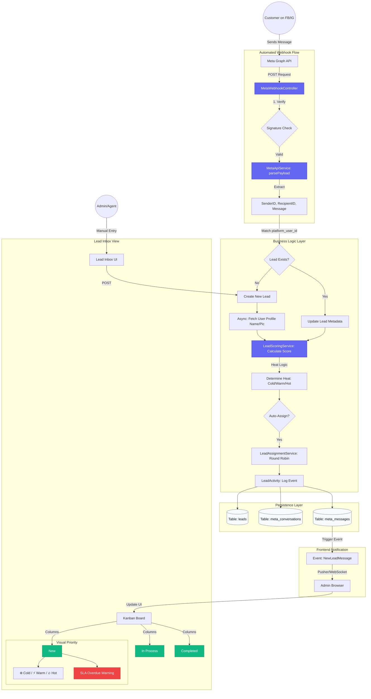

# Lead Module Audit & Improvement Plan

## 1. Flow Architecture
Below is the visualized flow of how leads are captured, processed, and displayed in the system.

---

## 2. Root Cause Analysis (Status: FIXED ✅)

The following critical issues were identified and have been resolved:

### A. Missing Configuration (Empty Meta Accounts)
The system had zero records in the `meta_accounts` table. 
- **Fix**: Added `meta_leads.settings` permission and a Setup Wizard in the UI to facilitate account connection.

### B. Inconsistent Conversation Identification
Mismatch in ID generation between Webhook and Admin Controller.
- **Fix**: Both now use a deterministic `{sender_id}_{recipient_id}` format. No more duplicate threads.

### C. Global Read Receipt Bug
Logic error marked all outgoing messages as "Read" globally.
- **Fix**: Added proper filtering by `conversation_id` in `handleReadEvent`.

### D. Redundant Scoring Logic
Duplicated logic in `Lead` model and `LeadScoringService`.
- **Fix**: Centralized all logic in `LeadScoringService`. The model now delegates to the service.

---

## 3. Applied Improvements (Real-Life User Friendly)

### 3.1 Intelligent Lead "Heat" Indicators
Leads now display visual icons in the Kanban board based on their engagement score:
- 🔥 **Hot (80+)**: Very active, needs immediate attention.
- ⚡ **Warm (40-79)**: Showing interest, needs follow-up.
- ❄️ **Cold (<40)**: Minimal engagement or old contact.

### 3.2 Automated Response Time Tracking
The system now calculates the actual average time your agents take to reply to incoming messages, giving you real performance data in the Analytics tab.

### 3.3 Quick Reply "Starter Pack"
Seeded default templates for common scenarios:
- *Greeting & Intro*
- *Price Inquiry Response*
- *Showroom Appointment Booking*
- *Customization Follow-up*

### 3.4 SLA & Priority Alerts
Visual "Overdue" badges now appear on cards that have exceeded their 24h SLA response window.
