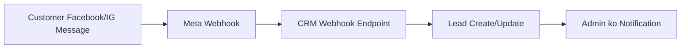

# 📱 Lead Social Integration Guide (Hinglish)

> Ye document Lead feature ke baare mein detailed guide hai jisme Facebook/Instagram accounts ko kaise connect karna hai, locally ngrok se kaise test karna hai, aur production mein aane wale common issues aur unke solutions bataye gaye hain.

---

## 📑 Table of Contents

1. [Overview - Kya Hai Ye Feature](#1-overview---kya-hai-ye-feature)
2. [Prerequisites - Pehle Kya Chahiye](#2-prerequisites---pehle-kya-chahiye)
3. [Meta Developer Account Setup](#3-meta-developer-account-setup)
4. [Local Development Setup with ngrok](#4-local-development-setup-with-ngrok)
5. [CRM Configuration](#5-crm-configuration)
6. [Social Account Connection Steps](#6-social-account-connection-steps)
7. [Testing the Integration](#7-testing-the-integration)
8. [Production Deployment](#8-production-deployment)
9. [Common Issues aur Solutions](#9-common-issues-aur-solutions)
10. [Troubleshooting Guide](#10-troubleshooting-guide)
11. [Production Data Requirements - Kahan Se Kya Lena Hai](#11-production-data-requirements---kahan-se-kya-lena-hai-)

---

## 1. Overview - Kya Hai Ye Feature

Ye Lead Management feature Facebook aur Instagram messages ko directly CRM mein capture karta hai. Jab koi customer aapke Facebook Page ya Instagram Business Account pe message karta hai, toh wo message webhook ke through CRM mein aa jaata hai aur ek naya Lead automatically create ho jaata hai.

### Kaise Kaam Karta Hai (Flow):



### Key Components:

| File                         | Kya Karta Hai                                    |
| ---------------------------- | ------------------------------------------------ |
| `MetaWebhookController.php`  | Facebook/Instagram se messages receive karta hai |
| `MetaSettingsController.php` | Social accounts ko manage karta hai              |
| `MetaApiService.php`         | Meta Graph API se communicate karta hai          |
| `LeadController.php`         | Leads ko manage karta hai (CRUD + messaging)     |
| `Lead.php`                   | Lead model with platform, status, scoring        |
| `MetaAccount.php`            | Connected accounts store karta hai               |

---

## 2. Prerequisites - Pehle Kya Chahiye

### Account Requirements:

-   ✅ **Facebook Business Account** - Personal account se nahi hoga
-   ✅ **Facebook Page** - jo business/test ke liye use karenge
-   ✅ **Meta Developer Account** - developers.facebook.com pe register
-   ✅ **Instagram Business Account** (Optional) - agar Instagram lead chahiye

### Technical Requirements:

-   ✅ PHP 8.1+ with Laravel
-   ✅ HTTPS URL (production ke liye mandatory, local ke liye ngrok use karenge)
-   ✅ ngrok installed (local testing ke liye)

### Environment Variables jo chahiye:

```env
# Meta/Facebook API Configuration
META_APP_ID=your_app_id
META_APP_SECRET=your_app_secret
META_WEBHOOK_VERIFY_TOKEN=any_custom_secure_string
```

---

## 3. Meta Developer Account Setup

### Step 1: Developer Account Create Karo

1. [developers.facebook.com](https://developers.facebook.com) pe jao
2. "Get Started" pe click karo
3. Facebook account se login karo
4. Developer agreement accept karo

### Step 2: New App Create Karo

1. Dashboard pe "Create App" button click karo
2. **App Type**: "Business" select karo
3. App name do (e.g., "My CRM Integration")
4. Business portfolio select karo (ya naya create karo)
5. "Create App" pe click karo

### Step 3: Products Add Karo

App dashboard pe jao aur ye products add karo:

1. **Messenger** - "Set Up" pe click karo
2. **Instagram Messaging** (optional) - "Set Up" pe click karo

### Step 4: App Credentials Le Lo

1. Left sidebar mein **Settings** > **Basic** pe jao
2. Note karo:
    - **App ID**
    - **App Secret** (Show button pe click karke dekho)

> ⚠️ **IMPORTANT**: App Secret ko kabhi publicly share mat karo!

### Step 5: Permissions/Scopes Configure Karo

**Messenger Settings** mein in permissions ka access lo:

-   `pages_messaging` - Messages send/receive ke liye
-   `pages_manage_metadata` - Page info access ke liye

---

## 4. Local Development Setup with ngrok

### Kyon Chahiye ngrok?

Meta webhooks ko HTTPS URL chahiye. Localhost pe HTTPS nahi hota, isliye ngrok use karte hain jo localhost ko public HTTPS URL deta hai.

### Step 1: ngrok Install Karo

**Windows ke liye:**

```powershell
# Chocolatey se
choco install ngrok

# Ya direct download
# https://ngrok.com/download se download aur extract karo
```

**ngrok Signup aur Auth:**

```powershell
# 1. ngrok.com pe signup karo (free account)
# 2. Dashboard se authtoken copy karo
# 3. Run this command:
ngrok config add-authtoken YOUR_AUTH_TOKEN
```

### Step 2: Local Laravel Server Start Karo

```powershell
cd D:\CRM-Minimal-Carbon\CRM-Minimal-Carbon
php artisan serve --port=8000
```

### Step 3: ngrok Start Karo (Nayi Terminal Mein)

```powershell
ngrok http 8000
```

### Step 4: ngrok URL Note Karo

ngrok start hone ke baad kuch aisa dikhega:

```
Forwarding    https://abc123.ngrok.io -> http://localhost:8000
```

Ye `https://abc123.ngrok.io` URL copy karo - ye aapka public webhook URL hai.

> ⚠️ **Note**: Free ngrok account mein URL har restart pe change hoti hai. Development ke liye thik hai, but production mein apni domain use karo.

### Step 5: APP_URL Update Karo (.env mein)

```env
# Local testing ke liye temporarily ngrok URL set karo
APP_URL=https://abc123.ngrok.io
```

Fir cache clear karo:

```powershell
php artisan config:clear
```

---

## 5. CRM Configuration

### Step 1: Environment Variables Set Karo

`.env` file mein ye add karo:

```env
# Meta/Facebook API Configuration
META_APP_ID=your_app_id_from_facebook
META_APP_SECRET=your_app_secret_from_facebook
META_WEBHOOK_VERIFY_TOKEN=my_crm_verify_token_123

# Make sure APP_URL is HTTPS (ngrok URL for local, domain for production)
APP_URL=https://your-domain.com
```

### Step 2: Config Files Check Karo

`config/services.php` mein ye already configured hai:

```php
'meta' => [
    'app_id' => env('META_APP_ID'),
    'app_secret' => env('META_APP_SECRET'),
    'webhook_verify_token' => env('META_WEBHOOK_VERIFY_TOKEN'),
],
```

### Step 3: Database Migrate Karo

Agar fresh setup hai:

```powershell
php artisan migrate
```

### Step 4: Cache Clear Karo

```powershell
php artisan config:clear
php artisan cache:clear
php artisan view:clear
```

---

## 6. Social Account Connection Steps

### Step 1: CRM Settings Page Open Karo

Browser mein jao: `http://localhost:8000/admin/settings/meta`

Ya production mein: `https://your-domain.com/admin/settings/meta`

### Step 2: Meta Developer Portal Mein Webhook Configure Karo

1. Meta Developer Portal pe apne app mein jao
2. **Messenger** > **Settings** pe jao
3. Webhooks section mein **Add Callback URL** pe click karo
4. Details bharo:
    - **Callback URL**: CRM settings page se copy karo (e.g., `https://abc123.ngrok.io/webhook/meta`)
    - **Verify Token**: CRM settings page se copy karo (jo `.env` mein set kiya tha)
5. **Verify and Save** pe click karo

### Step 3: Webhook Events Subscribe Karo

Webhook verify hone ke baad, in events ko subscribe karo:

-   ✅ `messages` - Customer ke messages receive ke liye
-   ✅ `message_deliveries` - Delivery status ke liye
-   ✅ `message_reads` - Read receipts ke liye

### Step 4: Page Access Token Generate Karo

1. [Graph API Explorer](https://developers.facebook.com/tools/explorer/) pe jao
2. Apne app ko select karo
3. **Add Permission** pe click karo:
    - `pages_messaging`
    - `pages_manage_metadata`
    - `pages_show_list`
4. **Generate Access Token** pe click karo
5. Facebook login popup mein page select karo
6. Token copy karo

### Step 5: CRM Mein Account Add Karo

1. CRM ke Meta Settings page pe "Add Account" pe click karo
2. Form bharo:
    - **Account Name**: Kuch bhi (e.g., "My FB Page")
    - **Platform**: Facebook ya Instagram select karo
    - **Page ID**: Facebook Page ID dalo (Page Settings > About mein milega)
    - **Access Token**: Step 4 ka token paste karo
3. **Connect Account** pe click karo

> ✅ Agar sab sahi hai toh account list mein dikhai dega with "Active" status.

---

## 7. Testing the Integration

### Local Testing (ngrok ke saath):

1. **Webhook Test karo:**

    - Meta Settings page pe "Test Webhook" button pe click karo
    - Green tick = Webhook working ✅
    - Red cross = Check settings ❌

2. **Message Send karke Test Karo:**

    - Apne Facebook Page pe jao
    - Kisi dost se (ya khud doosre account se) page pe message karo
    - CRM mein Leads page pe check karo - naya lead aa jaana chahiye

3. **ngrok Dashboard Check Karo:**
    ```
    http://127.0.0.1:4040
    ```
    Isme saare incoming webhook requests dikh jayenge. Debugging ke liye bahut helpful hai!

### Production Testing:

1. Real user se page pe message karwao
2. CRM check karo
3. Reply bhejo aur check karo recipient ko mila ya nahi

---

## 8. Production Deployment

### Step 1: Environment Variables Set Karo

Production server pe `.env` mein:

```env
APP_URL=https://your-actual-domain.com
APP_ENV=production
APP_DEBUG=false

META_APP_ID=your_app_id
META_APP_SECRET=your_app_secret
META_WEBHOOK_VERIFY_TOKEN=your_secure_token
```

### Step 2: HTTPS Certificate Ensure Karo

-   SSL certificate installed hona chahiye (Let's Encrypt bhi chalega)
-   `https://` se URL accessible hona chahiye

### Step 3: Meta App Webhook URL Update Karo

1. Meta Developer Portal pe jao
2. Webhook Callback URL update karo with production URL:
    ```
    https://your-domain.com/webhook/meta
    ```
3. Re-verify karo

### Step 4: Long-Lived Token Setup Karo

Short-lived token 1-2 hour mein expire ho jata hai. Production ke liye long-lived token use karo:

1. CRM mein account add karo
2. "Refresh Token" button regularly use karo
3. Ya cron job setup karo for auto-refresh

### Step 5: Meta App ko Live Mode Mein Dalo

Development mode mein sirf developers ko messages milte hain. Public use ke liye:

1. Meta Developer Portal pe jao
2. **App Review** pe jao
3. Required permissions ke liye submit karo:
    - `pages_messaging`
4. Review process complete hone ka wait karo
5. App Mode ko **Live** switch karo

> ⚠️ **Important**: App Review mein 1-5 days lag sakte hain

---

## 9. Common Issues aur Solutions

### Issue 1: Webhook Verification Failed ❌

**Symptoms:**

-   "Webhook verification failed" error Meta portal pe
-   Test webhook button fail

**Causes & Solutions:**

| Cause                 | Solution                                                      |
| --------------------- | ------------------------------------------------------------- |
| Verify token mismatch | `.env` mein `META_WEBHOOK_VERIFY_TOKEN` check karo            |
| URL accessible nahi   | ngrok running hai check karo, URL test karo browser mein      |
| SSL/HTTPS issue       | ngrok HTTPS URL use karo, ya production mein SSL install karo |
| Firewall blocking     | Server firewall check karo, port open karo                    |

**Debug Kaise Karo:**

```powershell
# Browser mein test karo:
https://your-url.com/webhook/meta?hub.mode=subscribe&hub.verify_token=your_token&hub.challenge=test123
# Response "test123" aana chahiye
```

### Issue 2: Messages nahi aa rahe ❌

**Symptoms:**

-   Webhook verified hai but messages CRM mein nahi aa rahe
-   Lead create nahi ho raha

**Causes & Solutions:**

| Cause                  | Solution                                                |
| ---------------------- | ------------------------------------------------------- |
| Events subscribed nahi | Messenger Settings mein `messages` event subscribe karo |
| Page connected nahi    | CRM mein account add karo with valid Page Access Token  |
| Token expired          | Refresh Token button use karo                           |
| Account inactive       | Settings mein account Active hai check karo             |

**Debug Kaise Karo:**

```powershell
# Laravel logs check karo:
# storage/logs/laravel.log mein "meta" channel logs dekho

# ngrok dashboard check karo:
http://127.0.0.1:4040
# Failed requests ka response body dekho
```

### Issue 3: Token Expired Error ❌

**Symptoms:**

-   "Invalid OAuth access token" error
-   Messages send nahi ho rahe

**Solutions:**

1. **Manual Refresh:**

    - CRM Meta Settings pe jao
    - Account ke paas "Refresh" button pe click karo

2. **Permanent Page Token (Recommended for Production):**

    ```
    # Graph API Explorer use karo:
    # 1. Short-lived token generate karo
    # 2. Is URL pe GET request karo:
    https://graph.facebook.com/oauth/access_token?grant_type=fb_exchange_token&client_id=APP_ID&client_secret=APP_SECRET&fb_exchange_token=SHORT_LIVED_TOKEN
    # 3. Response mein long-lived token milega (60 days valid)

    # 4. Permanent page token ke liye:
    https://graph.facebook.com/PAGE_ID?fields=access_token&access_token=LONG_LIVED_TOKEN
    ```

### Issue 4: Signature Verification Failed ❌

**Symptoms:**

-   "Invalid webhook signature" logs mein
-   401 response webhook pe

**Cause:** `META_APP_SECRET` galat hai

**Solution:**

```env
# .env mein sahi App Secret dalo
META_APP_SECRET=correct_app_secret_from_meta_portal
```

### Issue 5: Rate Limiting Errors ❌

**Symptoms:**

-   429 Too Many Requests error
-   Messages intermittently fail

**Solutions:**

1. CRM mein rate limiting already configured hai (`throttle:meta-api` middleware)
2. Agar phir bhi issue ho:
    ```env
    # .env mein rate limits adjust karo (optional)
    LEAD_META_RATE_LIMIT=60
    ```

### Issue 6: ngrok URL Change Ho Gaya ❌

**Symptoms:**

-   Webhook stop working after ngrok restart
-   Verification fail

**Solution:**

-   ngrok restart karne ke baad:
    1. Naya URL copy karo
    2. `.env` mein `APP_URL` update karo
    3. `php artisan config:clear` run karo
    4. Meta Portal mein webhook URL update karo

**Pro Tip:** ngrok paid plan mein static URL milta hai jo change nahi hota.

---

## 10. Troubleshooting Guide

### Logs Kahan Dekhe:

1. **Laravel Logs:**

    ```
    storage/logs/laravel.log
    ```

2. **Meta-specific Logs:**

    ```php
    // Code mein Log::channel('meta') use ho raha hai
    // Custom log channel add kar sakte ho config/logging.php mein
    ```

3. **ngrok Dashboard:**
    ```
    http://127.0.0.1:4040
    ```

### Quick Diagnostic Commands:

```powershell
# 1. Check if webhook route exists
php artisan route:list | findstr webhook

# 2. Test Meta API connection
php artisan tinker
>>> $account = \App\Models\MetaAccount::first();
>>> $account?->decrypted_token ? "Token exists" : "No token";

# 3. Check config values
php artisan tinker
>>> config('services.meta')
```

### Production Checklist:

-   [ ] `APP_URL` is HTTPS with correct domain
-   [ ] `META_APP_ID` set correctly
-   [ ] `META_APP_SECRET` set correctly
-   [ ] `META_WEBHOOK_VERIFY_TOKEN` set correctly
-   [ ] SSL certificate valid
-   [ ] Webhook URL verified in Meta Portal
-   [ ] Required events subscribed (`messages`, `message_deliveries`, `message_reads`)
-   [ ] Page Access Token valid (not expired)
-   [ ] Meta Account added in CRM and Active
-   [ ] App is in Live mode (for public use)
-   [ ] App Review completed for required permissions

### Support Resources:

-   [Meta for Developers Documentation](https://developers.facebook.com/docs/messenger-platform)
-   [Graph API Explorer](https://developers.facebook.com/tools/explorer/)
-   [Webhook Debugger](https://developers.facebook.com/tools/debug/webhooks/)
-   [ngrok Documentation](https://ngrok.com/docs)

---

## 11. Production Data Requirements - Kahan Se Kya Lena Hai 📋

### .env File Mein Required Variables:

```env
# ========================================
# META/FACEBOOK CONFIGURATION (REQUIRED)
# ========================================

META_APP_ID=1174215157813551
META_APP_SECRET=xxxxxxxxxxxxxxxxxxxxxxxxxxxxxxxx
META_WEBHOOK_VERIFY_TOKEN=minimalcarbon_webhook_2026

# ========================================
# APP URL (PRODUCTION DOMAIN)
# ========================================
APP_URL=https://your-production-domain.com
```

---

### Data Kahan Se Lena Hai (Complete Table):

| Variable/Data                 | Kahan Se Milega            | Steps                                                                |
| ----------------------------- | -------------------------- | -------------------------------------------------------------------- |
| **META_APP_ID**               | Facebook Developer Console | `My Apps` → App Select → `App ID` (top bar mein dikhega)             |
| **META_APP_SECRET**           | Facebook Developer Console | `App Settings` → `Basic` → `App Secret` (Show pe click karo)         |
| **META_WEBHOOK_VERIFY_TOKEN** | Khud Generate Karo         | Koi bhi random secure string likho (jaise `mycrm_secure_token_2026`) |
| **Page ID**                   | Facebook Page Settings     | Page pe jao → `About` → `Page ID` copy karo                          |
| **Page Access Token**         | Graph API Explorer         | `developers.facebook.com/tools/explorer` pe generate karo            |
| **Webhook URL**               | Tumhara Server             | `https://your-domain.com/webhook/meta`                               |

---

### Step-by-Step: Production Ke Liye Data Collect Karo

#### 1️⃣ META_APP_ID Kaise Le:

```
Location: developers.facebook.com → My Apps → [Your App]
Position: Top bar mein "App ID: XXXXXXXXXXXX" dikhega
Example: 1174215157813551
```

#### 2️⃣ META_APP_SECRET Kaise Le:

```
Location: developers.facebook.com → My Apps → [Your App]
         → Settings (left menu) → Basic
Position: "App Secret" field → "Show" button click karo
Example: a1b2c3d4e5f6g7h8i9j0k1l2m3n4o5p6
```

> ⚠️ **WARNING:** App Secret KABHI publicly share mat karo! Ye .env mein hi rakho.

#### 3️⃣ META_WEBHOOK_VERIFY_TOKEN Kaise Banao:

```
Khud generate karo - koi bhi random string
Example: minimalcarbon_webhook_2026
         my_crm_verify_abc123
         secure_token_xyz789

Note: Same token Facebook Console aur .env dono mein hona chahiye!
```

#### 4️⃣ Page ID Kaise Le:

```
Option 1: Facebook Page Settings se
- Page pe jao → About tab → Page ID

Option 2: URL se
- facebook.com/your-page pe jao
- Page ID URL mein ya "About" section mein milegi

Option 3: Meta Business Suite se
- business.facebook.com → Accounts → Pages → Page select karo
- Page ID visible hogi
```

#### 5️⃣ Page Access Token Kaise Generate Karo:

```
Location: developers.facebook.com/tools/explorer/

Steps:
1. "Meta App" dropdown mein apna app select karo
2. "User or Page" dropdown mein "Get Page Access Token" select karo
3. Permissions add karo:
   - pages_messaging
   - pages_manage_metadata
   - pages_show_list
   - pages_read_engagement
4. "Generate Access Token" pe click karo
5. Login popup mein Page select karo aur permissions allow karo
6. Token copy karo (bahut lamba hoga)
```

---

### CRM Meta Settings Page Mein Kya Fill Karna Hai:

| Field            | Value                         | Kahan Se           |
| ---------------- | ----------------------------- | ------------------ |
| **Account Name** | "My Facebook Page" (kuch bhi) | Apna naam do       |
| **Platform**     | Facebook ya Instagram         | Dropdown se select |
| **Page ID**      | 123456789012345               | Step 4 se          |
| **Access Token** | EAAG...xyz                    | Step 5 se          |

---

### Production Webhook URL:

```
Format: https://[YOUR-DOMAIN]/webhook/meta

Examples:
- https://crm.minimalcarbon.com/webhook/meta
- https://app.yourcompany.com/webhook/meta
- https://leads.example.com/webhook/meta
```

---

### Facebook Console Mein Kya Configure Karna Hai:

| Setting               | Location        | Value                                        |
| --------------------- | --------------- | -------------------------------------------- |
| **Callback URL**      | Webhooks Page   | `https://your-domain.com/webhook/meta`       |
| **Verify Token**      | Webhooks Page   | Same as `META_WEBHOOK_VERIFY_TOKEN` in .env  |
| **Subscribed Events** | Webhooks → Page | `messages`, `leadgen`, `messaging_postbacks` |

---

### Final Checklist - Production Setup:

```
.env File:
[ ] META_APP_ID = Facebook App ID
[ ] META_APP_SECRET = Facebook App Secret
[ ] META_WEBHOOK_VERIFY_TOKEN = Your custom token
[ ] APP_URL = https://your-production-domain.com

Facebook Developer Console:
[ ] Webhook Callback URL configured
[ ] Verify Token matched with .env
[ ] Events subscribed: messages, leadgen, messaging_postbacks
[ ] Facebook Page connected to App
[ ] App in "Live" mode (not Development)

CRM Meta Settings (/admin/settings/meta):
[ ] Meta Account added with Page ID
[ ] Valid Access Token connected
[ ] Account status: Active
```

---

## Quick Reference Card

### Important URLs:

| Purpose               | URL                                             |
| --------------------- | ----------------------------------------------- |
| Meta Developer Portal | https://developers.facebook.com                 |
| Graph API Explorer    | https://developers.facebook.com/tools/explorer/ |
| CRM Meta Settings     | `/admin/settings/meta`                          |
| CRM Leads Page        | `/admin/leads`                                  |
| Webhook Endpoint      | `/webhook/meta`                                 |

### Environment Variables:

```env
META_APP_ID=____________
META_APP_SECRET=____________
META_WEBHOOK_VERIFY_TOKEN=____________
APP_URL=https://____________
```

### Common Commands:

```powershell
# Start local server
php artisan serve --port=8000

# Start ngrok
ngrok http 8000

# Clear config
php artisan config:clear

# Check logs
Get-Content storage/logs/laravel.log -Tail 50
```

---

> 📝 **Document Version**: 1.0  
> **Last Updated**: January 2026  
> **Author**: Development Team

Agar koi question ya issue ho toh team mein discuss karo ya GitHub issues check karo! 🚀
