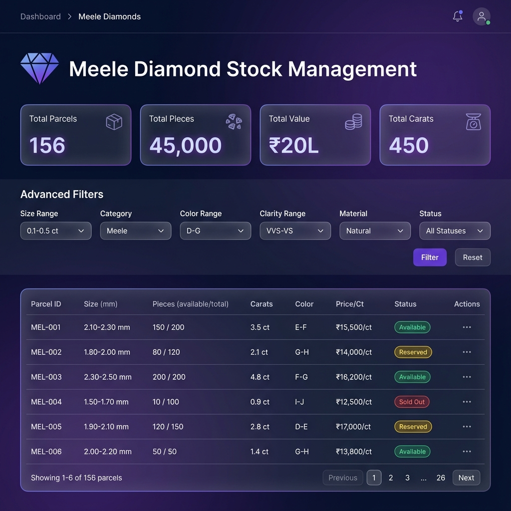
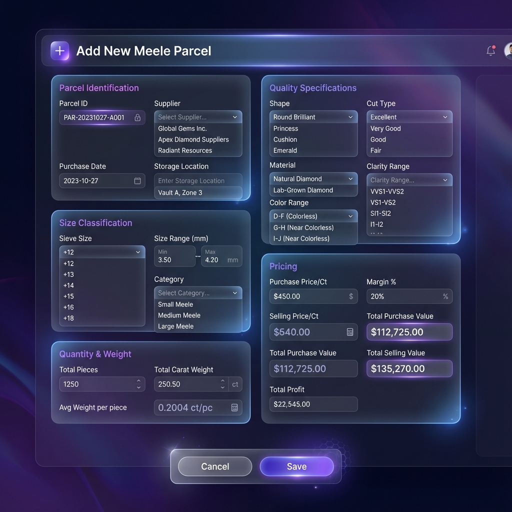
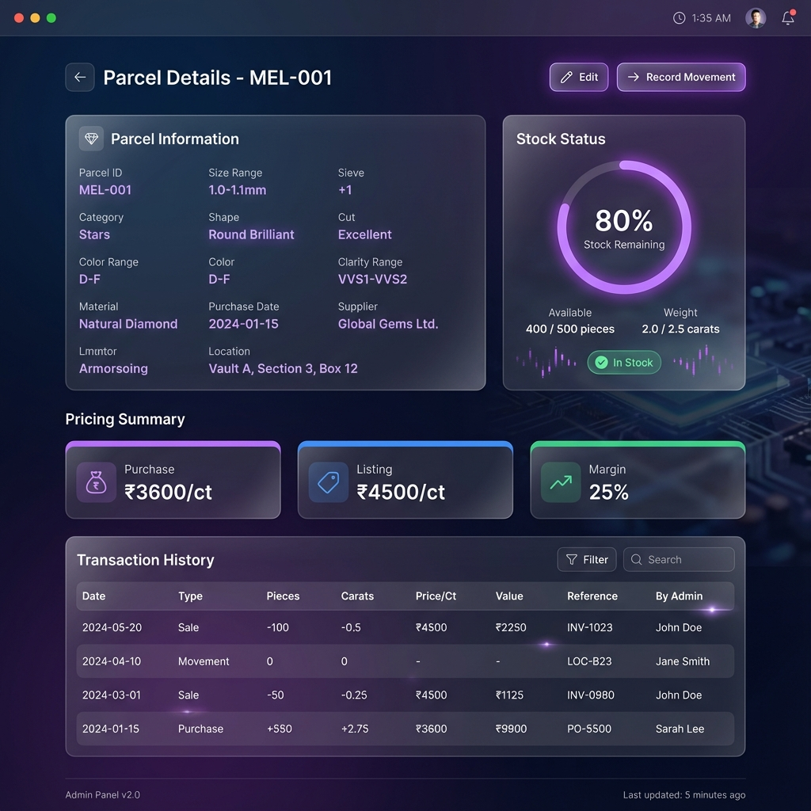
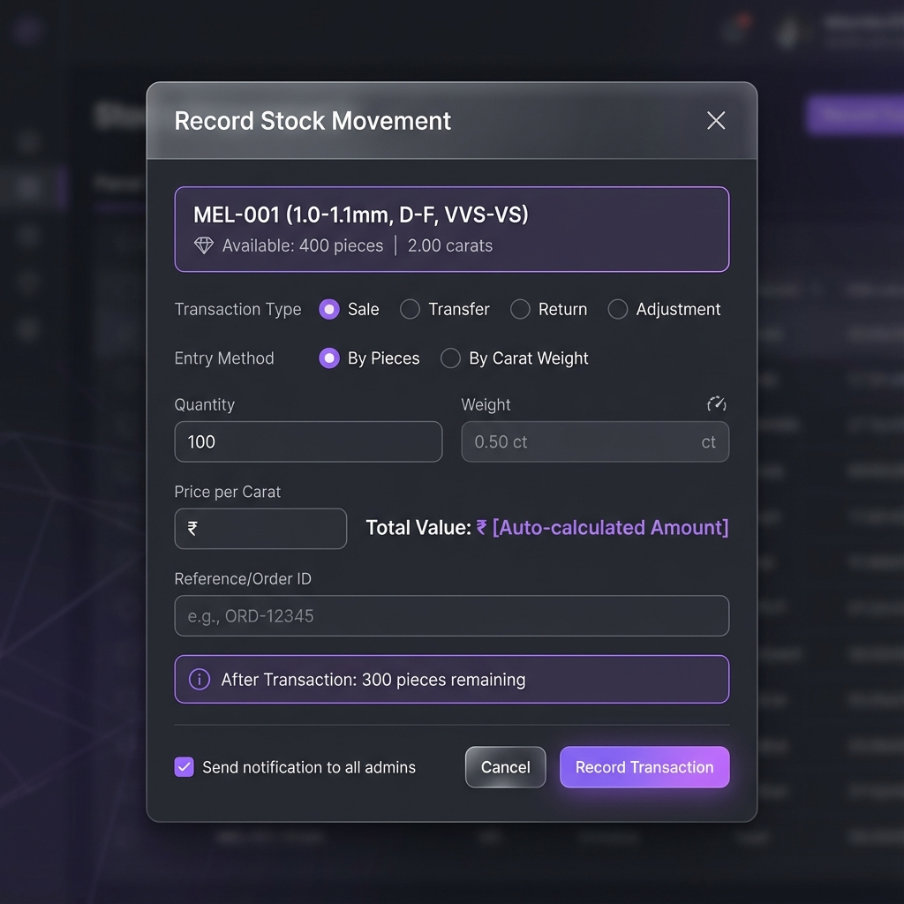
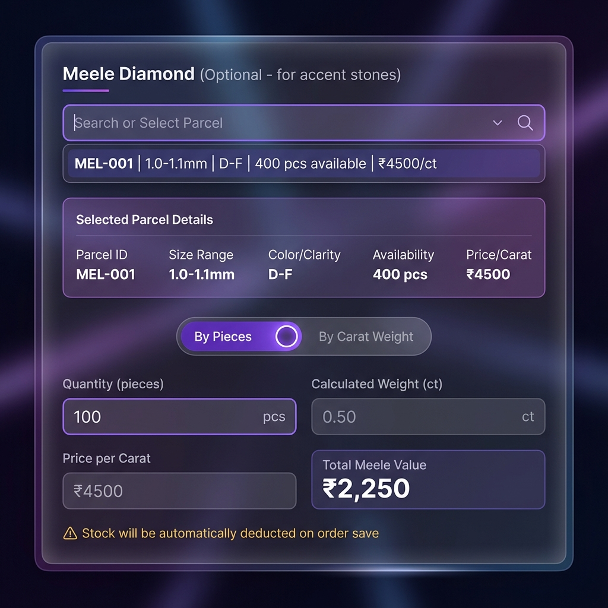
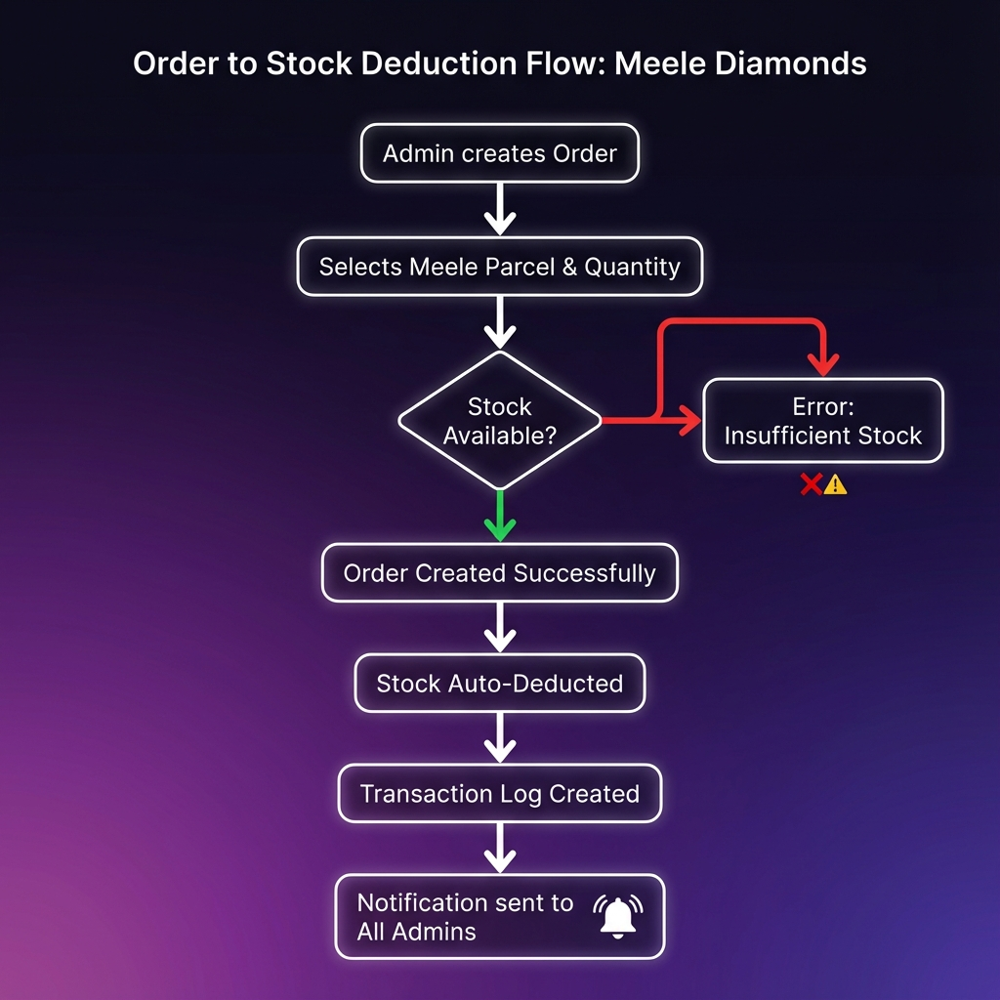

# 💎 Meele Diamond Stock Management Module

> **Document Version:** 1.0  
> **Date:** January 8, 2026  
> **Project:** CRM-Minimal-Carbon  
> **Author:** Development Team

---

## 📋 Table of Contents

1. [Overview](#overview)
2. [Meele Diamond Kya Hai?](#meele-diamond-kya-hai)
3. [Key Features](#key-features)
4. [UI Screens](#ui-screens)
5. [Order Integration Flow](#order-integration-flow)
6. [Database Schema](#database-schema)
7. [Technical Implementation](#technical-implementation)
8. [Implementation Timeline](#implementation-timeline)

---

## Overview

Yeh document **Meele Diamond Stock Management Module** ka complete specification hai. Isme bataya gaya hai ki:

-   Meele diamonds ka stock kaise manage hoga
-   Order ke saath integration kaise hoga
-   Sabhi admins ko notifications kaise jayenge
-   Database structure kya hogi

---

## Meele Diamond Kya Hai?

**Meele (Melee) diamonds** chote diamonds hote hain jo typically **0.2 carat se kam** ke hote hain (0.6mm - 4mm diameter). Ye jewellery mein **accent stones** ke taur par use hote hain - side mein ya halo mein lagane ke liye.

### Solitaire vs Meele - Main Farak

| Aspect       | Solitaire Diamond (Current Module)       | Meele Diamond (New Module)                    |
| ------------ | ---------------------------------------- | --------------------------------------------- |
| **Tracking** | Individual stones (1 record = 1 diamond) | **Parcels** (1 record = bahut saare diamonds) |
| **Weight**   | Exact carat weight per stone             | **Total weight** + **Piece count**            |
| **Size**     | Exact mm measurement                     | **Sieve size** / **MM range**                 |
| **Pricing**  | Per stone basis                          | **Per carat** basis                           |
| **Stock**    | Binary (In Stock / Sold)                 | **Quantity-based** (partial sale possible)    |

### Size Classification Chart

| Sieve Size | MM Range       | Avg Carat | Category            |
| ---------- | -------------- | --------- | ------------------- |
| 000        | 0.80 - 0.90 mm | 0.003 ct  | Stars (bahut chote) |
| 00         | 0.90 - 1.00 mm | 0.004 ct  | Stars               |
| 0          | 1.00 - 1.10 mm | 0.005 ct  | Stars               |
| +1         | 1.10 - 1.20 mm | 0.006 ct  | Stars               |
| +2         | 1.20 - 1.30 mm | 0.008 ct  | Meele (medium)      |
| +3         | 1.30 - 1.40 mm | 0.010 ct  | Meele               |
| +4         | 1.40 - 1.50 mm | 0.012 ct  | Meele               |
| +5         | 1.50 - 1.70 mm | 0.015 ct  | Meele               |
| +6         | 1.70 - 1.90 mm | 0.020 ct  | Meele               |
| +7         | 1.90 - 2.00 mm | 0.030 ct  | Meele (bade)        |
| -7         | 2.00 - 2.10 mm | 0.035 ct  | Coarse Meele        |
| -6         | 2.10 - 2.20 mm | 0.040 ct  | Coarse Meele        |
| -5         | 2.20 - 2.50 mm | 0.050 ct  | Coarse Meele        |
| -4         | 2.50 - 2.70 mm | 0.060 ct  | Coarse Meele        |

---

## Key Features

| Feature                      | Description                                           |
| ---------------------------- | ----------------------------------------------------- |
| 📦 **Parcel-based Tracking** | Stock parcels mein track hoga, individual stones nahi |
| 🔢 **Quantity Management**   | Pieces + Carat dono track honge                       |
| ✂️ **Partial Sales**         | Parcel ka kuch portion bhi bech sakte ho              |
| 🔗 **Order Integration**     | Order mein meele select → auto stock deduct           |
| 🔔 **Notifications**         | Sabhi admins ko stock movement notification           |
| 📜 **Transaction Log**       | Complete history of all movements                     |
| ⚠️ **Low Stock Alert**       | Threshold se neeche jaane par warning                 |
| 📊 **Import/Export**         | Excel se bulk data management                         |

---

## UI Screens

### 1. Stock List Page (Index)

Main dashboard jahan sabhi meele parcels dikhenge with stats aur filters.



**Features:**

-   **Stats Cards:** Total Parcels, Pieces, Value, Carats
-   **Advanced Filters:** Size, Category, Color, Clarity, Material, Status
-   **Data Table:** Parcel ID, Size, Pieces (available/total), Carats, Color, Price/Ct, Status
-   **Status Pills:** 🟢 Available, 🟡 Reserved, 🔴 Sold Out
-   **Actions:** View, Edit, Record Movement

---

### 2. Add/Edit Parcel Form

Naya parcel add karne ya existing edit karne ka form.



**Form Sections:**

1. **Parcel Identification:** Parcel ID (auto-generated), Supplier, Purchase Date, Storage Location
2. **Size Classification:** Sieve Size, Size Range (mm), Category
3. **Quantity & Weight:** Total Pieces, Total Carat Weight, Avg Weight/Piece (auto)
4. **Quality Specifications:** Shape, Cut Type, Material, Color Range, Clarity Range
5. **Pricing:** Purchase Price/Ct, Margin %, Selling Price/Ct (auto), Total Values

---

### 3. Parcel Detail View

Ek parcel ki complete details with transaction history.



**Sections:**

-   **Parcel Information:** Saari specifications
-   **Stock Status:** Circular progress bar showing remaining stock %
-   **Pricing Summary:** Purchase, Listing, Margin cards
-   **Transaction History:** Complete log of all stock movements

---

### 4. Stock Movement Modal

Manual stock movement record karne ke liye modal (Sale, Transfer, Return, Adjustment).



**Features:**

-   Transaction Type selection (Sale, Transfer, Return, Adjustment)
-   Entry Method: By Pieces or By Carat Weight
-   Auto-calculation of weight/pieces
-   Reference/Order ID linking
-   "After Transaction" preview
-   Notification checkbox

---

### 5. Order Form - Meele Selection

Order form mein Meele Diamond section.



**Features:**

-   Searchable parcel dropdown
-   Selected parcel details card
-   Entry method toggle (Pieces / Carat)
-   Auto-calculated values
-   Warning: "Stock will be automatically deducted"

---

## Order Integration Flow

Jab Order create hota hai aur usme Meele Diamond use hota hai:



### Step-by-Step Process:

1. **Admin Order Create Karta Hai**

    - Order form mein jaata hai

2. **Meele Parcel Select Karta Hai**

    - Dropdown se parcel choose karta hai
    - Quantity (pieces) ya Carat weight enter karta hai

3. **System Validates Stock**

    - Available quantity >= Requested quantity?
    - ❌ **NO** → Error message: "Insufficient stock in parcel MEL-XXX"
    - ✅ **YES** → Continue to step 4

4. **Order Successfully Created**

    - Order database mein save hota hai

5. **Stock Auto-Deducted**

    - `available_pieces -= ordered_pieces`
    - `available_carat -= ordered_carat`
    - Status auto-update (in_stock → low_stock → out_of_stock)

6. **Transaction Log Created**

    - `meele_transactions` table mein record
    - Type: 'sale', Reference: order_id

7. **Notification to All Admins**
    - "Meele Parcel MEL-001 se 100pcs (0.5ct) bika - Order #ORD-123"
    - Real-time notification via database + broadcast

---

## Database Schema

### Table 1: `meele_diamonds`

Main table for storing meele diamond parcels.

```sql
CREATE TABLE meele_diamonds (
    -- IDENTIFICATION
    id                  BIGINT PRIMARY KEY AUTO_INCREMENT,
    parcel_id           VARCHAR(50) UNIQUE NOT NULL,    -- "MEL-2026-001"

    -- SIZE CLASSIFICATION
    sieve_size          VARCHAR(20),                    -- "+2", "-7", etc.
    size_mm_min         DECIMAL(4,2),                   -- 0.80
    size_mm_max         DECIMAL(4,2),                   -- 0.90
    size_category       ENUM('stars', 'meele', 'coarse_meele'),

    -- QUANTITY & WEIGHT
    total_pieces        INT NOT NULL,                   -- Total pieces in parcel
    available_pieces    INT NOT NULL,                   -- Current available
    total_carat_weight  DECIMAL(10,4) NOT NULL,         -- Total weight
    available_carat     DECIMAL(10,4) NOT NULL,         -- Available weight

    -- QUALITY GRADES
    cut                 VARCHAR(50),                    -- Full Cut / Single Cut    
    shape               VARCHAR(50),                    -- Round / Princess
    color_range         VARCHAR(20),                    -- "D-F", "G-H"
    clarity_range       VARCHAR(20),                    -- "VVS-VS"
    material            VARCHAR(50),                    -- Natural / Lab-grown

    -- PRICING
    purchase_price_per_ct    DECIMAL(12,2),
    listing_price_per_ct     DECIMAL(12,2),
    margin                   DECIMAL(5,2),
    total_purchase_value     DECIMAL(15,2),
    total_listing_value      DECIMAL(15,2),

    -- LIFECYCLE
    purchase_date            DATE,
    supplier                 VARCHAR(100),
    location                 VARCHAR(100),              -- Vault/Tray location

    -- STATUS
    status               ENUM('in_stock', 'low_stock', 'out_of_stock', 'reserved'),
    low_stock_threshold  INT DEFAULT 50,                -- Alert threshold

    -- TRACKING
    admin_id             BIGINT,                        -- Assigned admin
    note                 TEXT,
    images               JSON,

    created_at           TIMESTAMP,
    updated_at           TIMESTAMP,
    deleted_at           TIMESTAMP,                     -- Soft delete

    FOREIGN KEY (admin_id) REFERENCES admins(id)
);
```

### Table 2: `meele_transactions`

Log table for all stock movements.

```sql
CREATE TABLE meele_transactions (
    id                  BIGINT PRIMARY KEY AUTO_INCREMENT,
    meele_diamond_id    BIGINT NOT NULL,
    transaction_type    ENUM('purchase', 'sale', 'transfer', 'adjustment', 'return'),
    pieces              INT,                            -- + for add, - for deduct
    carat_weight        DECIMAL(10,4),
    price_per_ct        DECIMAL(12,2),
    total_value         DECIMAL(15,2),
    reference_type      VARCHAR(50),                    -- 'order', 'invoice', 'manual'
    reference_id        BIGINT,                         -- Order/Invoice ID
    notes               TEXT,
    created_by          BIGINT,
    created_at          TIMESTAMP,

    FOREIGN KEY (meele_diamond_id) REFERENCES meele_diamonds(id),
    FOREIGN KEY (created_by) REFERENCES admins(id)
);
```

### Table 3: Orders Table Update

Existing `orders` table mein naye columns:

```sql
ALTER TABLE orders ADD COLUMN meele_diamond_id BIGINT NULL;
ALTER TABLE orders ADD COLUMN meele_pieces INT NULL;
ALTER TABLE orders ADD COLUMN meele_carat DECIMAL(10,4) NULL;
ALTER TABLE orders ADD COLUMN meele_price_per_ct DECIMAL(12,2) NULL;
ALTER TABLE orders ADD COLUMN meele_total_value DECIMAL(12,2) NULL;
ALTER TABLE orders ADD FOREIGN KEY (meele_diamond_id) REFERENCES meele_diamonds(id);
```

---

## Technical Implementation

### File Structure

```
app/
├── Models/
│   ├── MeeleDiamond.php              [NEW]
│   └── MeeleTransaction.php          [NEW]
├── Http/Controllers/
│   └── MeeleDiamondController.php    [NEW]
├── Notifications/
│   └── MeeleStockDeductedNotification.php  [NEW]

database/migrations/
├── create_meele_diamonds_table.php       [NEW]
├── create_meele_transactions_table.php   [NEW]
└── add_meele_columns_to_orders_table.php [NEW]

resources/views/
├── meele-diamonds/
│   ├── index.blade.php           [NEW]
│   ├── create.blade.php          [NEW]
│   ├── edit.blade.php            [NEW]
│   ├── show.blade.php            [NEW]
│   └── partials/
│       └── _transaction-modal.blade.php  [NEW]
├── orders/partials/
│   └── _meele_section.blade.php  [NEW]
```

### Routes

```php
Route::prefix('meele-diamonds')->name('meele.')->group(function () {
    Route::get('/', 'index')->name('index');
    Route::get('/create', 'create')->name('create');
    Route::post('/', 'store')->name('store');
    Route::get('/{id}', 'show')->name('show');
    Route::get('/{id}/edit', 'edit')->name('edit');
    Route::put('/{id}', 'update')->name('update');
    Route::delete('/{id}', 'destroy')->name('destroy');
    Route::post('/{id}/transaction', 'recordTransaction')->name('transaction');
    Route::post('/import', 'import')->name('import');
    Route::get('/export', 'export')->name('export');
});
```

### Permissions

| Permission Key               | Description                |
| ---------------------------- | -------------------------- |
| `meele_diamonds.view`        | Meele Stock Dekho          |
| `meele_diamonds.create`      | Naya Parcel Add Karo       |
| `meele_diamonds.edit`        | Parcel Edit Karo           |
| `meele_diamonds.delete`      | Parcel Delete Karo         |
| `meele_diamonds.transaction` | Stock Movement Record Karo |
| `meele_diamonds.import`      | Excel Import               |
| `meele_diamonds.export`      | Excel Export               |

---

## Implementation Timeline

| Phase       | Tasks                               | Duration |
| ----------- | ----------------------------------- | -------- |
| **Phase 1** | Database migrations + Models        | Day 1    |
| **Phase 2** | Controller + Routes + Permissions   | Day 1-2  |
| **Phase 3** | Views (index, create, edit, show)   | Day 2-3  |
| **Phase 4** | Order Integration + Stock Deduction | Day 3    |
| **Phase 5** | Notifications System                | Day 3    |
| **Phase 6** | Import/Export Excel                 | Day 4    |
| **Phase 7** | Testing + UI Polish                 | Day 4    |

**Total Estimated Time:** 4 Days

---

## Appendix

### Notification Format

```
📦 Meele Diamond Stock Update

Title: "Meele Stock Deducted"
Message: "100 pieces (0.50 ct) from Parcel MEL-001 used in Order #ORD-123"

Details:
├── Parcel: MEL-001 (1.0-1.1mm, D-F)
├── Quantity: 100 pieces
├── Weight: 0.50 ct
├── Value: ₹2,250
├── Remaining: 300 pcs / 1.50 ct
└── By: Admin Name
```

### Low Stock Threshold Logic

```php
// After each transaction
if ($parcel->available_pieces <= $parcel->low_stock_threshold) {
    $parcel->status = 'low_stock';
}

if ($parcel->available_pieces == 0) {
    $parcel->status = 'out_of_stock';
}
```

---

> **Note:** Yeh document implementation guide hai. Actual implementation mein minor changes ho sakte hain based on requirements.

---

**Document End** | CRM-Minimal-Carbon | Meele Diamond Module v1.0
