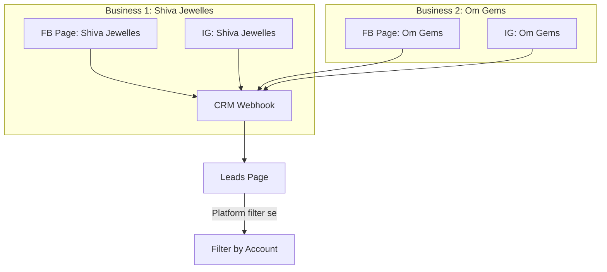

# 🏢 Multi-Account Lead Integration Guide (Hinglish)

> Ye document multiple Facebook/Instagram accounts (jaise Shiva Jewelles, Om Gems, etc.) ko CRM Lead system se connect karne ka complete guide hai.

---

## 📑 Table of Contents

1. [Overview - Multi Account Kya Hai](#1-overview---multi-account-kya-hai)
2. [Current Architecture - System Kaise Kaam Karta Hai](#2-current-architecture---system-kaise-kaam-karta-hai)
3. [Multiple Accounts Add Karne Ka Process](#3-multiple-accounts-add-karne-ka-process)
4. [Step-by-Step: Second Account Add Karo](#4-step-by-step-second-account-add-karo)
5. [Important Points - Yaad Rakhne Wali Baatein](#5-important-points---yaad-rakhne-wali-baatein)
6. [Common Issues aur Solutions](#6-common-issues-aur-solutions)
7. [Production Checklist](#7-production-checklist)

---

## 1. Overview - Multi Account Kya Hai

CRM system already **multiple accounts** support karta hai. Matlab tum ek se zyada Facebook Pages aur Instagram Business Accounts connect kar sakte ho:

```
Example Setup:
├── Shiva Jewelles (Facebook Page) ✅ Connected
├── Shiva Jewelles (Instagram Business) ✅ Connected
├── Om Gems (Facebook Page) → Add karenge
├── Om Gems (Instagram Business) → Add karenge
└── Any other business...
```

### Kaise Kaam Karega:



**Key Point:** Ek hi webhook URL (`/webhook/meta`) saare accounts ke messages receive karega, system automatically detect karega ki message kis Page/Account se aaya hai.

---

## 2. Current Architecture - System Kaise Kaam Karta Hai

### Database Structure:

`meta_accounts` table multiple accounts store karti hai:

| Column             | Description                              |
| ------------------ | ---------------------------------------- |
| `id`               | Auto ID                                  |
| `account_name`     | Display name (jaise "Shiva Jewelles FB") |
| `platform`         | `facebook` ya `instagram`                |
| `page_id`          | Facebook Page ID ya Instagram Account ID |
| `access_token`     | Encrypted Page Access Token              |
| `is_active`        | Account active hai ya nahi               |
| `token_expires_at` | Token expiry date                        |

### Message Flow:

```
1. Customer message karta hai → Shiva Jewelles FB Page pe
2. Meta Webhook fire hota hai → CRM ko payload milta hai
3. Payload mein Page ID hota hai → System match karti hai `meta_accounts` se
4. Lead create hoti hai with correct platform info
5. Admin Lead page pe dekh sakta hai
```

---

## 3. Multiple Accounts Add Karne Ka Process

### Prerequisites Har Account Ke Liye:

Har business account ke liye tumhe ye chahiye:

| Requirement                               | Kahan Se Milega                      |
| ----------------------------------------- | ------------------------------------ |
| **Facebook Page ID**                      | Page Settings > About > Page ID      |
| **Page Access Token**                     | Graph API Explorer se generate       |
| **Instagram Business Account** (optional) | Facebook Page se linked hona chahiye |

### Important: Ek Meta App - Multiple Pages

> ⚠️ **Tum ek hi Meta App use kar sakte ho saare pages ke liye!**

Matlab:

-   `.env` mein same `META_APP_ID` aur `META_APP_SECRET` rahega
-   Same `META_WEBHOOK_VERIFY_TOKEN` rahega
-   Sirf har page ka alag **Page Access Token** aur **Page ID** chahiye

---

## 4. Step-by-Step: Second Account Add Karo

### Example: Om Gems Facebook Page Add Karna

#### Step 1: Page ID Nikalo

```
1. Facebook pe Om Gems Page pe jao
2. Page Settings > About pe jao
3. "Page ID" copy karo (e.g., 987654321012345)
```

#### Step 2: Page Access Token Generate Karo

```
1. https://developers.facebook.com/tools/explorer/ pe jao
2. Apna existing Meta App select karo (jo Shiva Jewelles ke liye use kiya)
3. "User or Page" dropdown mein "Get Page Access Token" select karo
4. Login popup mein:
   - ✅ Shiva Jewelles (pehle se selected hai)
   - ✅ Om Gems (naya select karo) ← YE IMPORTANT HAI
5. "Generate Access Token" pe click karo
6. Dropdown mein ab "Om Gems" page select karo
7. Token copy karo
```

> 💡 **Pro Tip:** Graph API Explorer mein Page dropdown se correct page select karna mat bhoolna, nahi toh galat token generate hoga!

#### Step 3: CRM Mein Account Add Karo

```
1. CRM open karo: /admin/settings/meta
2. "Add New Account" button pe click karo
3. Form bharo:
   - Account Name: "Om Gems Facebook"
   - Platform: Facebook
   - Page ID: 987654321012345
   - Access Token: [Step 2 ka token paste karo]
4. "Connect Account" pe click karo
```

#### Step 4: Page Ko App Se Connect Karo (Facebook Console)

```
1. developers.facebook.com pe jao
2. Apne App mein jao > Messenger > Settings
3. "Access Tokens" section mein:
   - "Add or Remove Pages" pe click karo
   - Om Gems page ko bhi add karo
4. Ab Om Gems page webhooks receive kar payegi
```

> ⚠️ **CRITICAL:** Agar Step 4 skip kar diya toh messages nahi aayenge!

#### Step 5: Verify Karo

```
1. Kisi se Om Gems page pe message karwao
2. CRM Leads page check karo
3. Naya lead aana chahiye with "Om Gems" source
```

---

## 5. Important Points - Yaad Rakhne Wali Baatein

### ✅ What Works Automatically:

| Feature             | Description                                                        |
| ------------------- | ------------------------------------------------------------------ |
| **Webhook Sharing** | Ek webhook URL saare accounts ke liye kaam karega                  |
| **Auto Detection**  | System automatically pata laga legi ki message kis account se aaya |
| **Lead Creation**   | Har message ke liye correct platform/source ke saath lead banega   |
| **Reply**           | Sahi account se reply jayega customer ko                           |

### ⚠️ Har Account Ke Liye Zaroor Karo:

| Action                      | Why Important                     |
| --------------------------- | --------------------------------- |
| Page ko App se connect karo | Nahi toh webhooks nahi aayenge    |
| Correct Page Token use karo | Galat token = galat page se reply |
| Token refresh karo          | Tokens expire hote hain           |

### 🔑 Access Token Rules:

```
1 Page = 1 Unique Page Access Token

Example:
├── Shiva Jewelles FB → Token: EAAG...abc (unique)
├── Shiva Jewelles IG → Token: EAAG...def (unique)
├── Om Gems FB → Token: EAAG...ghi (unique)
└── Om Gems IG → Token: EAAG...jkl (unique)
```

---

## 6. Common Issues aur Solutions

### Issue 1: Naya Account add kiya but messages nahi aa rahe

**Problem:** Om Gems ka account CRM mein add kiya but messages nahi dikhte

**Solutions:**

| Check                      | Action                                                                           |
| -------------------------- | -------------------------------------------------------------------------------- |
| Page App se connected hai? | Facebook Console > Messenger > Settings > Access Tokens mein page dikhna chahiye |
| Webhook events subscribed? | `messages` event tick hona chahiye page ke liye                                  |
| Token sahi hai?            | Graph API Explorer se verify karo                                                |
| Account Active hai?        | CRM Settings mein green toggle check karo                                        |

### Issue 2: Reply galat account se ja raha hai

**Problem:** Customer ko reply kiya but galat business name se gaya

**Solution:**

```
1. Lead details check karo - platform_id sahi hai?
2. MetaAccount table mein page_id match karo
3. Agar mismatch hai toh account delete karke dobara add karo with correct Page ID
```

### Issue 3: Token Expired for one account

**Problem:** Ek account ka token expire ho gaya, doosre kaam kar rahe

**Solution:**

```
1. CRM Settings > Meta pe jao
2. Expired account ke paas "Refresh" button click karo
3. Agar refresh fail ho toh naya token generate karo (Step 2 follow karo)
```

### Issue 4: Instagram messages nahi aa rahe

**Problem:** Facebook messages aa rahe but Instagram ke nahi

**Solutions:**

```
1. Instagram Business Account Facebook Page se linked hona chahiye
2. Instagram Messaging product Meta App mein enabled hona chahiye
3. Alag se Instagram account CRM mein add karo with:
   - Platform: instagram
   - Page ID: Instagram Account ID (not Page ID)
   - Access Token: Page Access Token (same page ka)
```

---

## 7. Production Checklist

### Har Naye Account Ke Liye:

```
[ ] Facebook Page ID collected
[ ] Page Access Token generated (Graph API Explorer se)
[ ] Token tested with correct page selected
[ ] Account added in CRM (/admin/settings/meta)
[ ] Page connected to App (Facebook Console > Messenger > Settings)
[ ] Webhook events subscribed for page
[ ] Test message sent and lead created
[ ] Reply functionality tested
```

### Multi-Account Setup Table:

| Account Name      | Platform  | Page ID | Token Status | Webhook | Status |
| ----------------- | --------- | ------- | ------------ | ------- | ------ |
| Shiva Jewelles FB | Facebook  | 123...  | ✅ Valid     | ✅      | Active |
| Shiva Jewelles IG | Instagram | 456...  | ✅ Valid     | ✅      | Active |
| Om Gems FB        | Facebook  | 789...  | ⏳ Pending   | ❌      | Setup  |
| Om Gems IG        | Instagram | ...     | ⏳ Pending   | ❌      | Setup  |

---

## Quick Reference

### CRM URLs:

| Purpose                      | URL                    |
| ---------------------------- | ---------------------- |
| Meta Settings (Add Accounts) | `/admin/settings/meta` |
| Leads Page                   | `/admin/leads`         |
| Webhook Endpoint             | `/webhook/meta`        |

### Facebook Console URLs:

| Purpose                | URL                                             |
| ---------------------- | ----------------------------------------------- |
| Developer Portal       | https://developers.facebook.com                 |
| Graph API Explorer     | https://developers.facebook.com/tools/explorer/ |
| App Messenger Settings | App Dashboard > Messenger > Settings            |

### Commands:

```powershell
# Local testing ke liye
php artisan serve --port=8000
cloudflared tunnel --url http://localhost:8000

# Cache clear (after .env changes)
php artisan config:clear
php artisan cache:clear
```

---

> 📝 **Document Version**: 1.0  
> **Last Updated**: January 2026  
> **Related Doc**: [LEAD_SOCIAL_INTEGRATION_GUIDE.md](./LEAD_SOCIAL_INTEGRATION_GUIDE.md)

Koi question ho toh team se poochho! 🚀
