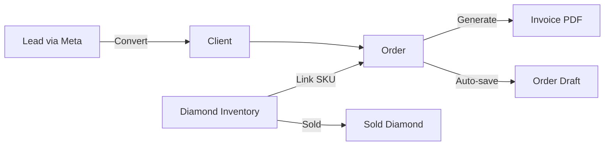
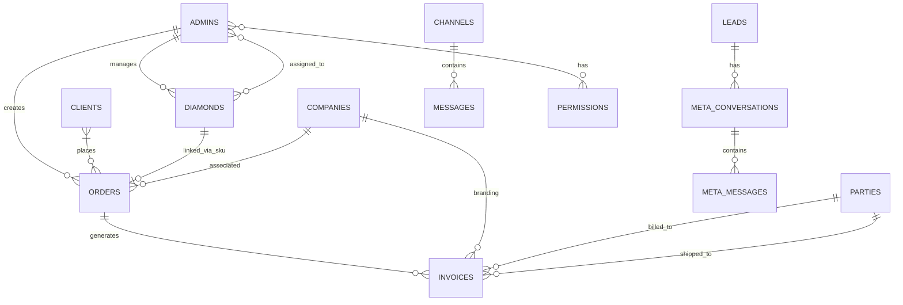
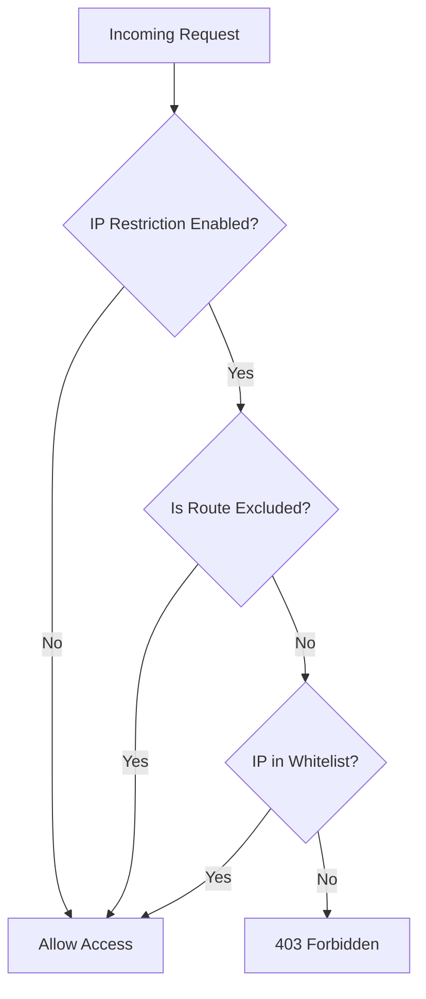

# Product Requirements Document (PRD)

<div align="center">
  
  <h1>💎 Meele CRM</h1>
  <p><strong>Diamond & Jewelry Business Management System</strong></p>
  <p>🚀 <em>Scalable, Secure, and Proprietary Internal Operations Platform</em></p>
</div>

---

## 📝 Document Information

| Attribute | Value |
| :--- | :--- |
| **Project** | Meele CRM — v3.1 (March 2026 Edition) |
| **Status** | 🟢 Production Ready |
| **Last Updated** | March 10, 2026 |
| **Author** | System Architecture Review |

> **What's New in v3.1?**
> *   📂 Consolidated all documentation into `docs/` — single source of truth.
> *   🛍️ **Shopify Integration**: Bi-directional sync for products, collections, and orders.
> *   🌙 **Adaptive UI**: Full Dark Mode support with system-level theme switching.
> *   📱 **Mobile First**: Complete responsive redesign for field sales agents.
> *   📈 **Consolidated Analytics**: All-company sales dashboard with global targets.
> *   🛡️ **Enhanced Security**: IP-based access control with GeoIP logging in the navbar.
> *   📧 **Gmail Module**: Production-ready OAuth2 email with sync, compose, audit logging.

---

## 1. Executive Summary

Meele CRM is a **proprietary, end-to-end business management system** engineered specifically for the diamond and jewelry trading industry. It centralizes stone-level inventory tracking, procurement, multi-currency invoicing, sales analytics, lead management, and team collaboration into a single, high-performance admin panel.

### Core Architecture
- **Backend**: Laravel 12 (Monolithic with Modular Extensions)
- **Frontend**: Blade + Vue.js 3 Hybrid (Optimized for P95 speed)
- **Database**: MySQL 8.0+ with Redis caching layer
- **Integrations**: Google Gmail API, Meta/WhatsApp Business API, Shopify Admin API, Aramex, 17Track, Cloudinary

### Scale
- **55 Eloquent Models** · **41 Controllers** · **12 Services** · **8 Queued Jobs**
- **57+ Database Tables** · **15 Notification Types** · **8 Broadcast Events**

---

## 2. Problem Statement

Diamond trading operations traditionally suffer from **"Tool Fragmentation"**:
1.  **Inventory Lag**: Spreadsheets fail to track real-time stone availability.
2.  **Revenue Leaks**: Unmanaged leads across WhatsApp/Instagram lead to missed closures.
3.  **Manual Toil**: Per-region invoicing and shipping tracking consume hours of staff time.
4.  **Security Blindspots**: Internal communications lack audit trails and IP-based restriction.

**The Solution**: A unified "Command Center" that connects every facet of the business—from the factory floor to the global sales desk.

---

## 3. Core Modules & Features

### 🛍️ 3.1 Shopify Integration
*   **Product Sync**: Bi-directional SKU/Barcode matching between CRM and Shopify (API v2024-01, rate-limited 550ms, 3 retries).
*   **Metafield Mapping**: Automatic extraction of `metal_purity`, Stone Clarity, and Carat Weight to Shopify metafields.
*   **Draft Orders**: Automatic creation of Shopify draft products/orders upon CRM sales.
*   **Webhooks**: HMAC-verified listeners for `products/create`, `products/update`, `products/delete`, `orders/create`.
*   **Admin UI**: Settings, test connection, import/export products, collections, sync logs.

### 🌙 3.2 Adaptive UI & UX
*   **Dark Mode**: High-contrast dark theme with CSS variable tokens (`data-theme="dark"`).
*   **Responsive Layout**: Fluid sidebar and grid system optimized for tablets and smartphones.
*   **Interactive Navbar**: Live ticking clock, time-based greeting chips, and quick-access IP security controls.
*   **Visual Flair**: Premium 3-stop gradients with category-specific colored glow shadows.

### 📈 3.3 Sales & Consolidated Analytics
*   **Global Dashboard**: Real-time aggregation of sales across all registered companies.
*   **Target Management**: Monthly goal setting with projected vs. actual progress ring charts.
*   **Automated Snapshots**: Daily sales archival via Artisan scheduler for historical trend analysis.
*   **CSV/PDF Exports**: Per-company and all-company sales reports.

### 💎 3.4 Diamond Inventory
*   **Single Stone Tracking**: 40+ attributes per diamond (SKU, shape, carat, color, clarity, cut, polish, symmetry, fluorescence, measurements, depth, table, crown, pavilion, girdle, culet, grading lab, certificate URL, video URL, cost price, margin, listing price, etc.).
*   **Price Calculations**: Auto-calculation of `listing_price` from `purchase_price` and `margin` via model boot events.
*   **Sold Tracking**: When SKU linked to order → `markAsSold()` records date, price, profit, duration.
*   **Multi-Admin Assignment**: Diamonds assigned to admins via `diamond_admin` pivot table.
*   **Barcode Generation**: Picqer-powered barcodes (format: `YY+BRAND_CODE+LOT_NO`).
*   **Bulk Operations**: Background job-powered Excel imports/exports with error reporting, mass attribute editing.

### 💠 3.5 Melee Diamond Inventory
*   **Category Management**: Shape/size-based category tracking.
*   **Stock IN/OUT**: Transaction-based stock movements with weighted average cost per carat.
*   **Transaction History**: Full audit trail of all stock movements.
*   **Low-Stock Notifications**: Automatic alerts when stock falls below thresholds.

### 📦 3.6 Orders & Drafts
*   **Three Order Types** with distinct status workflows:
    - **Ready to Ship**: `r_order_in_process → r_order_shipped`
    - **Custom Diamond**: `d_diamond_in_discuss → d_diamond_in_making → d_diamond_completed → d_diamond_in_certificate → d_order_shipped`
    - **Custom Jewellery**: `j_diamond_in_progress → j_cad_in_progress → j_cad_done → j_order_in_qc → j_qc_done → j_order_completed → j_order_shipped`
*   **Auto-Save Drafts**: Every 30 seconds → `order_drafts` table (90-day retention).
*   **Error Recovery**: Drafts created on validation/server failures.
*   **Diamond SKU Linking**: Automatic sold status update on order creation.
*   **File Uploads**: Cloudinary (images + PDFs).

### 🧾 3.7 Invoicing
*   **PDF Generation**: via DomPDF with company branding, logos, bank details.
*   **Multi-Currency**: INR/USD/GBP via `CurrencyService`.
*   **Copy Types**: Original, Duplicate, Triplicate.
*   **Line Items**: `invoice_items` table for detailed tracking.
*   **Parties**: Integrates with `parties` table for billed-to/shipped-to entities.
*   **Tax**: Automated GST/IGST for 7 international regions.

### 📧 3.8 Email Module (Gmail)
*   **Architecture**: Fully modular under `app/Modules/Email/` with own controllers, services, models, repositories, policies, and providers.
*   **OAuth 2.0**: Google Cloud Console integration with automatic token refresh (scopes: `gmail.readonly`, `gmail.modify`, `gmail.compose`, `gmail.send`).
*   **Sync**: Full + incremental sync via Gmail History API (300s interval, 50 per page).
*   **Features**: Inbox, sent, starred, drafts, trash, compose/send, thread view, search, star/read toggles, soft delete with restore.
*   **Attachments**: Streaming download with checksum verification.
*   **Audit**: Immutable `EmailAuditLog` for compliance.
*   **Database**: 6 tables — `email_accounts`, `emails`, `email_attachments`, `email_user_states`, `email_audit_logs`.
*   **Access Roles**: Owner (full), Manager (inbox + settings), Agent (read/reply/send), Auditor (view + audit logs).
*   **Setup**: Requires `GMAIL_CLIENT_ID`, `GMAIL_CLIENT_SECRET`, `GMAIL_REDIRECT_URL` in `.env`. See Gmail setup section below.

#### Gmail Google Cloud Setup
1. Go to [Google Cloud Console](https://console.cloud.google.com/) → Create project **Minimal-Carbon-CRM**.
2. Enable **Gmail API** and **Google People API**.
3. Configure **OAuth Consent Screen** → Add scopes: `gmail.readonly`, `gmail.modify`, `gmail.compose`, `gmail.send`.
4. Create **OAuth 2.0 Client ID** → Authorized Redirect URI: `https://your-domain.com/admin/email/oauth/callback`.
5. Add cron for auto-sync: `* * * * * cd /path-to-project && php artisan schedule:run >> /dev/null 2>&1`

### 💬 3.9 Real-time Chat
*   **Channels**: Public and private channels with membership control.
*   **Direct Messages**: One-on-one messaging between admins.
*   **Thread Replies**: Nested conversation threads.
*   **@Mentions**: User mentions with `UserMentioned` broadcast event + notifications.
*   **File Attachments**: Cloudinary uploads (10MB max, MIME whitelist, virus scanning).
*   **Broadcast Events**: `MessageSent`, `MessagesRead`, `ChannelMembershipChanged`, `UserMentioned`.

### 📱 3.10 Lead Management (Meta/WhatsApp)
*   **Meta Webhooks**: Facebook/Instagram lead capture via `MetaWebhookController`.
*   **Conversation Threading**: Messages grouped into `meta_conversations`.
*   **Lead Scoring**: Automatic scoring via `LeadScoringService` (message 5pts, contact 20pts, 0-100 scale).
*   **Assignment Strategies**: Round-robin, load-balanced, random.
*   **SLA Management**: 24hr deadline tracking with overdue detection.
*   **Status Flow**: `new → contacted → qualified → proposal_sent → negotiating → won/lost/unqualified`.
*   **Reply**: Send messages back through Meta Graph API (rate-limited).

### 💰 3.11 Financial & Procurement
*   **Gold Tracker**: Dashboard + purchases CRUD + distribution to factories + gold return workflow + wastage metrics.
*   **Expense Manager**: Category-based tracking, monthly/annual reports, Excel exports, Cloudinary invoice storage.
*   **Purchases**: Vendor tracking with amount, description, date filtering, completion workflow.

### 📦 3.12 Packages
*   Handover & return management with stock lookup.

### 👥 3.13 Clients & Companies
*   **Clients**: Auto-created from orders (deduplicated by email). Index, search, export, data views.
*   **Companies**: Full CRUD with per-company sales dashboard, monthly targets, CSV/PDF export.

### 🏭 3.14 Master Data
*   Full CRUD for: Metal Types, Setting Types, Closure Types, Ring Sizes, Stone Types, Stone Shapes, Stone Colors, Diamond Clarities, Diamond Cuts.
*   Tools: Jewellery calculator, gold rate lookup.
*   Multi-Currency: INR, USD, GBP support with symbols and formatting.

---

## 4. System Architecture

### 4.1 Data Flow



### 4.2 Entity Relationships



### 4.3 Data Consistency

| Area | Mechanism | Impact if Broken |
| :--- | :--- | :--- |
| Diamond sold status | Model boot event + `markAsSold()` | Inventory discrepancy |
| Order-Client linking | Transaction-wrapped creation | Orphan orders |
| Permission caching | 10-minute cache with `clearPermissionCache()` | Stale access rights |
| Invoice totals | Calculated from items on save | Financial inaccuracy |
| Lead scoring | Auto-recalculated on activity | Incorrect prioritization |

---

## 5. Technical Requirements

### 5.1 Tech Stack Detail

| Layer | Technology | Version | Purpose |
| :--- | :--- | :--- | :--- |
| **Framework** | Laravel | 12.x | Core Application Engine |
| **Runtime** | PHP | 8.2+ | Server-side Logic |
| **Frontend** | Vue.js | 3.5 | Reactive Components |
| **CSS** | TailwindCSS | 4.0 | Utility-first Styling |
| **Real-time** | Pusher | 7.2 | WebSocket Messaging |
| **CDN** | Cloudinary | 3.x | Media & Document Hosting |
| **Worker** | PM2 | 6.0 | Process & Queue Management |
| **Search** | Laravel Scout + TNTSearch | — | Full-text Search |
| **PDF** | DomPDF | 3.1 | Invoice/Report Generation |
| **Excel** | Maatwebsite Excel | 3.1 | Import/Export |
| **Barcodes** | Picqer | 3.2 | Physical Inventory Tracking |
| **Testing** | Pest + Playwright | 3.0 / 1.58 | Unit + E2E Testing |
| **Email** | Google API Client | 2.15 | Gmail OAuth Integration |

### 5.2 Scalability Strategy (100K+ Users)
*   **Search**: Move from file-based TNTSearch to **Meilisearch** cluster.
*   **Cache**: Dedicated **Redis** cluster for sessions, permissions, and counters.
*   **PDF**: Transition DomPDF generation to asynchronous **Queue Workers**.
*   **Database**: Implement **Table Partitioning** for `audit_logs` and `emails`.

---

## 6. Security & Compliance

### 6.1 Authentication & RBAC
*   **Dedicated Admin Guard**: Separate from default Laravel user guard.
*   **RBAC**: Custom permission system with 50+ granular slugs and 10-minute role caching.
*   **All routes** under `/admin` prefix with `admin.permission:resource.action` middleware.

### 6.2 IP Security
*   **Whitelist-based access** with GeoIP logging and automated access request workflows.
*   **Quick-access shield** in navbar for toggling IP restriction.
*   **Database Tables**: `allowed_ips` (IP whitelist) + `app_settings` (master toggle).
*   **Excluded routes**: `/admin/login`, `/api/*`, `/webhook/*` always accessible.
*   **Emergency reset**: `php artisan ip:reset` if locked out.



### 6.3 Data Protection
*   **Encryption**: AES-256-GCM for all OAuth tokens and sensitive master data.
*   **Audit Trail**: Immutable logging via `AuditLogger` service + `AuditLog` model + `AdminObserver`.
*   **CSRF**: Enabled except for external webhooks (Shopify, Meta, 17Track).
*   **Webhooks**: HMAC-verified (Shopify), signature-verified (Meta).
*   **Uploads**: MIME whitelist, 10MB max, virus scanning for chat attachments.
*   **Rate Limiting**: Applied to heavy operations (Meta API, bulk diamond ops).

---

## 7. External Integrations

| Integration | Purpose | Details |
| :--- | :--- | :--- |
| **Shopify** | E-commerce sync | Bi-directional product/order sync, HMAC webhooks, metafield mapping, API v2024-01 |
| **Gmail** | Email management | OAuth2, full/incremental sync, compose/send, audit logging |
| **Meta/WhatsApp** | Lead messaging | Webhook lead capture, conversation threading, reply capability |
| **Cloudinary** | Media storage | Cloud images/files for diamonds, chat, invoices |
| **Aramex** | Shipping tracking | API credentials (username, password, account, PIN, entity, country) |
| **17Track** | Shipment webhooks | Tracking status updates |
| **Pusher** | Real-time | 8 broadcast events for chat, diamonds, leads |

---

## 8. Deployment & Hosting

### 8.1 Infrastructure
| Item | Details |
| :--- | :--- |
| **Hosting** | cPanel (Shared/VPS) |
| **Domain** | GoDaddy (A record → server IP) |
| **SSL** | cPanel AutoSSL / Let's Encrypt |
| **PHP** | 8.2+ via MultiPHP Manager |

### 8.2 cPanel File Structure
```
/home/<cpanel-user>/
├── public_html/           ← Laravel public/ contents
│   ├── index.php
│   ├── .htaccess
│   ├── css/, js/, images/
│   └── storage → ../storage/app/public
├── crm-app/               ← Main Laravel app (outside public_html)
│   ├── app/, bootstrap/, config/, database/
│   ├── resources/, routes/, storage/, vendor/
│   ├── .env
│   └── artisan
```

### 8.3 Key Commands
```bash
php artisan migrate                    # Run migrations
php artisan db:seed                    # Seed database (16 seeders)
php artisan config:clear && php artisan cache:clear  # Clear caches
php artisan ip:reset                   # Emergency IP reset
php artisan email:sync --limit=100     # Manual email sync
composer dev                           # artisan serve + queue:listen + npm dev
```

---

## 9. Notifications (15 Types)

| Notification | Trigger |
| :--- | :--- |
| ChannelAdded | New chat channel created |
| ChatMention | User @mentioned in chat |
| DiamondAssigned / Reassigned / Sold | Diamond assignment or sale events |
| DraftCompletionReminder | Incomplete order draft reminder |
| ExportCompleted / ImportCompleted | Background job completion |
| MeleeLowStock | Melee stock below threshold |
| OrderCancelled / Created / Updated | Order lifecycle events |
| OrderProductivityReminder | Staff productivity nudge |
| OverdueOrder | Order past SLA deadline |
| PackageIssued | Package handover event |

---

## 10. Roadmap & Future Vision

- [ ] **Phase 1**: Cloudflare R2 / S3 Migration for all local file storage (see `storage_migration_plan.md`).
- [ ] **Phase 2**: Laravel Reverb integration for self-hosted WebSockets.
- [ ] **Phase 3**: AI-powered diamond pricing suggestions based on historical trends.
- [ ] **Phase 4**: Full REST API exposure for native Mobile App support.
- [ ] **Phase 5**: VGL Certificate integration (see `VGL_INTEGRATION_PLAN.md`).
- [ ] **Phase 6**: Jewellery Stock module (see `JEWELLERY_STOCK_MODULE_PLAN.md`).
- [ ] **Phase 7**: Multi-carrier shipping tracking — Aramex, UPS, USPS, FedEx (see `shipping_tracking_plan.md`).

---

## 11. Related Documentation

| Document | Purpose |
| :--- | :--- |
| `DEVELOPER_GUIDE.md` | Setup, prerequisites, `.env` config, seeders, project structure |
| `TODO.md` | Active task list (security, permissions, testing, ops) |
| `SHIPPING_MODULE_API_DOCS.md` | API spec for React-based shipping frontend |
| `shopify-crm-integration-docs.md` | Shopify Custom App setup, metafields, webhooks, schema |
| `VGL_INTEGRATION_PLAN.md` | CRM ↔ VGL certificate integration plan |
| `storage_migration_plan.md` | Local+Cloudinary → Cloudflare R2 migration plan |
| `JEWELLERY_STOCK_MODULE_PLAN.md` | Future Jewellery Stock module full spec |
| `shipping_tracking_plan.md` | Multi-carrier tracking implementation plan |
| `PARTY_CATEGORY_IMPLEMENTATION.md` | Party categories + invoice image upload plan |
| `UNWANTED_FILES_ANALYSIS.md` | Dead code audit & cleanup reference |
| `meele-diamond-stock-management/` | Melee diamond stock module spec with images |

---

<div align="right">
  <p><em>Last consolidated: March 10, 2026</em></p>
</div>
