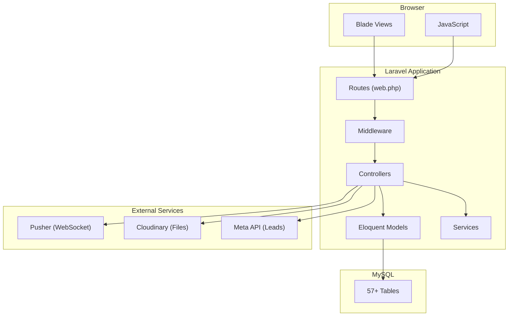

# CRM-Minimal-Carbon - Complete Project Documentation

> **Project Name:** CRM-Minimal-Carbon  
> **Technology Stack:** Laravel 11 + MySQL + Pusher (WebSocket) + Cloudinary  
> **Last Updated:** January 13, 2026

---

## Table of Contents

1. [Project Overview](#1-project-overview)
2. [Technology Stack](#2-technology-stack)
3. [Project Architecture](#3-project-architecture)
4. [Module Overview](#4-module-overview)
5. [Authentication & Authorization](#5-authentication--authorization)
6. [Core Modules](#6-core-modules)
7. [Database Schema](#7-database-schema)
8. [File Structure](#8-file-structure)
9. [Third-Party Integrations](#9-third-party-integrations)
10. [Recent Features](#10-recent-features)
11. [Development Setup](#11-development-setup)
12. [Common Tasks](#12-common-tasks)

---

## 1. Project Overview

**CRM-Minimal-Carbon** is a comprehensive Customer Relationship Management system designed for jewelry/diamond businesses. It manages:

-   **Diamond Inventory** - Stock management, bulk import/export, pricing
-   **Order Management** - Multi-type orders (Ready to Ship, Custom Diamond, Custom Jewellery)
-   **Invoice Generation** - PDF invoices with multi-currency support
-   **Lead Management** - Facebook/Instagram integration via Meta API
-   **Team Chat** - Real-time messaging with channels
-   **Expense Tracking** - Purchases and office expenses

---

## 2. Technology Stack

| Layer              | Technology                      |
| ------------------ | ------------------------------- |
| **Backend**        | Laravel 11 (PHP 8.2+)           |
| **Database**       | MySQL 8.0                       |
| **Frontend**       | Blade Templates + Vanilla JS    |
| **CSS**            | Custom CSS (no framework)       |
| **Real-time**      | Pusher (WebSocket)              |
| **File Storage**   | Cloudinary                      |
| **PDF Generation** | DomPDF                          |
| **Queue**          | Laravel Queue (Database driver) |
| **Cache**          | File Cache                      |

---

## 3. Project Architecture



---

## 4. Module Overview

| Module          | Description             | Controller                                          | Key Features                                   |
| --------------- | ----------------------- | --------------------------------------------------- | ---------------------------------------------- |
| **Admin/Auth**  | User management & login | `AdminController`, `AdminAuthController`            | Login, super admin, avatar upload              |
| **Permissions** | RBAC system             | `PermissionController`, `AdminPermissionController` | Granular permissions, categories               |
| **Chat**        | Team messaging          | `ChatController`                                    | Channels, DMs, threads, file sharing, mentions |
| **Orders**      | Order management        | `OrderController`, `OrderDraftController`           | 3 order types, drafts, auto-save               |
| **Diamonds**    | Inventory management    | `DiamondController`                                 | Bulk import/export, pricing, assignment        |
| **Invoices**    | Invoice generation      | `InvoiceController`                                 | PDF export, multi-currency, item lines         |
| **Parties**     | Client/vendor contacts  | `PartyController`                                   | Company associations                           |
| **Leads**       | Lead capture            | `LeadController`                                    | Meta integration, activities                   |
| **Expenses**    | Expense tracking        | `ExpenseController`                                 | Categories, attachments                        |
| **Purchases**   | Purchase tracking       | `PurchaseController`                                | Vendor, amounts                                |
| **Companies**   | Company profiles        | `CompanyController`                                 | Banking details, logos                         |
| **Clients**     | Client database         | `ClientController`                                  | Auto-created from orders                       |
| **Attributes**  | Lookup tables           | Multiple controllers                                | Metal types, ring sizes, etc.                  |

---

## 5. Authentication & Authorization

### Admin Authentication

-   **Guard:** `admin` (custom guard in `config/auth.php`)
-   **Middleware:** `admin.auth` - checks `Auth::guard('admin')->check()`
-   **Model:** `App\Models\Admin`
-   **Login:** `/admin/login`

### Permission System

-   **Middleware:** `admin.permission:{permission_key}`
-   **Model:** `App\Models\Permission`
-   **Pivot Table:** `admin_permission`
-   **Super Admin:** `is_super = true` bypasses all permission checks

### Permission Categories

```
admins.*          - Admin management
permissions.*     - Permission management
orders.*          - Order CRUD
diamonds.*        - Diamond CRUD
invoices.*        - Invoice CRUD
parties.*         - Party CRUD
chat.*            - Chat access
leads.*           - Lead management
purchases.*       - Purchase tracking
expenses.*        - Expense tracking
companies.*       - Company management
clients.*         - Client management
{attribute}.*     - Each attribute type
```

---

## 6. Core Modules

### 6.1 Orders Module

**Order Types:**

1. **Ready to Ship** - Pre-made items
2. **Custom Diamond** - Custom diamond orders
3. **Custom Jewellery** - Custom jewellery with specifications

**Key Features:**

-   Dynamic form loading via AJAX partials
-   File upload to Cloudinary (images + PDFs)
-   Diamond SKU linking (marks diamond as sold)
-   Auto-save drafts (NEW - Jan 2026)
-   Status workflow per order type

**Order Statuses:**

```
Ready to Ship: r_order_in_process → r_order_shipped
Custom Diamond: d_diamond_in_discuss → d_diamond_in_making → d_diamond_completed → d_diamond_in_certificate → d_order_shipped
Custom Jewellery: j_diamond_in_progress → j_cad_in_progress → j_cad_done → j_order_in_qc → j_qc_done → j_order_completed → j_order_shipped
```

---

### 6.2 Diamonds Module

**Key Features:**

-   Bulk import via Excel/CSV
-   Bulk export with filters
-   Barcode generation
-   Price calculation (cost + margin = list price)
-   Multi-admin assignment
-   Sold status tracking
-   Job tracking history

**Diamond Fields:**

```
sku, shape, carat, color, clarity, cut, polish, symmetry,
fluorescence, measurements, depth, table, crown, pavilion,
girdle, culet, grading_lab, certificate_url, video_url,
cost_price, margin_percentage, listing_price, is_sold_out,
sold_price, sold_at, assigned_to (many-to-many with admins)
```

---

### 6.3 Chat Module

**Real-time messaging system using Pusher.**

**Features:**

-   Public/Private channels
-   Direct messages
-   Thread replies
-   File attachments (Cloudinary)
-   @mentions with notifications
-   Message search (full-text)
-   Unread count badges

**Events:**

```php
MessageSent::class     // New message in channel
ChannelRead::class     // User marked channel as read
```

---

### 6.4 Invoices Module

**PDF invoice generation with DomPDF.**

**Features:**

-   Multi-currency (INR/USD)
-   Company branding (logo, bank details)
-   Line items with quantity/price
-   Copy types (Original, Duplicate, Triplicate)
-   Mark as done
-   PDF download

---

### 6.5 Leads Module (Meta Integration)

**Facebook/Instagram lead capture via Meta Webhooks.**

**Features:**

-   Meta OAuth connection
-   Webhook handling for messages
-   Conversation threading
-   Lead activities tracking
-   Status workflow
-   Reply to leads (via Meta API)

**Meta Integration Tables:**

```
meta_accounts      - Connected FB/IG accounts
meta_conversations - Conversation threads
meta_messages      - Individual messages
meta_message_logs  - Webhook logs for debugging
```

---

### 6.6 Expenses & Purchases

**Financial tracking modules.**

**Expenses:**

-   Categories (rent, utilities, salaries, etc.)
-   File attachments
-   Date filtering
-   Soft delete

**Purchases:**

-   Vendor tracking
-   Amount + description
-   Date filtering

---

## 7. Database Schema

### Core Tables (57 total)

**Authentication:**

```
admins                  - Admin users
permissions             - Available permissions
admin_permission        - Pivot: admin ↔ permission
sessions                - Laravel sessions
```

**Orders:**

```
orders                  - Main orders table
order_drafts            - Auto-saved drafts (NEW)
```

**Diamonds:**

```
diamonds                - Diamond inventory
diamond_admin           - Pivot: diamond ↔ admin (assignment)
job_tracks              - Import/export job history
diamond_clarities       - Lookup: clarity grades
diamond_cuts            - Lookup: cut grades
```

**Chat:**

```
channels               - Chat channels
messages               - Chat messages
message_attachments    - File attachments
message_links          - Extracted URLs
message_reads          - Read receipts
```

**Invoices:**

```
invoices               - Invoice headers
invoice_items          - Invoice line items
parties                - Clients/vendors
```

**Leads:**

```
leads                  - Lead records
lead_activities        - Activity log
meta_accounts          - Connected Meta accounts
meta_conversations     - Conversation threads
meta_messages          - Individual messages
meta_message_logs      - Debug logs
message_templates      - Quick reply templates
```

**Financial:**

```
purchases              - Purchase records
expenses               - Expense records
```

**Lookups (Attributes):**

```
companies              - Company profiles
clients                - Client database
metal_types            - Gold/silver/platinum
setting_types          - Prong/bezel/channel
closure_types          - Earring closures
ring_sizes             - Ring size chart
stone_types            - Diamond/ruby/etc
stone_shapes           - Round/princess/etc
stone_colors           - Color grades
```

---

## 8. File Structure

```
CRM-Minimal-Carbon/
├── app/
│   ├── Http/
│   │   ├── Controllers/       # 29 controllers
│   │   └── Middleware/        # admin.auth, admin.permission
│   ├── Models/                # 36 Eloquent models
│   ├── Notifications/         # Notification classes
│   ├── Services/              # Business logic (CurrencyService, etc.)
│   └── Events/                # Broadcast events
│
├── config/
│   ├── auth.php               # Admin guard configuration
│   ├── broadcasting.php       # Pusher configuration
│   └── cloudinary.php         # Cloudinary configuration
│
├── database/
│   └── migrations/            # 57 migration files
│
├── public/
│   ├── css/                   # Compiled CSS
│   ├── js/                    # JavaScript files
│   │   └── order-autosave.js  # Auto-save functionality
│   └── images/                # Static images
│
├── resources/
│   └── views/
│       ├── layouts/           # admin.blade.php (main layout)
│       ├── admin/             # Dashboard
│       ├── admins/            # Admin CRUD views
│       ├── orders/            # Order views + drafts/
│       ├── diamonds/          # Diamond views
│       ├── invoices/          # Invoice views
│       ├── chat/              # Chat interface
│       ├── leads/             # Lead management
│       └── {module}/          # Other module views
│
├── routes/
│   ├── web.php                # All web routes
│   └── channels.php           # Broadcasting channels
│
└── .env                       # Environment configuration
```

---

## 9. Third-Party Integrations

### Pusher (Real-time)

```env
PUSHER_APP_ID=xxx
PUSHER_APP_KEY=xxx
PUSHER_APP_SECRET=xxx
PUSHER_APP_CLUSTER=ap2
```

### Cloudinary (File Storage)

```env
CLOUDINARY_CLOUD_NAME=xxx
CLOUDINARY_API_KEY=xxx
CLOUDINARY_API_SECRET=xxx
```

### Meta API (Leads)

```env
META_APP_ID=xxx
META_APP_SECRET=xxx
META_VERIFY_TOKEN=xxx
```

### Currency API

```env
EXCHANGE_RATE_API_KEY=xxx
```

---

## 10. Recent Features (Jan 2026)

### Order Draft System (Latest)

-   **Auto-save**: Every 30 seconds to server
-   **Error recovery**: Drafts created on validation/server errors
-   **Management UI**: `/admin/orders/drafts`
-   **Login popup**: Notification for pending drafts
-   **Files**: `OrderDraft.php`, `OrderDraftController.php`, `order-autosave.js`

### Client Database

-   Clients auto-created from order submissions
-   Linked via `client_id` foreign key on orders
-   Deduplicated by email

### Bug Fixes

-   MySQL integer column error for nullable foreign keys
-   Route ordering for draft routes vs `{order}` wildcard

---

## 11. Development Setup

### Prerequisites

-   PHP 8.2+
-   Composer
-   MySQL 8.0
-   Node.js (for asset compilation if needed)

### Installation

```bash
# Clone repository
git clone <repo-url>
cd CRM-Minimal-Carbon

# Install dependencies
composer install

# Copy environment file
cp .env.example .env

# Generate app key
php artisan key:generate

# Configure database in .env
DB_DATABASE=minimal_crm
DB_USERNAME=root
DB_PASSWORD=

# Run migrations
php artisan migrate

# Seed initial data (if seeders exist)
php artisan db:seed

# Start server
php artisan serve
```

### Default Super Admin

```
Email: superadmin@example.com
Password: Password!123!
```

---

## 12. Common Tasks

### Adding a New Permission

1. Insert into `permissions` table with `key`, `name`, `category`
2. Assign to admins via `admin_permission` pivot
3. Use middleware: `->middleware('admin.permission:your.key')`

### Adding a New Attribute

1. Create migration: `php artisan make:migration create_{name}_table`
2. Create model: `php artisan make:model {Name}`
3. Create controller extending `BaseResourceController`
4. Add routes in `web.php`
5. Create views: `index`, `create`, `edit`, `partials/_form`

### Creating a New Module

1. **Migration** - Define table schema
2. **Model** - Create Eloquent model with relationships
3. **Controller** - CRUD operations
4. **Views** - Blade templates
5. **Routes** - Add to `web.php` with middleware
6. **Sidebar** - Add link in `layouts/admin.blade.php`
7. **Permissions** - Create and assign permissions

---

## Quick Links

| Resource              | Path                                           |
| --------------------- | ---------------------------------------------- |
| Main Layout           | `resources/views/layouts/admin.blade.php`      |
| Routes                | `routes/web.php`                               |
| Auth Config           | `config/auth.php`                              |
| Admin Model           | `app/Models/Admin.php`                         |
| Permission Middleware | `app/Http/Middleware/CheckAdminPermission.php` |
| Chat Controller       | `app/Http/Controllers/ChatController.php`      |
| Diamond Controller    | `app/Http/Controllers/DiamondController.php`   |
| Order Controller      | `app/Http/Controllers/OrderController.php`     |

---

_This documentation provides an overview of the entire CRM system. For specific module details, refer to the code comments and individual controller/model files._
