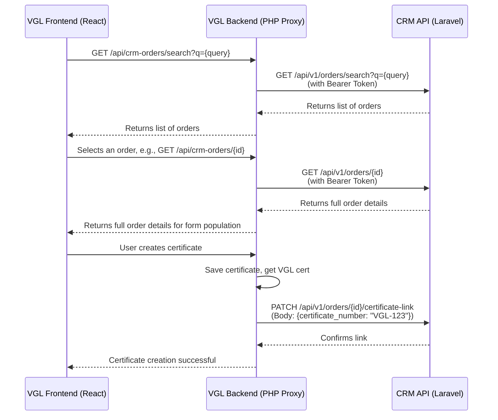

# VGL Certificate Integration Plan

> **Created:** February 20, 2026
> **Purpose:** To connect CRM order data with vgllab.com, allowing certificate creators to auto-populate certificate forms from CRM orders via a secure API.
> **Projects:** CRM (Laravel) ↔ VGL (React/TypeScript frontend + PHP backend)

---

## 1. Problem Definition

Certificate creators at `vgllab.com` currently follow a manual and time-consuming process:

1.  Log into the CRM to look up order details (diamond specifications, jewellery details, images, client info).
2.  Manually copy and paste these details into the VGL certificate creation form.
3.  Repeat this process for every single certificate.

**Goal:** Expose CRM order data through a secure, well-defined API that enables the VGL platform to fetch and auto-populate certificate forms directly, eliminating manual data entry.

---

## 2. Proposed Architecture

The proposed solution involves a one-way data flow from the CRM to VGL, with a single PATCH request to link a created certificate back to the CRM order.



┌──────────────────────┐         HTTPS/JSON           ┌──────────────────────┐
│                      │  ◄──────────────────────►    │                      │
│   CRM (Laravel)      │     API Token Auth           │   VGL (React+PHP)    │
│   This Project       │                              │   vgllab.com         │
│                      │                              │                      │
│  ┌────────────────┐  │   GET /api/v1/orders         │  ┌────────────────┐  │
│  │ Orders         │──┼──────────────────────────►   │  │ Certificate    │  │
│  │ Diamonds       │  │   GET /api/v1/orders/{id}    │  │ Creation Form  │  │
│  │ Companies      │  │                              │  │ (auto-fill)    │  │
│  │ MetalTypes     │  │   GET /api/v1/orders/search  │  └────────────────┘  │
│  │ Images (CDN)   │  │         ?q=client_name       │                      │
│  └────────────────┘  │                              │  ┌────────────────┐  │
│                      │   POST /api/v1/orders/{id}/  │  │ Certificate    │  │
│  ┌────────────────┐  │        certificate-link      │  │ Database       │  │
│  │ API Token Auth │  │  ◄────────────────────────   │  │                │  │
│  │ (Sanctum)      │  │  (link cert# back to order)  │  └────────────────┘  │
│  └────────────────┘  │                              │                      │
└──────────────────────┘                              └──────────────────────┘


> **Security Note:** The VGL PHP backend will act as a **proxy**. The CRM API token will be stored securely on the VGL server and will never be exposed to the client-side React application.

---

## 3. Phase 1: CRM API Setup (This Project)

### 3.1. Initial Setup

1.  **Install Laravel Sanctum** for API token authentication.
    ```bash
    composer require laravel/sanctum
    php artisan vendor:publish --provider="Laravel\Sanctum\SanctumServiceProvider"
    php artisan migrate
    ```
2.  **Update CORS Configuration** in `config/cors.php` to allow requests from VGL.
    ```php
    'paths' => ['api/*'],
    'allowed_origins' => ['https://vgllab.com', 'https://www.vgllab.com'],
    ```

### 3.2. New Files & Resources

| File Path                                             | Purpose                                                                 |
| ----------------------------------------------------- | ----------------------------------------------------------------------- |
| `routes/api.php`                                      | Defines all API v1 routes.                                              |
| `app/Http/Controllers/Api/V1/OrderApiController.php`  | Handles all incoming API requests for orders.                           |
| `app/Http/Resources/OrderResource.php`                | Transforms a single Order model into a JSON response.                   |
| `app/Http/Resources/OrderCollectionResource.php`      | Transforms a collection of orders.                                      |
| `app/Http/Resources/DiamondResource.php`              | Transforms Diamond data within the order response.                      |
| `database/migrations/xxxx_add_certificate_fields.php` | Adds `certificate_number` and `certificate_link` to the `orders` table. |

### 3.3. API Endpoints

| Method  | Endpoint                               | Purpose                                                                     |
| :------ | :------------------------------------- | :-------------------------------------------------------------------------- |
| `GET`   | `/api/v1/orders`                       | List orders (paginated, with filters for status, date).                     |
| `GET`   | `/api/v1/orders/{id}`                  | Get full details for a single order, including related models.              |
| `GET`   | `/api/v1/orders/search?q=`             | Search orders by client name, order ID, or diamond SKU.                     |
| `GET`   | `/api/v1/orders/for-certificate`       | Get a filtered list of orders with a status ready for certificate creation. |
| `PATCH` | `/api/v1/orders/{id}/certificate-link` | Link a VGL certificate number back to a CRM order.                          |
| `GET`   | `/api/v1/lookup/companies`             | Provide a list of companies/stores for dropdowns.                           |
| `GET`   | `/api/v1/lookup/metal-types`           | Provide a list of metal types for dropdowns.                                |

### 3.4. Database Modifications

A new nullable column will be added to the `orders` table:

| Column               | Type          | Description                                    |
| -------------------- | ------------- | ---------------------------------------------- |
| `certificate_number` | `VARCHAR(50)` | Stores the VGL certificate number once linked. |

### 3.5. Authentication

- **Method:** Laravel Sanctum API tokens.
- **Token Management:** A long-lived API token will be generated for the VGL backend.
- **Storage:** The token will be stored in VGL's `.env` file as `CRM_API_TOKEN`.
- **Usage:** All API requests must include an `Authorization: Bearer {token}` header.
- **Rate Limiting:** 60 requests per minute.

### 3.6. API Response Format (`OrderResource`)

```json
{
    "id": 142,
    "order_type": "custom_jewellery",
    "certificate_type": "Jewellery Certificate",
    "client": {
        "name": "John Doe",
        "email": "john@example.com",
        "mobile": "+1234567890"
    },
    "company": { "id": 1, "name": "VGL Store" },
    "jewellery_details": "18K Gold Hexagon Ring with salt and pepper diamond",
    "diamond_details": "1.5ct salt and pepper hexagon cut",
    "diamonds": [
        {
            "sku": "D-1234",
            "material": "Natural",
            "cut": "Hexagon",
            "clarity": "I3",
            "color": "FK2",
            "shape": "Hexagon",
            "weight": "1.50"
        }
    ],
    "specifications": { "metal_type": "18K Gold", "ring_size": "7" },
    "melee": { "name": "VS1 Round 1.3mm", "pieces": 12, "carat": "0.150" },
    "images": [
        {
            "url": "https://res.cloudinary.com/...",
            "public_id": "orders/abc123"
        }
    ],
    "gross_sell": "3500.00",
    "status_label": "J - Order Completed",
    "dispatch_date": "2026-02-20",
    "certificate_number": null,
    "created_at": "2026-02-15T10:30:00Z"
}
```

---

## 4. Phase 2: VGL Backend (PHP)

### 4.1. New Endpoints (Proxy)

| Endpoint                     | Purpose                            | Implementation Detail                         |
| :--------------------------- | :--------------------------------- | :-------------------------------------------- |
| `GET /api/crm-orders`        | Fetch & forward list of CRM orders | Calls CRM's `/api/v1/orders/for-certificate`. |
| `GET /api/crm-orders/search` | Search CRM orders                  | Calls CRM's `/api/v1/orders/search?q=...`.    |
| `GET /api/crm-orders/{id}`   | Get single order detail            | Calls CRM's `/api/v1/orders/{id}`.            |

### 4.2. `CrmApiService` Class

A dedicated service class (`CrmApiService.php`) will be created to:

- Read `CRM_API_URL` and `CRM_API_TOKEN` from the `.env` file.****
- Wrap all CRM API calls using a standard HTTP client like Guzzle.
- Handle errors, timeouts, and response parsing, returning structured arrays.

### 4.3. Database & Logic Update

- **Database:** Add a nullable `crm_order_id` (integer) column to the VGL `certificates` table.
- **Logic:** When a certificate is created using a `crm_order_id`, the backend will make a `PATCH` request to the CRM API (`/api/v1/orders/{id}/certificate-link`) to send the new certificate number back to the CRM.

---

## 5. Phase 3: VGL Frontend (React/TypeScript)

### 5.1. New Components

| Component            | Purpose                                                                                   |
| -------------------- | ----------------------------------------------------------------------------------------- |
| `CrmOrderSelector`   | A modal to search, filter, and select a CRM order.                                        |
| `OrderPreviewCard`   | A compact card to display order summaries in search results.                              |
| `ImportConfirmation` | A preview step to show which fields will be imported, with the ability to deselect items. |
| `CrmOrderBadge`      | A small badge on the certificate detail page indicating the linked CRM order.             |

### 5.2. Certificate Form Modifications

- An **"Import from CRM Order"** button will be added to the "Add New Certificate" modal.
- This button will trigger the `CrmOrderSelector` modal.
- Upon selection, the `ImportConfirmation` modal will appear.
- On confirmation, form fields will be auto-populated, marked with an "(auto)" indicator, and remain editable.
- A success badge ("✅ Imported from Order #142") will be displayed.

### 5.3. Data Mapping (CRM Order → VGL Certificate)

| VGL Certificate Field | CRM Source                             | Mapping Logic & Transformation                                             |
| :-------------------- | :------------------------------------- | :------------------------------------------------------------------------- |
| **Certificate Type**  | `order.order_type`                     | `custom_diamond` → "Diamond Certificate", others → "Jewellery Certificate" |
| **Store**             | `order.company.name`                   | Direct mapping.                                                            |
| **Jewelry Image**     | `order.images[0].url`                  | Use the URL of the first image in the array.                               |
| **Title**             | `order.jewellery_details`              | Use the primary jewellery description.                                     |
| **Date**              | `order.created_at`                     | Format as needed.                                                          |
| **Item**              | Parsed from `order.jewellery_details`  | e.g., "Engagement Ring", "Pendant".                                        |
| **Carat Weight**      | `order.diamonds[0].weight`             | Primary diamond's carat weight.                                            |
| **Gem Stone**         | `order.diamonds[0].material` + `shape` | e.g., "Natural Diamond, Hexagon".                                          |
| **Color / Clarity**   | `order.diamonds[0].color` / `clarity`  | Direct mapping from the Diamond model.                                     |
| **Metal Purity**      | `order.specifications.metal_type`      | From the linked MetalType model name.                                      |
| **Product Value**     | `order.gross_sell`                     | Direct mapping.                                                            |

---

## 6. Wireframes

### W1: Certificate Form — With CRM Import Button

```
┌──────────────────────────────────────────────────────────┐
│  Add New Certificate                                  ✕  │
├──────────────────────────────────────────────────────────┤
│  [ Certificate Number field ... ]                        │
│                                                          │
│  ┌──────────────────────────────────────────────────┐    │
│  │  📦 Import from CRM Order              [Search]  │    │
│  │  Quickly fill certificate details from an order. │    │
│  └──────────────────────────────────────────────────┘    │
│                                                          │
│  [ ... rest of form fields ... ]                         │
└──────────────────────────────────────────────────────────┘
```

### W2: CRM Order Selector Modal

```
┌──────────────────────────────────────────────────────────┐
│  Select CRM Order                                     ✕  │
├──────────────────────────────────────────────────────────┤
│  🔍 [ Search by Order ID, Client Name, SKU...        ]   │
│  Filter: [All] [Custom Diamond] [Custom Jewellery]       │
├──────────────────────────────────────────────────────────┤
│  ┌──────────────────────────────────────────────────┐    │
│  │  #142 │ Custom Jewellery │ 18K Hexagon Ring      │    │
│  │  Client: John Doe │ Store: VGL Store             │    │
│  │  Status: ● J - Order Completed     [Select →]   │    │
│  ├──────────────────────────────────────────────────┤    │
│  │  #139 │ Custom Diamond │ 1.5ct Round Brilliant   │    │
│  │  Client: Jane Smith │ Store: VGL Store           │    │
│  │  Status: ● D - In Certificate      [Select →]   │    │
│  └──────────────────────────────────────────────────┘    │
│  Showing 2 of 24 results          [← Prev] [Next →]      │
└──────────────────────────────────────────────────────────┘
```

### W3: Import Confirmation

```
┌──────────────────────────────────────────────────────────┐
│  Import Order #142                                    ✕  │
├──────────────────────────────────────────────────────────┤
│  You are about to import the following fields:           │
│  ☑ Certificate Type → Jewellery Certificate              │
│  ☑ Store → VGL Store                                     │
│  ☑ Title → 18K Hexagon Ring                              │
│  ☑ Carat Weight → 1.50 ct                                │
│  ☑ Gem Stone → Salt and Pepper Diamond                   │
│  ☑ Color / Clarity → FK2 / I3                            │
│  ☑ Metal Purity → 18K Gold                               │
│  ☑ Product Value → $3,500.00                             │
│                                                          │
│         [ Cancel ]    [ Import & Fill Form ]             │
└──────────────────────────────────────────────────────────┘
```

---

## 7. Implementation Plan

1.  **Phase 1 (CRM API):** To be built entirely within this Laravel project. This phase can be tested independently using Postman or a similar API client.
2.  **Phase 2 (VGL Backend):** To be built in the VGL PHP backend project.
3.  **Phase 3 (VGL Frontend):** To be built in the VGL React/TypeScript project.

### Dependencies from VGL Project

Before starting work on Phases 2 and 3, the VGL team will need to provide:

- VGL database schema for the `certificates` table.
- Access to the VGL backend codebase (PHP).
- The existing certificate creation React component (`.tsx`).
- An understanding of how VGL "stores" map to CRM "companies".
