# Meele Diamond Stock Management Module

**Version:** 1.0  
**Date:** January 8, 2026  
**Project:** CRM-Minimal-Carbon

Source document (PDF): `docs/meelediamond.pdf`  
All images used below are rendered from the PDF into: `docs/meele-diamond-stock-management/assets/`

## Table of Contents

1. [Overview](#1-overview)
2. [Meele Diamond Kya Hai?](#2-meele-diamond-kya-hai)
3. [Key Features](#3-key-features)
4. [UI Screens](#4-ui-screens)
5. [Order Integration Flow](#5-order-integration-flow)
6. [Database Schema](#6-database-schema)
7. [Technical Implementation](#7-technical-implementation)
8. [Implementation Timeline](#8-implementation-timeline)
9. [Appendix: Image Pages](#9-appendix-image-pages)

---

## 1. Overview

Yeh document **Meele Diamond Stock Management Module** ka complete specification hai. Isme cover hota hai:

- Meele diamonds ka stock kaise manage hoga
- Order ke saath integration kaise hoga
- Sabhi admins ko notifications kaise jayenge
- Database structure kya hogi

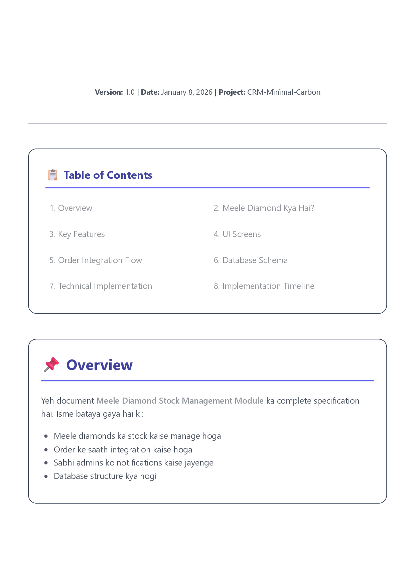

---

## 2. Meele Diamond Kya Hai?

Meele (Melee) diamonds chote diamonds hote hain jo typically **0.2 carat se kam** ke hote hain (**0.6mm - 4mm diameter**). Ye jewellery mein accent stones ke taur par use hote hain.

### Solitaire vs Meele - Main Farak

| Aspect   | Solitaire Diamond (Current)              | Meele Diamond (New)                       |
| -------- | ---------------------------------------- | ----------------------------------------- |
| Tracking | Individual stones (1 record = 1 diamond) | Parcels (1 record = bahut saare diamonds) |
| Weight   | Exact carat weight per stone             | Total weight + Piece count                |
| Pricing  | Per stone basis                          | Per carat basis                           |
| Stock    | Binary (In Stock / Sold)                 | Quantity-based (partial sale possible)    |

### Size Classification Chart

| Sieve Size | MM Range       | Avg Carat | Category     |
| ---------: | -------------- | --------: | ------------ |
|        000 | 0.80 - 0.90 mm |  0.003 ct | Stars        |
|         00 | 0.90 - 1.00 mm |  0.004 ct | Stars        |
|          0 | 1.00 - 1.10 mm |  0.005 ct | Stars        |
|         +1 | 1.10 - 1.20 mm |  0.006 ct | Stars        |
|         +2 | 1.20 - 1.30 mm |  0.008 ct | Meele        |
|         +3 | 1.30 - 1.40 mm |  0.010 ct | Meele        |
|         +4 | 1.40 - 1.50 mm |  0.012 ct | Meele        |
|         +5 | 1.50 - 1.70 mm |  0.015 ct | Meele        |
|         +6 | 1.70 - 1.90 mm |  0.020 ct | Meele        |
|         +7 | 1.90 - 2.00 mm |  0.030 ct | Meele        |
|         -7 | 2.00 - 2.10 mm |  0.035 ct | Coarse Meele |
|         -6 | 2.10 - 2.20 mm |  0.040 ct | Coarse Meele |
|         -5 | 2.20 - 2.50 mm |  0.050 ct | Coarse Meele |

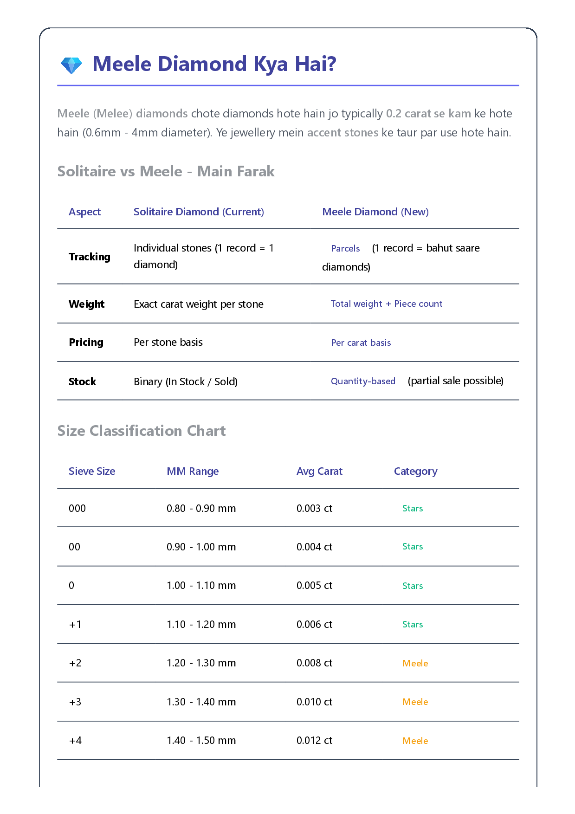
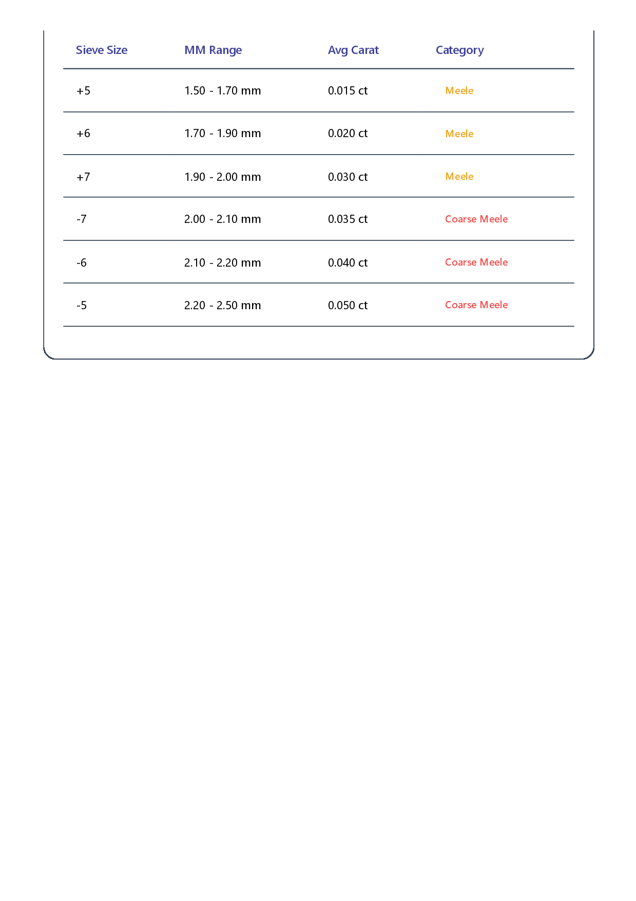

---

## 3. Key Features

- **Parcel-based Tracking:** Stock parcels mein track hoga, individual stones nahi
- **Quantity Management:** Pieces + Carat dono track honge
- **Partial Sales:** Parcel ka kuch portion bhi bech sakte ho
- **Order Integration:** Order mein meele select -> auto stock deduct
- **Notifications:** Sabhi admins ko stock movement notification
- **Transaction Log:** Complete history of all movements
- **Low Stock Alert:** Threshold se neeche jaane par warning
- **Import/Export:** Excel se bulk data management

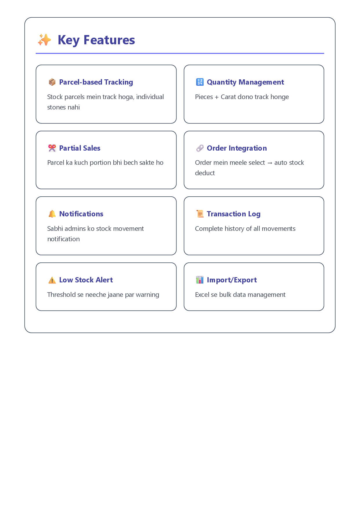

---

## 4. UI Screens

### 4.1 Stock List Page (Index)

Main dashboard jahan sabhi meele parcels dikhenge with stats aur filters.

**Features:** Stats Cards (Total Parcels, Pieces, Value, Carats), Advanced Filters, Data Table with Status Pills, Actions (View, Edit, Movement)

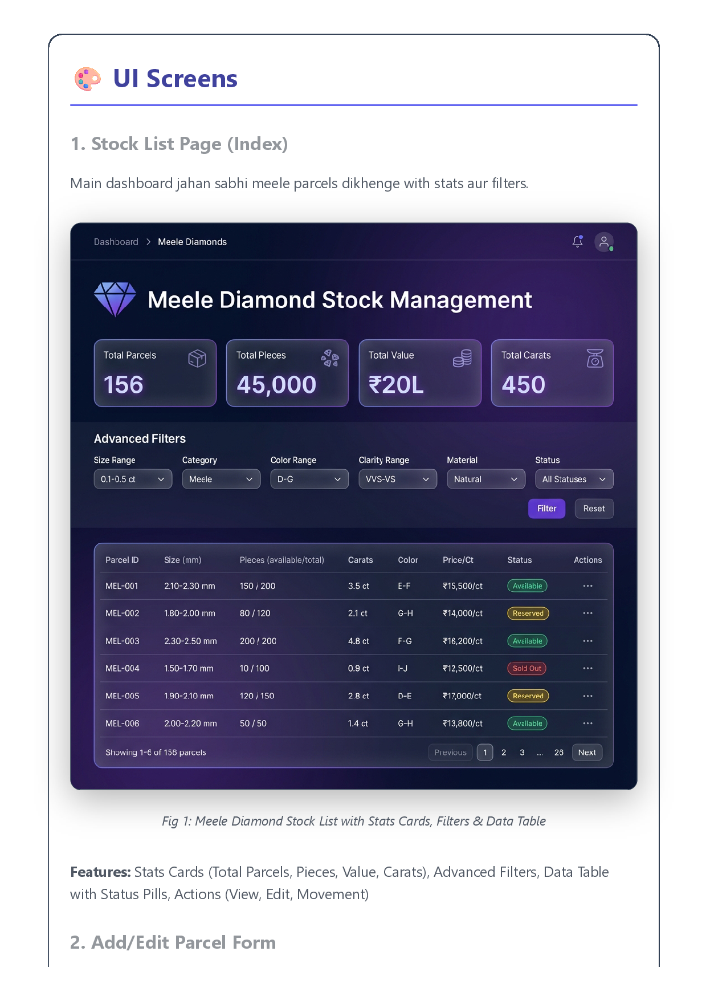

### 4.2 Add/Edit Parcel Form

Naya parcel add karne ya existing edit karne ka form.

**Sections:** Parcel Identification, Size Classification, Quantity & Weight, Quality Specifications, Pricing

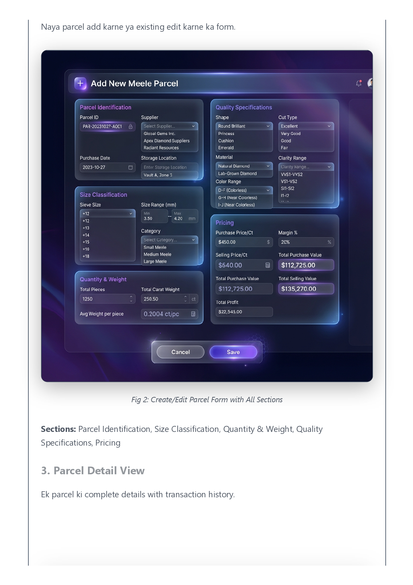

### 4.3 Parcel Detail View

Ek parcel ki complete details with transaction history.

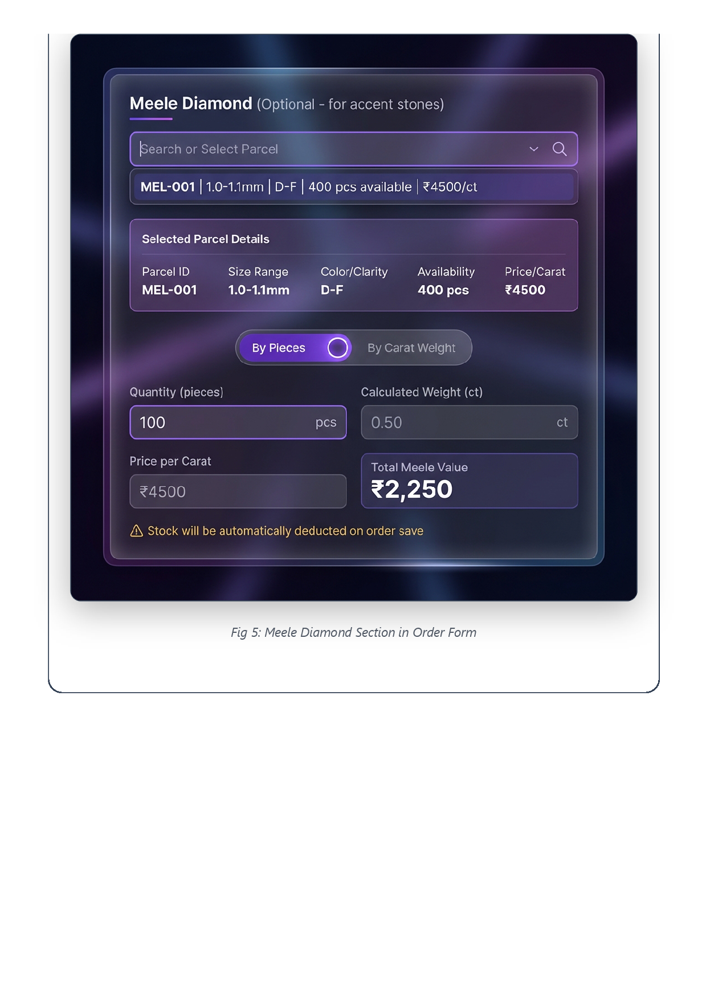

### 4.4 Stock Movement Modal

Manual stock movement record karne ke liye modal.

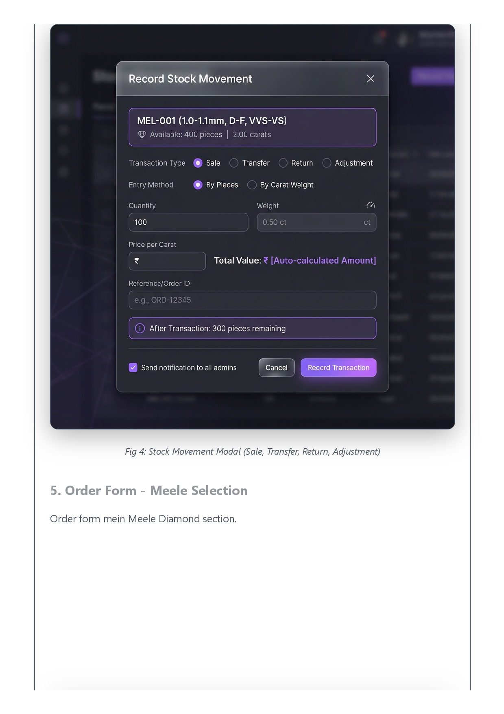

### 4.5 Order Form - Meele Selection

Order form mein Meele Diamond section.

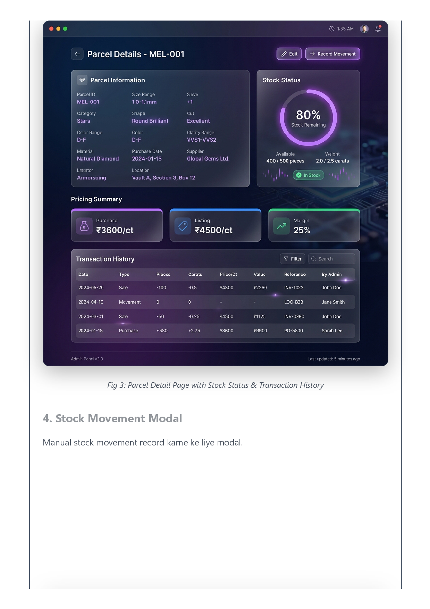

---

## 5. Order Integration Flow

Jab Order create hota hai aur usme Meele Diamond use hota hai:

### Step-by-Step Process

1. **Admin Order Create Karta Hai** - Order form mein jaata hai
2. **Meele Parcel Select Karta Hai** - Dropdown se parcel choose + quantity enter
3. **System Validates Stock** - Available >= Requested? (Error/Continue)
4. **Order Successfully Created** - Database mein save
5. **Stock Auto-Deducted** - `available_pieces -= ordered_pieces`
6. **Transaction Log Created** - `meele_transactions` table mein record
7. **Notification to All Admins** - Real-time notification bheja jaata hai

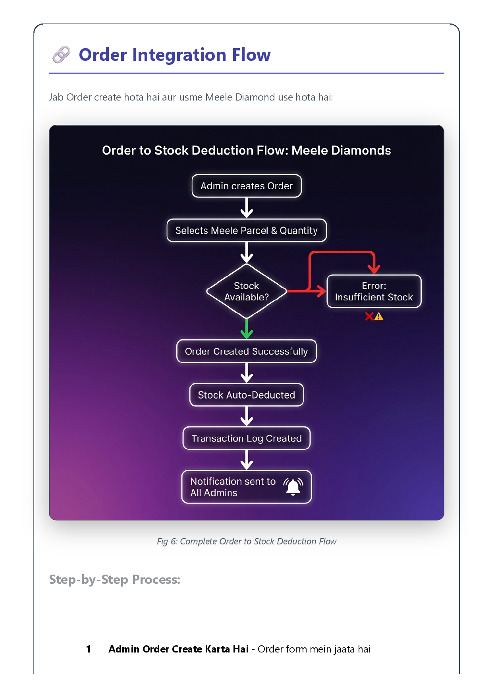
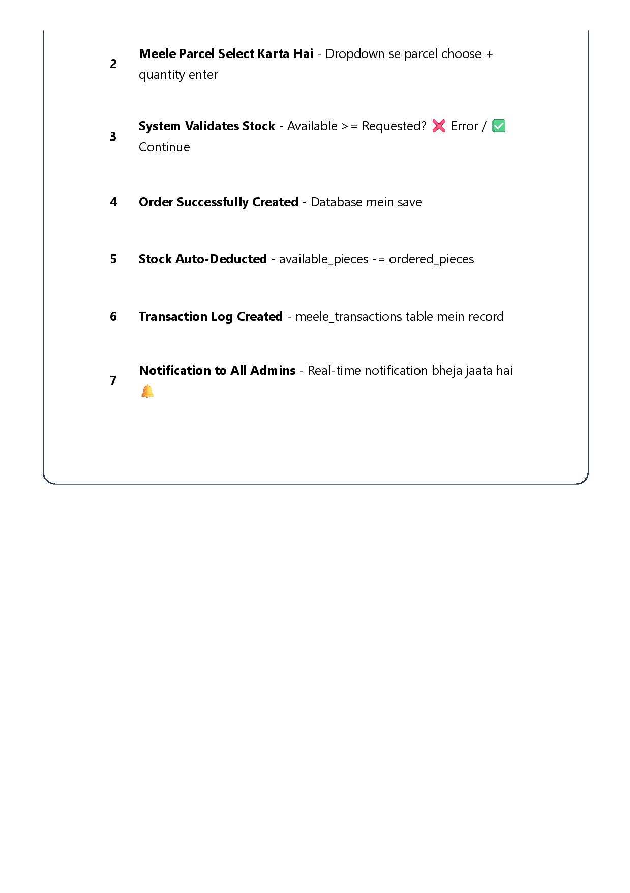

---

## 6. Database Schema

### Table 1: `meele_diamonds`

Main table for storing meele diamond parcels.

```sql
-- Key Columns
id                   BIGINT PRIMARY KEY
parcel_id            VARCHAR(50) UNIQUE    -- "MEL-2026-001"
sieve_size           VARCHAR(20)           -- "+2", "-7"
size_mm_min          DECIMAL(4,2)          -- 0.80
size_mm_max          DECIMAL(4,2)          -- 0.90
size_category        ENUM('stars', 'meele', 'coarse_meele')

total_pieces         INT                   -- Total in parcel
available_pieces     INT                   -- Currently available
total_carat_weight   DECIMAL(10,4)
available_carat      DECIMAL(10,4)

cut                 VARCHAR(50)
shape               VARCHAR(50)
color_range         VARCHAR(50)
clarity_range       VARCHAR(50)
material            VARCHAR(50)

purchase_price_per_ct  DECIMAL(12,2)
listing_price_per_ct   DECIMAL(12,2)
margin                DECIMAL(5,2)

status               ENUM('in_stock', 'low_stock', 'out_of_stock', 'reserved')
low_stock_threshold  INT DEFAULT 50
```

### Table 2: `meele_transactions`

Log table for all stock movements.

```sql
id               BIGINT PRIMARY KEY
meele_diamond_id BIGINT FK
transaction_type ENUM('purchase', 'sale', 'transfer', 'adjustment', 'return')
pieces           INT                   -- + for add, - for deduct
carat_weight     DECIMAL(10,4)
price_per_ct     DECIMAL(12,2)
total_value      DECIMAL(15,2)
reference_type   VARCHAR(50)           -- 'order', 'invoice', 'manual'
reference_id     BIGINT                -- Order/Invoice ID
created_by       BIGINT FK
created_at       TIMESTAMP
```

### Table 3: `orders` (Updates)

New columns to add:

```sql
meele_diamond_id   BIGINT FK NULL
meele_pieces       INT NULL
meele_carat        DECIMAL(10,4) NULL
meele_price_per_ct DECIMAL(12,2) NULL
meele_total_value  DECIMAL(12,2) NULL
```

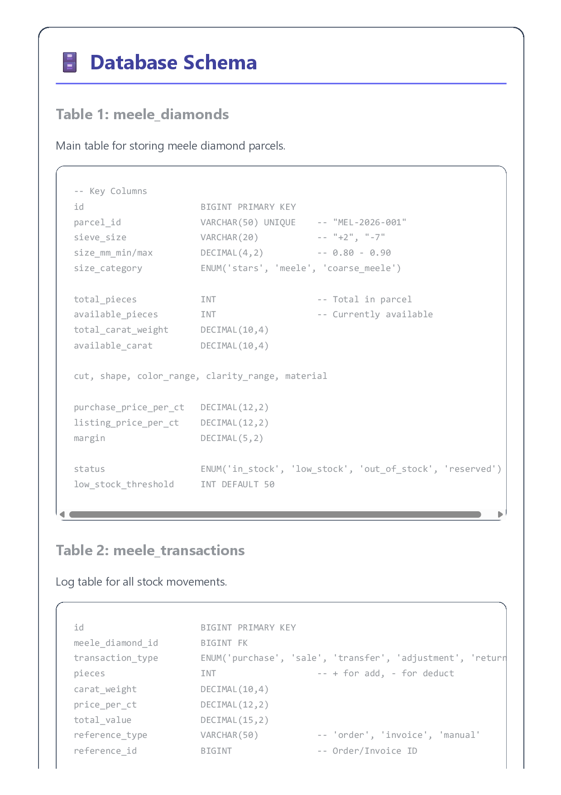
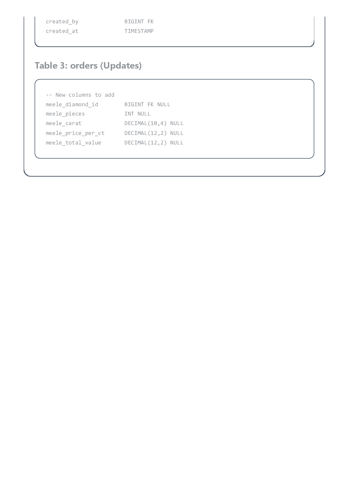

---

## 7. Technical Implementation

### File Structure

```text
app/
|-- Models/
|   |-- MeeleDiamond.php                 [NEW]
|   `-- MeeleTransaction.php             [NEW]
|-- Http/Controllers/
|   `-- MeeleDiamondController.php       [NEW]
`-- Notifications/
    `-- MeeleStockDeductedNotification.php [NEW]

database/migrations/
|-- create_meele_diamonds_table.php       [NEW]
|-- create_meele_transactions_table.php   [NEW]
`-- add_meele_columns_to_orders_table.php [NEW]

resources/views/meele-diamonds/
|-- index.blade.php
|-- create.blade.php
|-- edit.blade.php
`-- show.blade.php
```

### Permissions

| Permission Key               | Description                |
| ---------------------------- | -------------------------- |
| `meele_diamonds.view`        | Meele Stock Dekho          |
| `meele_diamonds.create`      | Naya Parcel Add Karo       |
| `meele_diamonds.edit`        | Parcel Edit Karo           |
| `meele_diamonds.delete`      | Parcel Delete Karo         |
| `meele_diamonds.transaction` | Stock Movement Record Karo |
| `meele_diamonds.import`      | Excel Import               |
| `meele_diamonds.export`      | Excel Export               |

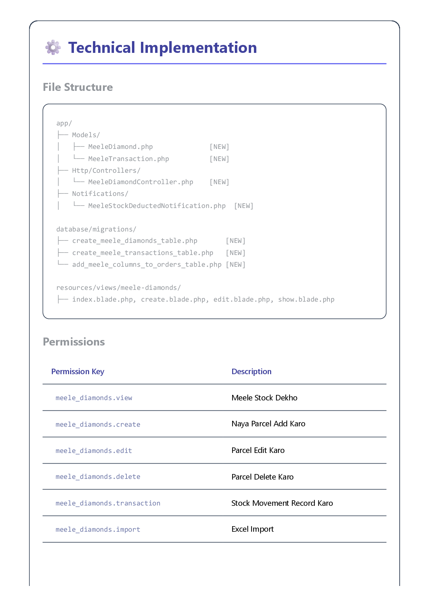

---

## 8. Implementation Timeline

| Phase   | Tasks                               | Duration |
| ------- | ----------------------------------- | -------- |
| Phase 1 | Database migrations + Models        | Day 1    |
| Phase 2 | Controller + Routes + Permissions   | Day 1-2  |
| Phase 3 | Views (index, create, edit, show)   | Day 2-3  |
| Phase 4 | Order Integration + Stock Deduction | Day 3    |
| Phase 5 | Notifications System                | Day 3    |
| Phase 6 | Import/Export Excel                 | Day 4    |
| Phase 7 | Testing + UI Polish                 | Day 4    |

**Total Estimated Time:** 4 Days

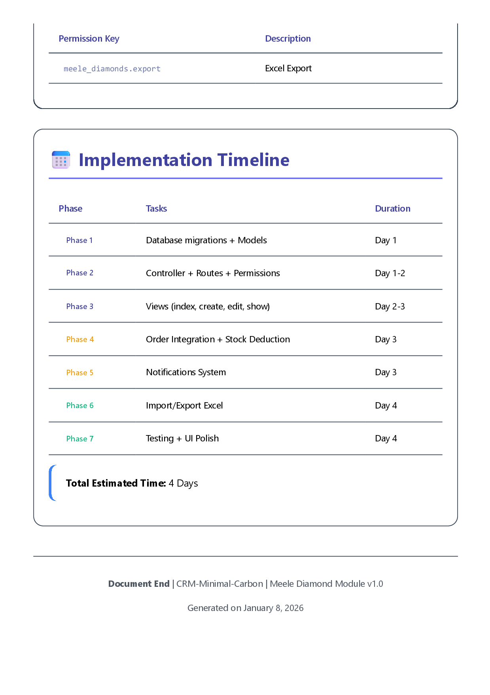

---

## 9. Appendix: Image Pages

If you want the complete original layout (page-by-page), these are the rendered pages:

- `./assets/page-01.png` (Cover + Table of Contents + Overview)
- `./assets/page-02.png` (Meele Diamond definition + table + size chart)
- `./assets/page-03.png` (Size chart continued)
- `./assets/page-04.png` (Key Features)
- `./assets/page-05.png` (UI Screens: Stock List)
- `./assets/page-06.png` (UI Screens: Add/Edit form)
- `./assets/page-07.png` (UI Screens: Order form selection)
- `./assets/page-08.png` (UI Screens: Stock movement modal)
- `./assets/page-09.png` (UI Screens: Parcel detail view)
- `./assets/page-10.png` (Order Integration flow diagram)
- `./assets/page-11.png` (Order Integration steps)
- `./assets/page-12.png` (Database schema: parcels + transactions)
- `./assets/page-13.png` (Database schema: orders updates)
- `./assets/page-14.png` (Technical implementation + permissions)
- `./assets/page-15.png` (Implementation timeline)
