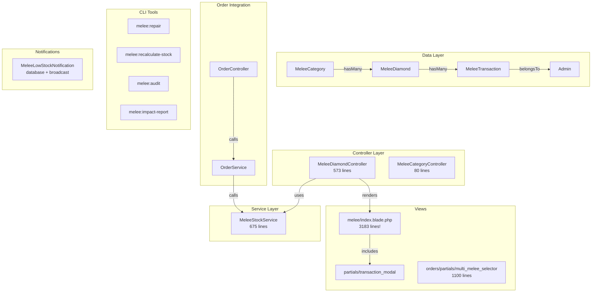
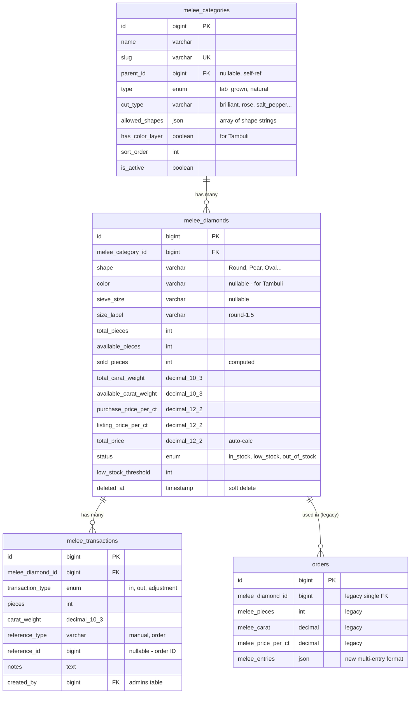
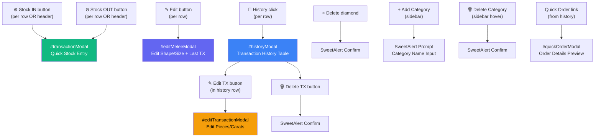
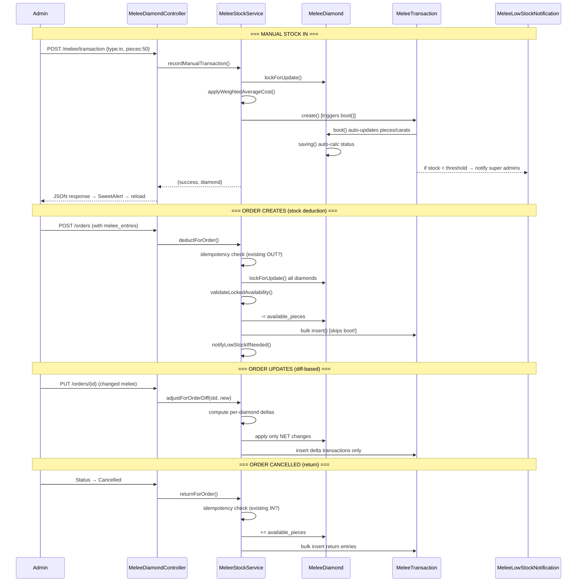

# 💎 Melee Diamond System — Senior Developer Architecture Review

## 1. System Overview

The Melee system manages **small diamond (melee) inventory** — tracking stock parcels by category, shape, and size with a full transaction ledger for IN/OUT operations. It integrates deeply with the **Order system** for automatic stock deduction/return.

---

## 2. Skills That Apply to This Project

| Skill | Purpose | Why It Matters Here |
|-------|---------|-------------------|
| **powerful-model-brain** | 6-phase reasoning for complex tasks | Architecture redesign requires deep decomposition |
| **laravel-expert** | Laravel best practices & patterns | Core framework — services, models, controllers |
| **database-design** | Schema optimization & integrity | Transaction ledger is the source of truth |
| **architecture** | System design & separation of concerns | Current system has dual-write problems |
| **clean-code** | Readability & maintainability | Controller is too fat (573 lines) |
| **debugging-strategies** | Root cause analysis | Stock drift was caused by architectural flaw |
| **security-audit** | Permission & authorization checks | Permissions exist but aren't enforced in controller |

---

## 3. Current Architecture — File Map



### Complete File Inventory

| Layer | File | Lines | Purpose |
|-------|------|-------|---------|
| **Model** | `MeleeCategory.php` | 82 | Category with type (lab_grown/natural), shapes, parent/child |
| **Model** | `MeleeDiamond.php` | 108 | Stock parcel — pieces, carats, pricing, status auto-calc |
| **Model** | `MeleeTransaction.php` | 90 | Ledger entry — in/out/adjustment with boot() auto-update |
| **Service** | `MeleeStockService.php` | 675 | Core stock logic — deduct, return, diff, validate, notify |
| **Controller** | `MeleeDiamondController.php` | 573 | CRUD + transactions + history + search |
| **Controller** | `MeleeCategoryController.php` | 80 | Category CRUD |
| **View** | `melee/index.blade.php` | 3183 | Full inventory dashboard with 5+ modals |
| **View** | `partials/transaction_modal.blade.php` | 199 | Stock IN/OUT modal |
| **View** | `orders/partials/multi_melee_selector.blade.php` | 1100 | Order form melee picker |
| **Notification** | `MeleeLowStockNotification.php` | 50 | Real-time low stock alert |
| **Seeder** | `MeleeCategoriesSeeder.php` | 93 | 7 default categories |
| **Seeder** | `MeleeDiamondSeeder.php` | — | Sample diamond data |
| **Seeder** | `MeleePermissionsSeeder.php` | 54 | 5 permission slugs |
| **Command** | `RepairMeleeStock.php` | 337 | 3-phase repair (dupes + orphans + recalc) |
| **Command** | `RecalculateMeleeStock.php` | 79 | Simple ledger-based recalculation |
| **Command** | `MeleeAudit.php` | — | Audit tool |
| **Command** | `MeleeImpactReport.php` | — | Impact analysis |
| **Migration** | `create_melee_categories_table` | 35 | Categories schema |
| **Migration** | `create_melee_diamonds_table` | 46 | Diamonds schema |
| **Migration** | `create_melee_transactions_table` | 36 | Transaction ledger schema |
| **Migration** | `add_melee_columns_to_orders` | — | Order ↔ melee FK columns |
| **Migration** | `add_melee_entries_to_orders` | — | JSON melee_entries column |

---

## 4. Database Schema (ERD)



---

## 5. UI Wireframes — Page Flow & Modal Map

### 5.1 Main Inventory Page (`/melee`)

```
┌─────────────────────────────────────────────────────────┐
│  HEADER BAR                                             │
│  ┌──────────┐ ┌──────────┐   ┌──────────┐ ┌──────────┐ │
│  │ Lab Grown│ │ Natural  │   │+ Add Stock│ │- Use Stk │ │
│  │  (active)│ │          │   │  (green)  │ │  (red)   │ │
│  └──────────┘ └──────────┘   └──────────┘ └──────────┘ │
├─────────┬───────────────────────────────────────────────┤
│SIDEBAR  │  MAIN PANEL                                   │
│         │  ┌─────────────────────────────────────────┐  │
│ ◆ Brill │  │ Header: "Brilliant Cut Diamond" | search│  │
│   (23)  │  ├─────────────────────────────────────────┤  │
│         │  │ ▼ Round (12 sizes, 450 pcs)             │  │
│ ◇ Rose  │  │  ┌─────────────────────────────────────┐│  │
│   (18)  │  │  │ # │ Size  │Stock│ $/ct │ct  │$ │Act ││  │
│         │  │  │ 1 │rnd-1.0│ 120 │$45.00│2.4 │$108│⊕⊖✎×│  │
│ ◇ S&P   │  │  │ 2 │rnd-1.2│  85 │$52.00│3.1 │$161│⊕⊖✎×│  │
│   (15)  │  │  │ 3 │rnd-1.5│   0 │$48.00│0.0 │  $0│⊕⊖✎×│  │
│         │  │  ├─────────── Add Size ─────────────────┤│  │
│ + Add   │  │  │ [size input] [+ Add]                 ││  │
│ Category│  │  └─────────────────────────────────────┘│  │
│         │  │ ▶ Pear (8 sizes, 220 pcs)  [collapsed]  │  │
│         │  │ ▶ Oval (5 sizes, 180 pcs)  [collapsed]  │  │
│         │  ├─── Add New Shape ────────────────────────┤  │
│         │  │ [shape▼] [size] [+ Add Shape]            │  │
│         │  └─────────────────────────────────────────┘  │
└─────────┴───────────────────────────────────────────────┘
```

### 5.2 Modal Map — What Opens Where



### 5.3 Transaction Modal Flow

```
User clicks "Add Stock" or row "⊕"
        │
        ▼
┌─── #transactionModal ────────────────┐
│  Quick Stock Entry                    │
│                                       │
│  ┌─ Selected Item Context ──────────┐ │
│  │ 📦 Brilliant Cut - Round - 1.5   │ │
│  │    Lab Grown          [Change]   │ │
│  └──────────────────────────────────┘ │
│   — OR —                              │
│  [Select2 AJAX Search Dropdown]       │
│                                       │
│  ┌──────────┐  ┌──────────┐           │
│  │ ● ADD IN │  │ ○ USE OUT│           │
│  └──────────┘  └──────────┘           │
│                                       │
│  ┌────────┐ ┌────────┐ ┌────────┐     │
│  │ Pieces │ │ Carats │ │ $/Ct   │     │
│  │  [25]  │ │ [1.250]│ │ [45.00]│     │
│  └────────┘ └────────┘ └────────┘     │
│                                       │
│  Notes: [__________________________]  │
│                                       │
│  ┌──────────────────────────────────┐ │
│  │     ✓ CONFIRM TRANSACTION        │ │
│  └──────────────────────────────────┘ │
└───────────────────────────────────────┘
```

### 5.4 Order Integration — Multi Melee Selector

```
Order Create/Edit Form
        │
        ▼
┌─── Side Stones / Melee (Optional) ───────────┐
│                                                │
│  ┌─ Selected Pills ──────────────────────────┐ │
│  │ ┌────────────────────────────────────────┐ │ │
│  │ │[Lab Brilliant Round 1.5] Pcs:[12] $540 │ │ │  ← pill with inline edit
│  │ │ 0.360ct                           [×]  │ │ │
│  │ └────────────────────────────────────────┘ │ │
│  │ ┌────────────────────────────────────────┐ │ │
│  │ │[Nat Rose Pear 2.0]      Pcs:[ 8] $320 │ │ │
│  │ │ 0.480ct                           [×]  │ │ │
│  │ └────────────────────────────────────────┘ │ │
│  └────────────────────────────────────────────┘ │
│                                                │
│  [🔍 Search Melee Diamond...              ]    │  ← Select2 AJAX
│                                                │
│  Total Carat: [0.840]   Total Price: [$860]    │
└────────────────────────────────────────────────┘
```

---

## 6. Data Flow — Stock Lifecycle



---

## 7. Critical Architecture Problems Found

### 🔴 Problem 1: Dual-Write Pattern (FIXED but scars remain)

**What happened:** The old code called `returnForOrder()` + `deductForOrder()` on every order edit, creating orphaned return transactions that inflated stock permanently.

**Current fix:** `adjustForOrderDiff()` now computes NET deltas. The `RepairMeleeStock` command cleans historical orphans.

**Remaining risk:** The `MeleeTransaction::boot()` hook AND `MeleeStockService` both modify diamond stock — two write paths for the same data.

### 🔴 Problem 2: Boot Hook vs Service — Dual Stock Update

```php
// MeleeTransaction boot() — auto-updates diamond on create()
static::created(function ($transaction) {
    $diamond->available_pieces += abs($transaction->pieces);
    $diamond->save();
});

// MeleeStockService::deductForOrder() — manually updates diamond THEN insert()
$diamond->available_pieces -= $entry['pieces'];
$diamond->save();
MeleeTransaction::insert($transactions); // insert() SKIPS boot!
```

**The problem:** `MeleeTransaction::create()` triggers boot (used by `recordManualTransaction`), but `MeleeTransaction::insert()` does NOT trigger boot (used by order operations). This means stock updates happen via different paths depending on context.

### 🟡 Problem 3: Controller Too Fat (573 lines)

The `MeleeDiamondController` has business logic mixed in:
- `update()` method has manual DB transactions with stock adjustment logic (lines 279-381)
- `updateTransaction()` has stock reversal logic (lines 415-490)
- `destroyTransaction()` has stock reversal logic (lines 495-545)

Per `AI_RULES.md`: *"Controllers only do: validate → call service → return response"*

### 🟡 Problem 4: No Permission Enforcement

Permissions are seeded (`melee_diamonds.view`, `.create`, `.edit`, `.delete`, `.transaction`) but **none are checked** in the controller. No `$this->authorize()`, no middleware, no Policy class.

### 🟡 Problem 5: Inline Validation

The controller uses `$request->validate()` inline instead of Form Request classes (violates AI_RULES §2).

### 🟡 Problem 6: Monster View (3183 lines)

`melee/index.blade.php` is a single 3183-line file containing:
- ~1400 lines of CSS (inline `<style>`)
- ~600 lines of HTML structure
- ~1200 lines of JavaScript
- 5+ modals defined inline

### 🟡 Problem 7: Status Calculated in 3 Places

Diamond status (`in_stock`/`low_stock`/`out_of_stock`) is recalculated in:
1. `MeleeDiamond::boot() saving()` hook
2. `MeleeDiamondController::update()` (lines 356-362)
3. `MeleeDiamondController::updateTransaction()` (lines 465-471)
4. `MeleeDiamondController::destroyTransaction()` (lines 521-527)
5. `RecalculateMeleeStock` command

---

## 8. How a Senior Dev Would Redesign This

### Phase 1: Extract Business Logic → Service

Move ALL stock mutation logic from controller to `MeleeStockService`:

```
MeleeStockService (refactored)
├── deductForOrder()          ✅ already here
├── returnForOrder()          ✅ already here
├── adjustForOrderDiff()      ✅ already here
├── recordManualTransaction() ✅ already here
├── validateAvailability()    ✅ already here
├── updateDiamond()           🆕 from controller::update()
├── deleteDiamond()           🆕 from controller::destroy()
├── updateTransaction()       🆕 from controller::updateTransaction()
├── deleteTransaction()       🆕 from controller::destroyTransaction()
└── addShape()                🆕 from controller::addShape()
```

### Phase 2: Kill the Dual-Write

**Remove `MeleeTransaction::boot()` entirely.** All stock mutations should go through the service.

```php
// BEFORE: Two paths
MeleeTransaction::create() → boot() updates diamond (path 1)
MeleeStockService → manual update + insert() (path 2)

// AFTER: One path
MeleeStockService → update diamond + create/insert transaction (single source)
```

### Phase 3: Add Authorization

```php
// New: app/Policies/MeleeDiamondPolicy.php
class MeleeDiamondPolicy {
    public function view(Admin $admin) { return $admin->hasPermission('melee_diamonds.view'); }
    public function create(Admin $admin) { return $admin->hasPermission('melee_diamonds.create'); }
    public function update(Admin $admin) { return $admin->hasPermission('melee_diamonds.edit'); }
    public function delete(Admin $admin) { return $admin->hasPermission('melee_diamonds.delete'); }
    public function transaction(Admin $admin) { return $admin->hasPermission('melee_diamonds.transaction'); }
}
```

### Phase 4: Form Requests

```
app/Http/Requests/
├── StoreMeleeTransactionRequest.php
├── AddMeleeShapeRequest.php
├── UpdateMeleeDiamondRequest.php
└── UpdateMeleeTransactionRequest.php
```

### Phase 5: Break Up the Monster View

```
resources/views/melee/
├── index.blade.php              (main layout, ~100 lines)
├── partials/
│   ├── _styles.blade.php        (all CSS)
│   ├── _header.blade.php        (page header with tabs)
│   ├── _sidebar.blade.php       (category navigation)
│   ├── _main_panel.blade.php    (shape groups + tables)
│   ├── _shape_group.blade.php   (single shape accordion)
│   ├── transaction_modal.blade.php  (exists)
│   ├── _history_modal.blade.php
│   ├── _edit_modal.blade.php
│   ├── _edit_transaction_modal.blade.php
│   └── _scripts.blade.php      (all JavaScript)
```

---

## 9. Route Map (Current)

| Method | URI | Controller Method | Purpose |
|--------|-----|-------------------|---------|
| GET | `/melee` | `index()` | Dashboard |
| GET | `/melee/search` | `search()` | AJAX autocomplete |
| GET | `/melee/stock/{id}` | `getStock()` | Live stock data |
| GET | `/melee/history/{id}` | `getHistory()` | Transaction history |
| POST | `/melee/transaction` | `transaction()` | Stock IN/OUT |
| POST | `/melee/add-shape` | `addShape()` | Add new shape+size |
| PUT | `/melee/{id}` | `update()` | Edit diamond |
| DELETE | `/melee/{id}` | `destroy()` | Delete diamond |
| PUT | `/melee/transaction/{id}` | `updateTransaction()` | Edit TX entry |
| DELETE | `/melee/transaction/{id}` | `destroyTransaction()` | Delete TX entry |
| POST | `/melee/category` | `category.store` | Add category |
| DELETE | `/melee/category/{id}` | `category.destroy` | Delete category |

---

## 10. Notification System

```
MeleeLowStockNotification
├── Channels: database + broadcast (ShouldBroadcastNow)
├── Triggered when: available_pieces < low_stock_threshold
├── Recipients: All super admins (Admin::where('is_super', true))
├── Triggered from:
│   ├── MeleeTransaction::boot() (manual transactions)
│   └── MeleeStockService::notifyLowStockIfNeeded() (order operations)
└── Shows in: Notification bell (notifications/index.blade.php)
```

---

## 11. Order Integration Architecture

### How Melee Connects to Orders

```
Order Create → OrderController::store()
    → OrderService::extractValidatedMeleeEntries() — parse form input
    → OrderService::validateMeleeStockAvailability() — check stock
    → Save order with melee_entries JSON
    → MeleeStockService::deductForOrder() — lock rows + deduct + log

Order Update → OrderController::update()  
    → OrderService::extractSnapshotMeleeEntries() — get OLD entries
    → OrderService::extractValidatedMeleeEntries() — get NEW entries
    → Save order with new melee_entries JSON
    → MeleeStockService::adjustForOrderDiff(old, new) — NET delta only

Order Cancel → Status change handler
    → OrderService::extractStoredMeleeEntries() — get current entries
    → MeleeStockService::returnForOrder() — return stock with idempotency
```

### Legacy Compatibility

The system supports **two formats**:
1. **Legacy single-melee**: `melee_diamond_id`, `melee_pieces`, `melee_carat`, `melee_price_per_ct` columns
2. **New multi-melee**: `melee_entries` JSON column with array of entries

`OrderService::normalizeStoredMeleeEntries()` handles both transparently.

---

## 12. Artisan CLI Tools

| Command | Purpose | Safety |
|---------|---------|--------|
| `melee:repair --dry-run` | Phase 1: Remove duplicate TXs, Phase 1.5: Remove orphaned returns, Phase 2: Recalculate stock | Safe with `--dry-run` |
| `melee:recalculate-stock` | Simple full recalculation from ledger | Destructive — overwrites all stock counts |
| `melee:audit` | Diagnostic audit report | Read-only |
| `melee:impact-report` | Analyze impact of repair on specific diamonds | Read-only |

---

## 13. Risk Inventory

| Risk | Likelihood | Impact | Current Mitigation |
|------|-----------|--------|-------------------|
| Stock drift from dual-write | **Medium** | **High** | `adjustForOrderDiff()` + repair commands |
| Concurrent stock deduction race | **Low** | **High** | `lockForUpdate()` in service |
| Orphaned return transactions | **Fixed** | **High** | `cleanOrphanedReturns()` in repair |
| No permission checks | **High** | **Medium** | None — needs Policy |
| Negative stock allowed | **Medium** | **Medium** | Warning only, no hard block |
| View file too large (3183 lines) | **High** | **Low** | None — needs decomposition |
| Boot hook + service double-counting | **Medium** | **High** | Insert() skips boot, but fragile |

---

## 14. Recommended Execution Roadmap

### Sprint 1: Safety & Correctness (1-2 days)
- [ ] Remove `MeleeTransaction::boot()` — single write path through service
- [ ] Move controller business logic to service
- [ ] Add MeleeDiamondPolicy + authorize() calls

### Sprint 2: Code Quality (1 day)
- [ ] Create Form Request classes
- [ ] Break up `melee/index.blade.php` into partials
- [ ] Extract CSS to `partials/_melee-styles.blade.php`

### Sprint 3: Robustness (1 day)
- [ ] Add negative stock hard-block option
- [ ] Add audit logging for all mutations
- [ ] Schedule periodic `melee:repair --dry-run` as health check

### Sprint 4: Testing (1 day)
- [ ] Unit tests for `MeleeStockService` (deduct, return, diff)
- [ ] Feature test for order ↔ melee integration
- [ ] Test concurrent deduction safety
