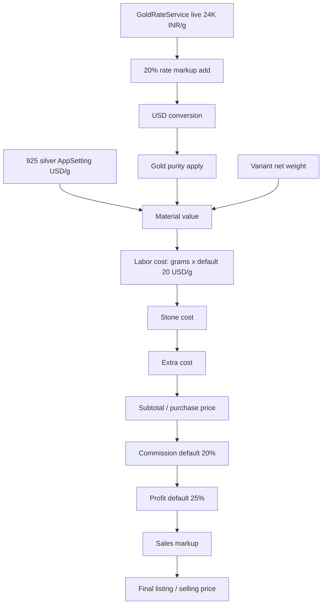

# Jewellery Stock Pricing System Implementation Plan

> **For Claude:** REQUIRED SUB-SKILL: Use superpowers:executing-plans to implement this plan task-by-task.

**Goal:** Jewellery Stock Create/Edit me live metal-rate based variant pricing add karna, jisme gold/silver material value, labor, stone, extra, commission, profit, aur sales markup se final listing price calculate ho.

**Architecture:** Parent catalogue item existing `jewellery_stocks` table me rahega. Material/color wise pricing rows new `jewellery_stock_pricings` child table me store hongi. Calculation hamesha Laravel service me server-side dobara chalegi; Blade JavaScript sirf user preview ke liye hoga.

**Tech Stack:** Laravel 12, Blade, Eloquent, FormRequest validation, existing `GoldRateService`, existing `AppSetting`, admin permission middleware.

---

## Summary

Jewellery Stock Create/Edit ke andar variant-based pricing system banana hai. Ek design ke liye 925 silver plus 10K/14K/18K/22K gold ke yellow, white, rose variants price honge.

System existing `GoldRateService` se live 24K INR/g rate lega, usme 20% add karega, existing currency API pattern se USD convert karega, phir purity percentage apply karega:

- 10K = 45%
- 14K = 60%
- 18K = 76%
- 22K = 91%

925 silver ka rate manual `AppSetting` se aayega jab tak silver API define nahi hoti.

## Task 1: Database And Permissions

**Files:**
- Create: `database/migrations/2026_04_24_000002_create_jewellery_stock_pricings_table.php`
- Create: `database/migrations/2026_04_24_000003_seed_jewellery_pricing_settings.php`
- Modify: `database/seeders/JewelleryStockPermissionsSeeder.php`
- Modify: `database/seeders/PermissionSeeder.php`

**Implementation:**
- Add `jewellery_stock_pricings` as child table of `jewellery_stocks`.
- Store one row per material/color variant with full calculation snapshot.
- Add default `AppSetting` keys:
  - `jewellery_pricing.labor_rate_usd_per_gram = 20`
  - `jewellery_pricing.default_commission_percent = 20`
  - `jewellery_pricing.default_profit_percent = 25`
  - `jewellery_pricing.default_sales_markup_percent = 0`
  - `jewellery_pricing.silver_925_rate_usd_per_gram = 0`
- Add permissions:
  - `jewellery_stock.view_profit`
  - `jewellery_stock.edit_commission`
  - `jewellery_stock.edit_profit`
  - `jewellery_stock.edit_sales_markup`

## Task 2: Models And Services

**Files:**
- Create: `app/Models/JewelleryStockPricing.php`
- Create: `app/Services/JewelleryMaterialRateService.php`
- Create: `app/Services/JewelleryPricingService.php`
- Modify: `app/Models/JewelleryStock.php`

**Implementation:**
- Add `JewelleryStock::pricingVariants()` relationship.
- `JewelleryMaterialRateService` returns adjusted gold USD/g and silver USD/g.
- `JewelleryPricingService` owns all formulas and permission-based assumptions.
- Server-side calculation must ignore restricted posted values from regular users.

## Task 3: Requests, Controller, Routes

**Files:**
- Modify: `app/Http/Requests/StoreJewelleryStockRequest.php`
- Modify: `app/Http/Requests/UpdateJewelleryStockRequest.php`
- Modify: `app/Http/Controllers/JewelleryStockController.php`
- Modify: `routes/web.php`

**Implementation:**
- Validate `pricing_variants` payload.
- In store/update transaction:
  - save existing parent stock fields
  - calculate pricing variants server-side
  - replace child pricing rows
  - set parent `purchase_price` and `selling_price` from default variant
- Add `GET jewellery-stock/pricing-rates` before `/{jewellery_stock}` route.

## Task 4: Blade UI

**Files:**
- Modify: `resources/views/jewellery-stock/create.blade.php`
- Modify: `resources/views/jewellery-stock/edit.blade.php`
- Modify: `resources/views/jewellery-stock/show.blade.php`

**Implementation:**
- Replace simple pricing fields with pricing matrix.
- User can enter net weight, stone cost, extra cost.
- Add "Copy to all" buttons for stone cost and extra cost.
- Super admin can edit labor rate.
- Users with permission can edit commission, profit, sales markup.
- Regular users cannot see profit details.
- Show page displays saved variants and hides profit unless allowed.

## Test Plan

- Unit test pricing service formulas:
  - purity percentages
  - 20% gold rate uplift before USD conversion
  - subtotal, commission, profit, sales markup, listing price
  - silver manual rate
- Feature test create/update:
  - parent stock row created
  - child variant rows created
  - default variant syncs parent prices
  - restricted users cannot override protected assumptions
- Regression:
  - Jewellery Stock index/show still render
  - order SKU lookup still uses parent `selling_price`
- Run:
  - `php artisan test`

## Assumptions

- Variant matrix storage is required.
- Silver rate is manual setting for now.
- Sales markup default is `0%`.
- Existing parent `purchase_price` means subtotal cost.
- Existing parent `selling_price` means final listing price.
- Excel file is reference only; app uses requested purity values.
